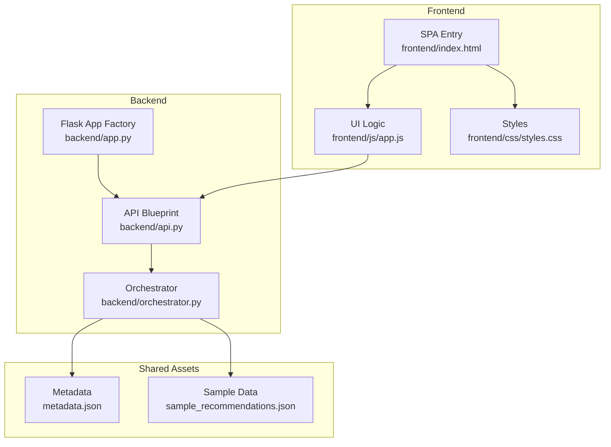
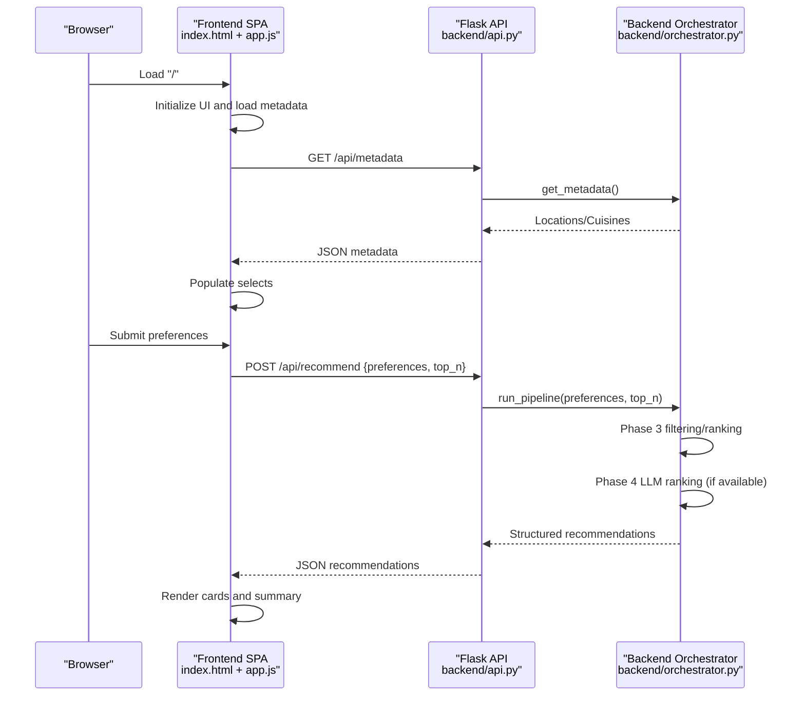
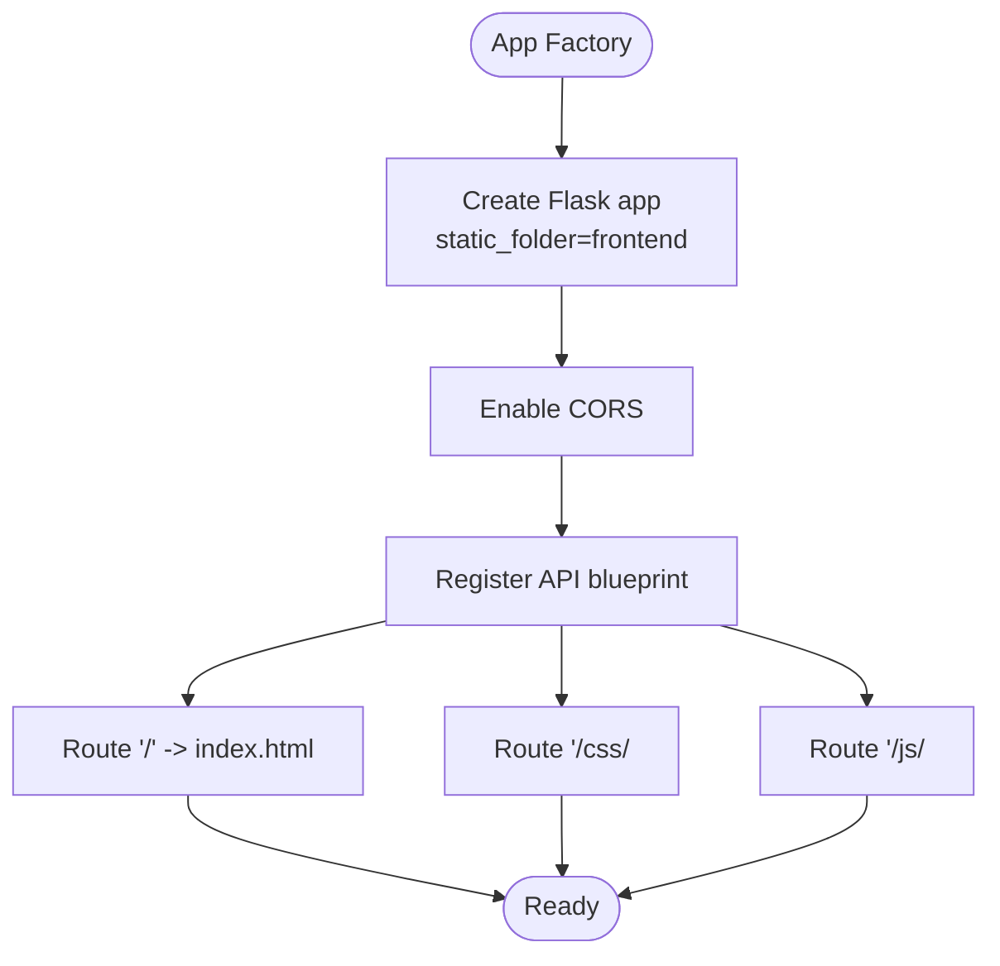
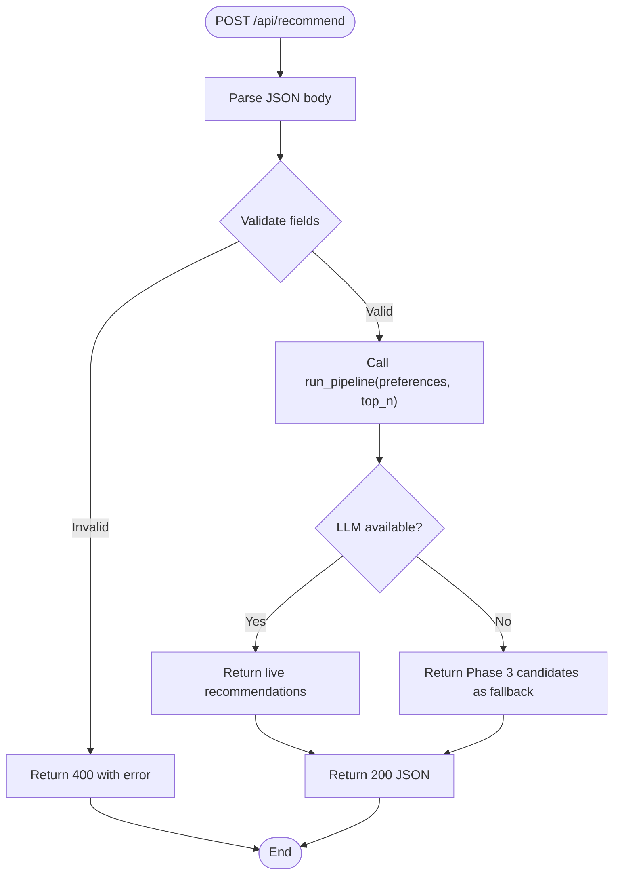
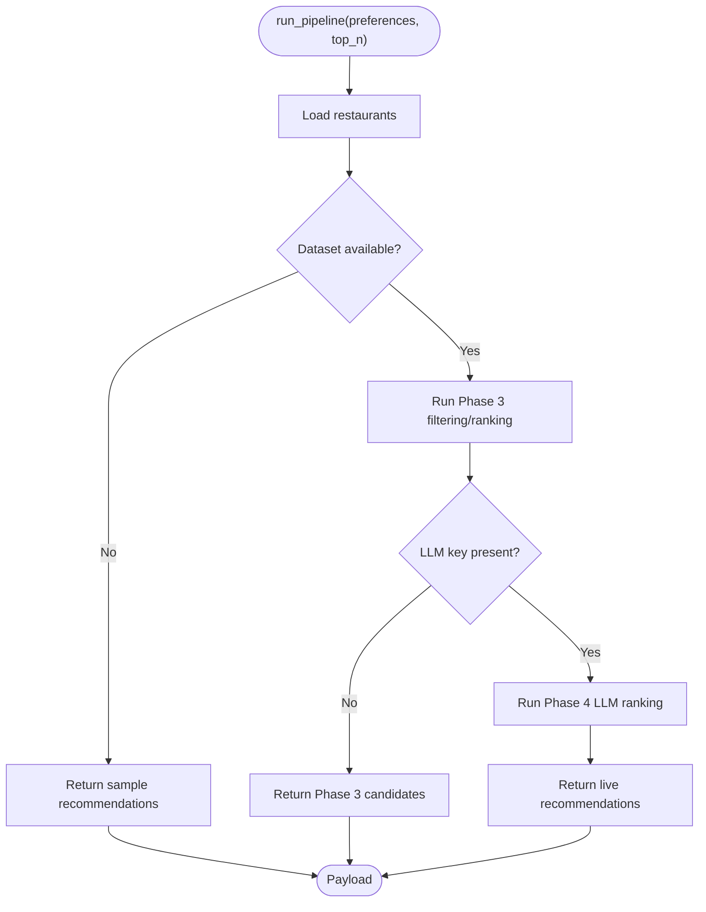
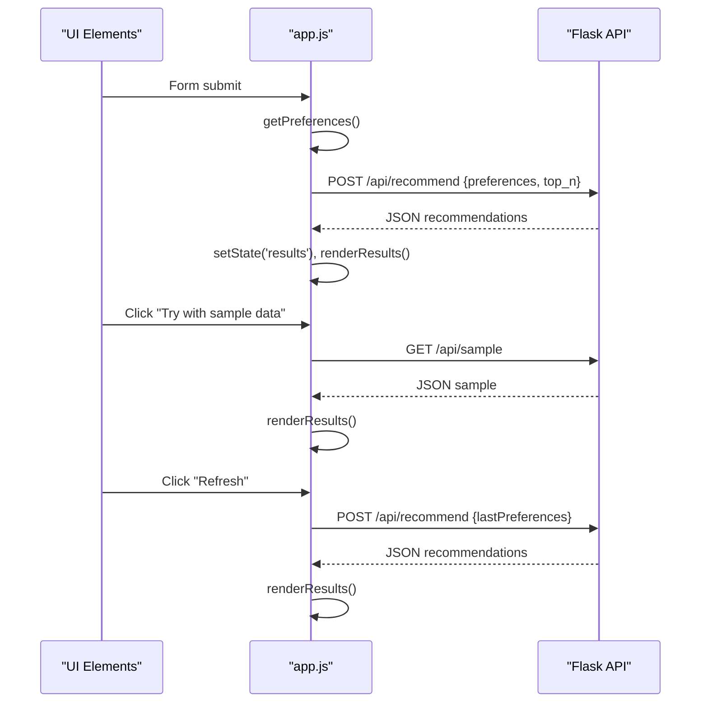
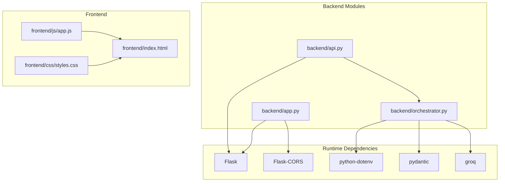

# Integration and Coordination

<cite>
**Referenced Files in This Document**
- [app.py](file://Zomato/architecture/phase_5_response_delivery/backend/app.py)
- [api.py](file://Zomato/architecture/phase_5_response_delivery/backend/api.py)
- [orchestrator.py](file://Zomato/architecture/phase_5_response_delivery/backend/orchestrator.py)
- [__main__.py](file://Zomato/architecture/phase_5_response_delivery/__main__.py)
- [index.html](file://Zomato/architecture/phase_5_response_delivery/frontend/index.html)
- [app.js](file://Zomato/architecture/phase_5_response_delivery/frontend/js/app.js)
- [styles.css](file://Zomato/architecture/phase_5_response_delivery/frontend/css/styles.css)
- [metadata.json](file://Zomato/architecture/phase_5_response_delivery/metadata.json)
- [sample_recommendations.json](file://Zomato/architecture/phase_5_response_delivery/sample_recommendations.json)
- [requirements.txt](file://Zomato/architecture/phase_5_response_delivery/requirements.txt)
</cite>

## Table of Contents
1. [Introduction](#introduction)
2. [Project Structure](#project-structure)
3. [Core Components](#core-components)
4. [Architecture Overview](#architecture-overview)
5. [Detailed Component Analysis](#detailed-component-analysis)
6. [Dependency Analysis](#dependency-analysis)
7. [Performance Considerations](#performance-considerations)
8. [Troubleshooting Guide](#troubleshooting-guide)
9. [Conclusion](#conclusion)
10. [Appendices](#appendices)

## Introduction
This document explains how the Flask backend coordinates with the frontend Single Page Application (SPA) in Phase 5 of the Zomato recommendation system. It details the REST API communication, data flow between orchestrator.py and the frontend JavaScript, state synchronization, routing, static asset serving, and frontend-backend protocols. It also covers configuration options for development and production, CORS policies, asset optimization, debugging, monitoring integration points, performance profiling, and best practices for maintaining separation of concerns.

## Project Structure
Phase 5 organizes the backend and frontend into separate directories under the phase_5_response_delivery package. The backend exposes a REST API and serves the SPA statically. The frontend is a pure client-side application that communicates with the backend via HTTP requests.



**Diagram sources**
- [app.py:14-40](file://Zomato/architecture/phase_5_response_delivery/backend/app.py#L14-L40)
- [api.py:13-84](file://Zomato/architecture/phase_5_response_delivery/backend/api.py#L13-L84)
- [orchestrator.py:112-292](file://Zomato/architecture/phase_5_response_delivery/backend/orchestrator.py#L112-L292)
- [index.html:1-198](file://Zomato/architecture/phase_5_response_delivery/frontend/index.html#L1-L198)
- [app.js:181-278](file://Zomato/architecture/phase_5_response_delivery/frontend/js/app.js#L181-L278)
- [metadata.json:1-196](file://Zomato/architecture/phase_5_response_delivery/metadata.json#L1-L196)
- [sample_recommendations.json:1-53](file://Zomato/architecture/phase_5_response_delivery/sample_recommendations.json#L1-L53)

**Section sources**
- [app.py:14-40](file://Zomato/architecture/phase_5_response_delivery/backend/app.py#L14-L40)
- [index.html:1-198](file://Zomato/architecture/phase_5_response_delivery/frontend/index.html#L1-L198)

## Core Components
- Backend Flask application factory registers the API blueprint and serves the SPA for non-API routes.
- REST API blueprint defines endpoints for health checks, sample data, metadata, and recommendation computation.
- Orchestrator coordinates Phase 3 candidate retrieval and Phase 4 LLM ranking, returning structured recommendation payloads.
- Frontend SPA handles form submission, API calls, rendering, and state transitions.

Key responsibilities:
- Backend: Exposes REST endpoints, validates requests, orchestrates pipeline execution, and returns JSON responses.
- Frontend: Manages UI state, collects preferences, performs fetch calls, renders results, and displays errors.

**Section sources**
- [app.py:14-40](file://Zomato/architecture/phase_5_response_delivery/backend/app.py#L14-L40)
- [api.py:18-84](file://Zomato/architecture/phase_5_response_delivery/backend/api.py#L18-L84)
- [orchestrator.py:112-292](file://Zomato/architecture/phase_5_response_delivery/backend/orchestrator.py#L112-L292)
- [app.js:61-278](file://Zomato/architecture/phase_5_response_delivery/frontend/js/app.js#L61-L278)

## Architecture Overview
The system follows a classic SPA architecture:
- The Flask app serves index.html for the root route and static assets for CSS/JS.
- The frontend SPA makes AJAX requests to backend endpoints.
- The backend orchestrator executes the recommendation pipeline and returns structured JSON.
- The frontend renders recommendations and updates UI state accordingly.



**Diagram sources**
- [app.py:27-40](file://Zomato/architecture/phase_5_response_delivery/backend/app.py#L27-L40)
- [api.py:32-84](file://Zomato/architecture/phase_5_response_delivery/backend/api.py#L32-L84)
- [orchestrator.py:112-292](file://Zomato/architecture/phase_5_response_delivery/backend/orchestrator.py#L112-L292)
- [app.js:181-278](file://Zomato/architecture/phase_5_response_delivery/frontend/js/app.js#L181-L278)

## Detailed Component Analysis

### Backend Application Factory and Routing
- Creates a Flask app with static folder pointing to the frontend directory.
- Enables CORS globally.
- Registers the API blueprint under /api.
- Serves SPA for root and asset routes (/css/<path>, /js/<path>).



**Diagram sources**
- [app.py:14-40](file://Zomato/architecture/phase_5_response_delivery/backend/app.py#L14-L40)

**Section sources**
- [app.py:14-40](file://Zomato/architecture/phase_5_response_delivery/backend/app.py#L14-L40)

### REST API Endpoints
- Health check: GET /api/health
- Sample data: GET /api/sample
- Metadata: GET /api/metadata
- Recommendations: POST /api/recommend with JSON body containing preferences and top_n

Validation and error handling:
- Validates presence and types of required fields.
- Returns structured JSON errors with HTTP status codes.
- Sanitizes and bounds top_n.



**Diagram sources**
- [api.py:41-84](file://Zomato/architecture/phase_5_response_delivery/backend/api.py#L41-L84)
- [orchestrator.py:112-292](file://Zomato/architecture/phase_5_response_delivery/backend/orchestrator.py#L112-L292)

**Section sources**
- [api.py:18-84](file://Zomato/architecture/phase_5_response_delivery/backend/api.py#L18-L84)

### Orchestrator Pipeline
Responsibilities:
- Loads restaurants from either the full dataset or a sample fallback.
- Executes Phase 3 filtering/ranking with deterministic imports.
- Executes Phase 4 LLM ranking if the Groq API key is present; otherwise falls back to Phase 3 results.
- Returns a standardized payload with summary, recommendations, preferences used, and source indicator.

Key behaviors:
- Dynamic imports with module cache invalidation to ensure fresh pipeline runs.
- Graceful degradation: returns sample or Phase 3 results when datasets or LLM are unavailable.
- Normalizes and sanitizes inputs for downstream phases.



**Diagram sources**
- [orchestrator.py:112-292](file://Zomato/architecture/phase_5_response_delivery/backend/orchestrator.py#L112-L292)

**Section sources**
- [orchestrator.py:112-292](file://Zomato/architecture/phase_5_response_delivery/backend/orchestrator.py#L112-L292)

### Frontend SPA Communication and State Management
Frontend responsibilities:
- Collects preferences from the form and converts budget to a categorical string.
- Sends POST /api/recommend with JSON payload.
- Fetches GET /api/metadata on initialization to populate location and cuisine dropdowns.
- Renders skeleton loaders during loading, displays error banners, and shows results with animated cards.
- Maintains lastPreferences to support refresh actions.



**Diagram sources**
- [app.js:61-278](file://Zomato/architecture/phase_5_response_delivery/frontend/js/app.js#L61-L278)
- [api.py:41-84](file://Zomato/architecture/phase_5_response_delivery/backend/api.py#L41-L84)

**Section sources**
- [app.js:61-278](file://Zomato/architecture/phase_5_response_delivery/frontend/js/app.js#L61-L278)
- [index.html:1-198](file://Zomato/architecture/phase_5_response_delivery/frontend/index.html#L1-L198)

### Static Asset Serving and SPA Routing
- The backend serves index.html for the root route and static assets from the frontend directory.
- CSS and JS are served under /css/... and /js/..., enabling local development and production builds.
- SPA routing is handled by the frontend; the backend treats non-API routes as SPA routes.

```mermaid
graph LR
Root["/''] --> Index["index.html"]
CSS["/css/<path>"] --> Styles["styles.css"]
JS["/js/<path>"] --> Script["app.js"]
```

**Diagram sources**
- [app.py:27-40](file://Zomato/architecture/phase_5_response_delivery/backend/app.py#L27-L40)

**Section sources**
- [app.py:27-40](file://Zomato/architecture/phase_5_response_delivery/backend/app.py#L27-L40)
- [styles.css:1-602](file://Zomato/architecture/phase_5_response_delivery/frontend/css/styles.css#L1-L602)

### Data Models and Payloads
Recommendation payload structure:
- summary: Human-readable summary of recommendations.
- recommendations: Array of recommendation objects with rank, restaurant_name, explanation, rating, cost_for_two, cuisine.
- preferences_used: Copy of preferences used for the request.
- source: Indicates origin of data ("live", "sample", "phase3_only").

Metadata payload structure:
- locations: Unique locations extracted from dataset or metadata.json.
- cuisines: Unique cuisines extracted from dataset or metadata.json.

**Section sources**
- [orchestrator.py:259-264](file://Zomato/architecture/phase_5_response_delivery/backend/orchestrator.py#L259-L264)
- [metadata.json:1-196](file://Zomato/architecture/phase_5_response_delivery/metadata.json#L1-L196)

## Dependency Analysis
External dependencies and runtime behavior:
- Flask and Flask-CORS enable cross-origin requests and serve static assets.
- python-dotenv loads environment variables (e.g., GROQ_API_KEY).
- pydantic validates data models for pipeline stages.
- groq SDK is used for LLM calls when available.



**Diagram sources**
- [requirements.txt:1-6](file://Zomato/architecture/phase_5_response_delivery/requirements.txt#L1-L6)
- [app.py:7-20](file://Zomato/architecture/phase_5_response_delivery/backend/app.py#L7-L20)
- [api.py:9-11](file://Zomato/architecture/phase_5_response_delivery/backend/api.py#L9-L11)
- [orchestrator.py:209-213](file://Zomato/architecture/phase_5_response_delivery/backend/orchestrator.py#L209-L213)

**Section sources**
- [requirements.txt:1-6](file://Zomato/architecture/phase_5_response_delivery/requirements.txt#L1-L6)
- [app.py:7-20](file://Zomato/architecture/phase_5_response_delivery/backend/app.py#L7-L20)
- [api.py:9-11](file://Zomato/architecture/phase_5_response_delivery/backend/api.py#L9-L11)
- [orchestrator.py:209-213](file://Zomato/architecture/phase_5_response_delivery/backend/orchestrator.py#L209-L213)

## Performance Considerations
- Request validation and normalization reduce backend overhead and prevent unnecessary pipeline runs.
- Module cache invalidation ensures deterministic imports for each request, avoiding stale cached modules.
- Graceful fallbacks minimize latency spikes when external services are unavailable.
- Frontend skeleton loaders improve perceived performance during network-bound operations.
- Static asset caching and CDN-ready URLs can be implemented in production deployments.

[No sources needed since this section provides general guidance]

## Troubleshooting Guide
Common integration issues and resolutions:
- CORS errors: Ensure Flask-CORS is enabled and requests originate from allowed origins. Verify that the frontend and backend run on compatible ports and hosts.
- Missing GROQ_API_KEY: The orchestrator raises an error when the key is absent; configure the environment variable or rely on fallbacks.
- Empty or invalid preferences: The API validates required fields and returns 400 with an error message; ensure the frontend sends a valid JSON body.
- Dataset not found: The orchestrator falls back to sample data; confirm metadata.json or dataset availability.
- Frontend not rendering results: Check network tab for failed requests, verify endpoint URLs, and inspect error banners in the UI.

Debugging techniques:
- Enable Flask debug mode via CLI arguments for development.
- Inspect browser console for JavaScript errors and network tab for API responses.
- Add logging statements in the backend to trace pipeline execution and exceptions.
- Monitor latency and error rates using the monitoring infrastructure from Phase 6.

**Section sources**
- [app.py:20](file://Zomato/architecture/phase_5_response_delivery/backend/app.py#L20)
- [api.py:56-58](file://Zomato/architecture/phase_5_response_delivery/backend/api.py#L56-L58)
- [orchestrator.py:212-213](file://Zomato/architecture/phase_5_response_delivery/backend/orchestrator.py#L212-L213)
- [app.js:187-205](file://Zomato/architecture/phase_5_response_delivery/frontend/js/app.js#L187-L205)

## Conclusion
Phase 5 integrates a Flask backend with a modern SPA frontend through a clean REST API contract. The backend orchestrator encapsulates pipeline logic and gracefully handles failures, while the frontend manages user interactions and state. The architecture supports development and production configurations, CORS-enabled communication, and scalable static asset delivery. Following the best practices outlined here will help maintain separation of concerns, improve reliability, and enhance user experience.

[No sources needed since this section summarizes without analyzing specific files]

## Appendices

### Configuration Options
- Development vs Production:
  - Development: Use Flask debug mode and local static assets.
  - Production: Serve compiled assets, configure CORS for trusted origins, and secure environment variables.
- CORS policies: Flask-CORS is enabled globally; adjust origins and credentials as needed for production.
- Environment variables: Configure GROQ_API_KEY for LLM ranking; ensure .env is loaded at startup.

**Section sources**
- [__main__.py:17-39](file://Zomato/architecture/phase_5_response_delivery/__main__.py#L17-L39)
- [app.py:20](file://Zomato/architecture/phase_5_response_delivery/backend/app.py#L20)
- [orchestrator.py:209-213](file://Zomato/architecture/phase_5_response_delivery/backend/orchestrator.py#L209-L213)

### Monitoring Integration Points
- Track query volume, latency, and error rates for /api/recommend.
- Log user feedback for recommendations to inform future improvements.
- Integrate analytics logger to capture preferences and outcomes.

**Section sources**
- [orchestrator.py:112-292](file://Zomato/architecture/phase_5_response_delivery/backend/orchestrator.py#L112-L292)

### Best Practices for Separation of Concerns
- Keep frontend stateless and delegate business logic to the backend orchestrator.
- Validate and normalize inputs on the backend; keep frontend UI logic focused on rendering and user interactions.
- Use standardized JSON payloads to decouple frontend and backend versions.
- Implement graceful fallbacks to ensure the UI remains functional even when upstream services fail.

[No sources needed since this section provides general guidance]