# Phase 5: Response Delivery

<cite>
**Referenced Files in This Document**
- [app.py](file://Zomato/architecture/phase_5_response_delivery/backend/app.py)
- [api.py](file://Zomato/architecture/phase_5_response_delivery/backend/api.py)
- [orchestrator.py](file://Zomato/architecture/phase_5_response_delivery/backend/orchestrator.py)
- [__main__.py](file://Zomato/architecture/phase_5_response_delivery/__main__.py)
- [index.html](file://Zomato/architecture/phase_5_response_delivery/frontend/index.html)
- [app.js](file://Zomato/architecture/phase_5_response_delivery/frontend/js/app.js)
- [styles.css](file://Zomato/architecture/phase_5_response_delivery/frontend/css/styles.css)
- [generate_metadata.py](file://Zomato/architecture/phase_5_response_delivery/generate_metadata.py)
- [metadata.json](file://Zomato/architecture/phase_5_response_delivery/metadata.json)
- [sample_recommendations.json](file://Zomato/architecture/phase_5_response_delivery/sample_recommendations.json)
- [requirements.txt](file://Zomato/architecture/phase_5_response_delivery/requirements.txt)
</cite>

## Table of Contents
1. [Introduction](#introduction)
2. [Project Structure](#project-structure)
3. [Core Components](#core-components)
4. [Architecture Overview](#architecture-overview)
5. [Detailed Component Analysis](#detailed-component-analysis)
6. [API Endpoint Reference](#api-endpoint-reference)
7. [Frontend Integration Patterns](#frontend-integration-patterns)
8. [Configuration and Deployment](#configuration-and-deployment)
9. [Security Considerations](#security-considerations)
10. [Performance Optimization](#performance-optimations)
11. [Troubleshooting Guide](#troubleshooting-guide)
12. [Conclusion](#conclusion)

## Introduction

Phase 5 Response Delivery represents the culmination of the Zomato recommendation system, responsible for orchestrating the complete recommendation pipeline and delivering personalized restaurant suggestions to users through an intuitive web interface. This phase integrates the candidate filtering from Phase 3 with the LLM ranking capabilities from Phase 4, providing users with AI-powered, contextually relevant restaurant recommendations.

The system consists of a Flask-based backend that serves both API endpoints and static frontend assets, paired with a modern React-free JavaScript frontend featuring sophisticated UI patterns, real-time feedback, and responsive design. Users can either provide their preferences through an interactive form or use pre-generated sample recommendations to explore the system's capabilities.

## Project Structure

The Phase 5 Response Delivery component follows a clean separation of concerns with distinct backend and frontend directories:

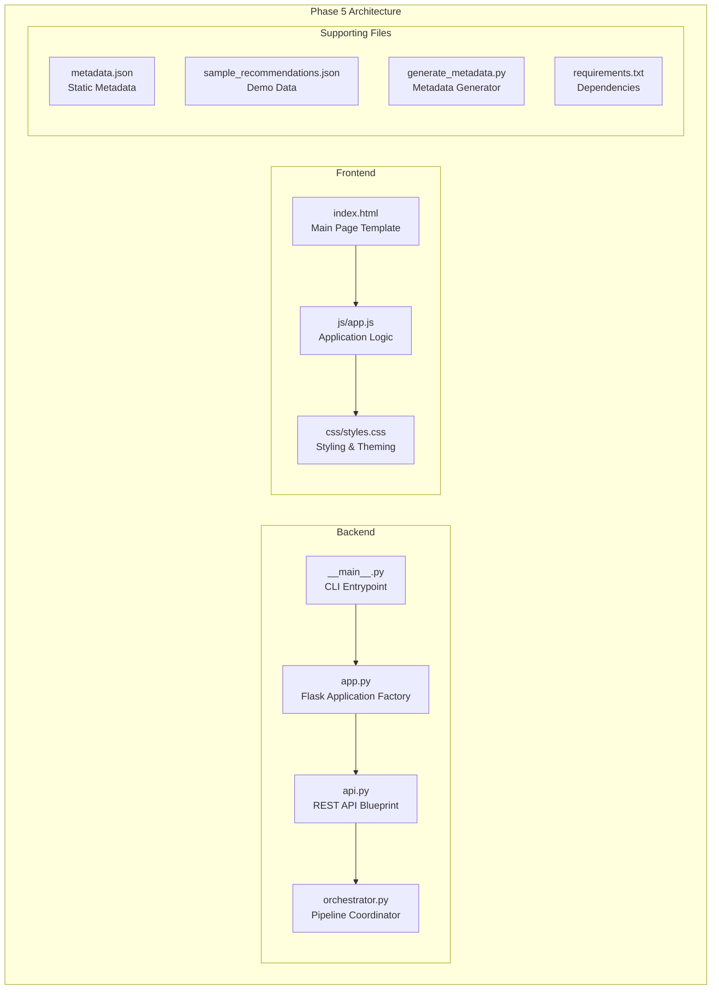

**Diagram sources**
- [app.py:14-41](file://Zomato/architecture/phase_5_response_delivery/backend/app.py#L14-L41)
- [api.py:13-84](file://Zomato/architecture/phase_5_response_delivery/backend/api.py#L13-L84)
- [orchestrator.py:112-292](file://Zomato/architecture/phase_5_response_delivery/backend/orchestrator.py#L112-L292)

**Section sources**
- [app.py:1-41](file://Zomato/architecture/phase_5_response_delivery/backend/app.py#L1-L41)
- [__main__.py:17-44](file://Zomato/architecture/phase_5_response_delivery/__main__.py#L17-L44)

## Core Components

### Backend Application Architecture

The backend employs a modular Flask architecture with clear separation between application creation, API definition, and orchestration logic:

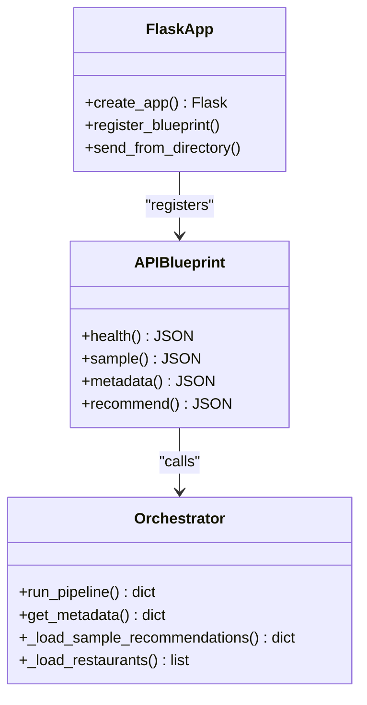

**Diagram sources**
- [app.py:14-41](file://Zomato/architecture/phase_5_response_delivery/backend/app.py#L14-L41)
- [api.py:13-84](file://Zomato/architecture/phase_5_response_delivery/backend/api.py#L13-L84)
- [orchestrator.py:112-292](file://Zomato/architecture/phase_5_response_delivery/backend/orchestrator.py#L112-L292)

### Frontend Application Structure

The frontend implements a sophisticated single-page application pattern with comprehensive state management and real-time feedback:

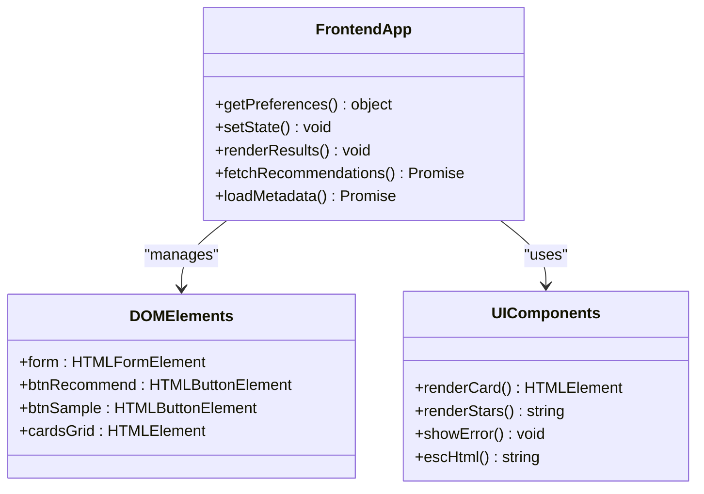

**Diagram sources**
- [app.js:61-278](file://Zomato/architecture/phase_5_response_delivery/frontend/js/app.js#L61-L278)

**Section sources**
- [index.html:1-198](file://Zomato/architecture/phase_5_response_delivery/frontend/index.html#L1-L198)
- [app.js:1-278](file://Zomato/architecture/phase_5_response_delivery/frontend/js/app.js#L1-L278)

## Architecture Overview

The Phase 5 system implements a sophisticated recommendation delivery pipeline that seamlessly integrates multiple phases of the Zomato architecture:

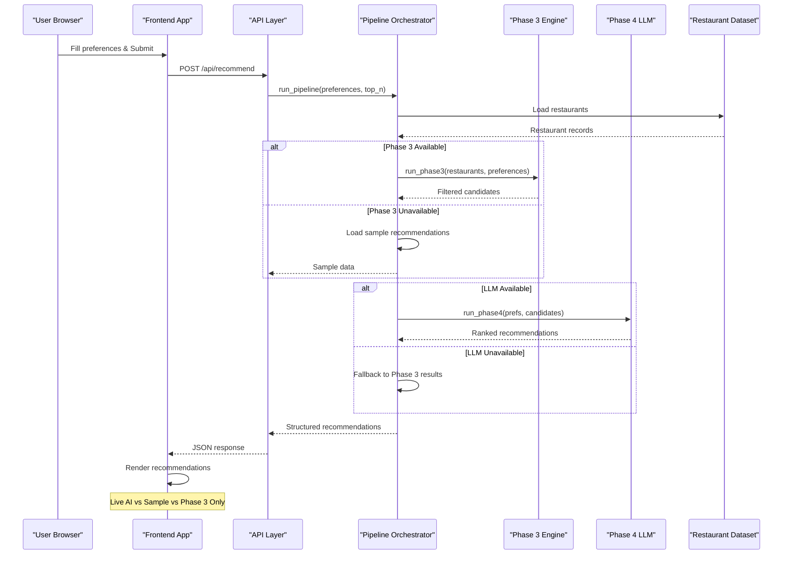

**Diagram sources**
- [api.py:41-84](file://Zomato/architecture/phase_5_response_delivery/backend/api.py#L41-L84)
- [orchestrator.py:112-292](file://Zomato/architecture/phase_5_response_delivery/backend/orchestrator.py#L112-L292)

The architecture demonstrates several key design patterns:

1. **Fallback Strategy**: The system gracefully handles missing datasets or LLM failures by falling back to sample recommendations
2. **Modular Orchestration**: Clear separation between API layer, orchestration logic, and phase-specific implementations
3. **Progressive Enhancement**: Users receive immediate feedback through skeleton loaders and error banners
4. **State Management**: Comprehensive frontend state management for UI transitions and user interactions

**Section sources**
- [orchestrator.py:166-191](file://Zomato/architecture/phase_5_response_delivery/backend/orchestrator.py#L166-L191)
- [app.js:77-90](file://Zomato/architecture/phase_5_response_delivery/frontend/js/app.js#L77-L90)

## Detailed Component Analysis

### Backend Application Factory

The Flask application factory pattern centralizes configuration and dependency management:

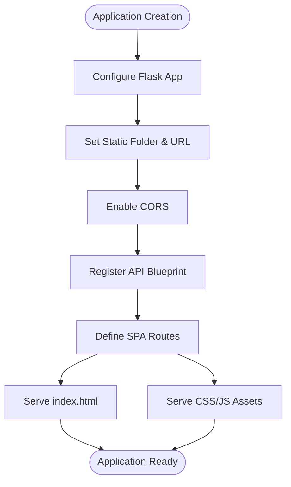

**Diagram sources**
- [app.py:14-41](file://Zomato/architecture/phase_5_response_delivery/backend/app.py#L14-L41)

Key features include:
- **Static Asset Serving**: Direct serving of frontend assets from the `/css` and `/js` routes
- **CORS Configuration**: Universal CORS enabled for cross-origin requests
- **SPA Routing**: Single-page application support with fallback to index.html

**Section sources**
- [app.py:14-41](file://Zomato/architecture/phase_5_response_delivery/backend/app.py#L14-L41)

### API Endpoint Implementation

The API layer provides four primary endpoints with comprehensive error handling:

#### Health Check Endpoint
The `/api/health` endpoint provides system monitoring capabilities:

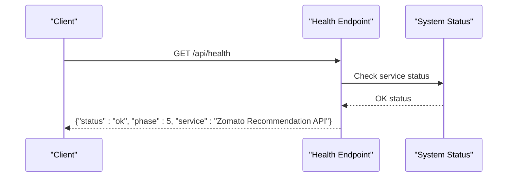

**Diagram sources**
- [api.py:18-21](file://Zomato/architecture/phase_5_response_delivery/backend/api.py#L18-L21)

#### Sample Data Endpoint
The `/api/sample` endpoint serves pre-generated recommendations for demonstration:

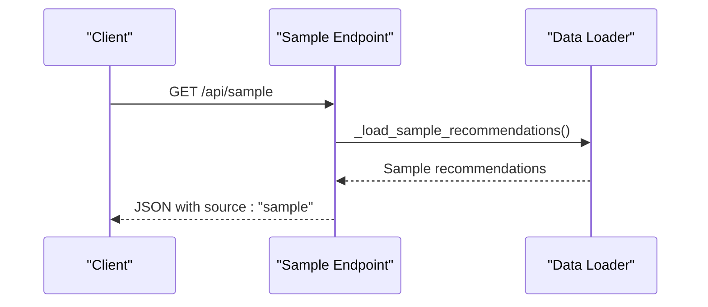

**Diagram sources**
- [api.py:24-29](file://Zomato/architecture/phase_5_response_delivery/backend/api.py#L24-L29)

#### Metadata Endpoint
The `/api/metadata` endpoint provides dynamic configuration data:

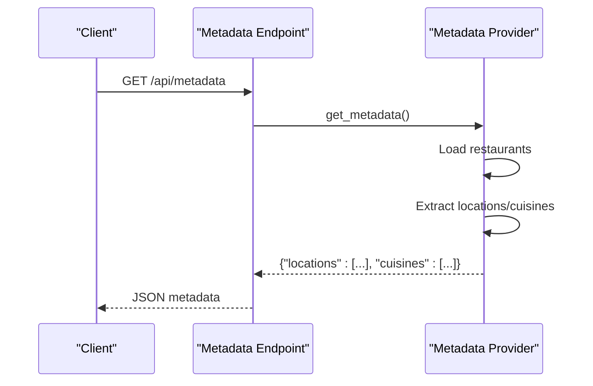

**Diagram sources**
- [api.py:32-39](file://Zomato/architecture/phase_5_response_delivery/backend/api.py#L32-L39)

#### Recommendation Endpoint
The `/api/recommend` endpoint implements the core recommendation logic:

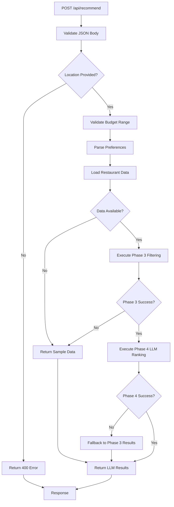

**Diagram sources**
- [api.py:41-84](file://Zomato/architecture/phase_5_response_delivery/backend/api.py#L41-L84)

**Section sources**
- [api.py:18-84](file://Zomato/architecture/phase_5_response_delivery/backend/api.py#L18-L84)

### Pipeline Orchestration

The orchestrator coordinates the complete recommendation pipeline with sophisticated fallback mechanisms:

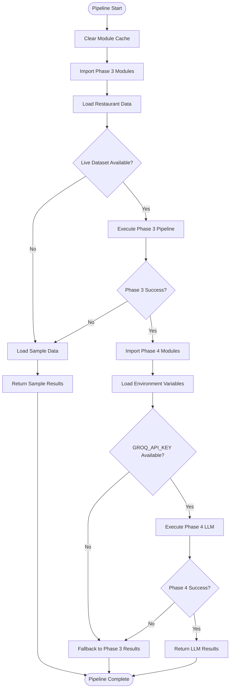

**Diagram sources**
- [orchestrator.py:112-292](file://Zomato/architecture/phase_5_response_delivery/backend/orchestrator.py#L112-L292)

Key orchestration features include:
- **Dynamic Module Loading**: Fresh imports for each request to avoid caching issues
- **Environment Configuration**: Secure API key management through dotenv
- **Comprehensive Error Handling**: Graceful degradation through multiple fallback strategies
- **Flexible Data Sources**: Support for both live datasets and sample data

**Section sources**
- [orchestrator.py:112-292](file://Zomato/architecture/phase_5_response_delivery/backend/orchestrator.py#L112-L292)

### Frontend Application Logic

The frontend implements sophisticated state management and user interaction patterns:

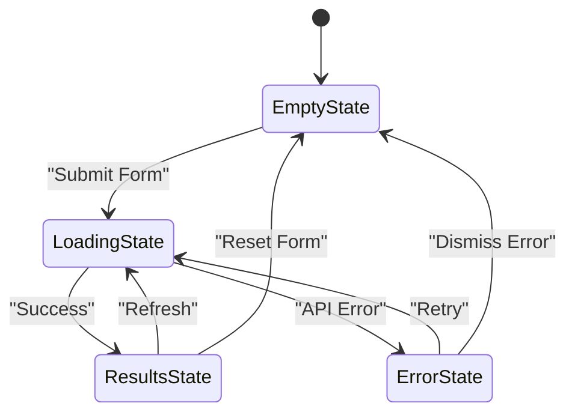

**Diagram sources**
- [app.js:77-90](file://Zomato/architecture/phase_5_response_delivery/frontend/js/app.js#L77-L90)

#### Interactive Form Features
The frontend provides comprehensive user interaction capabilities:

- **Real-time Budget Slider**: Dynamic cost display with gradient visualization
- **Rating Slider**: Live star rating preview with percentage-based styling
- **Dynamic Dropdowns**: Auto-populated location and cuisine options from metadata
- **Optional Preferences**: Comma-separated text input with automatic parsing

#### Recommendation Rendering
The system implements sophisticated card-based recommendation display:

- **Animated Entry**: Staggered card animations for visual appeal
- **Rank Highlighting**: Special styling for #1 ranked recommendations
- **Star Rating System**: Dynamic star rendering with fractional ratings
- **Source Indicators**: Visual badges distinguishing live AI vs sample vs Phase 3 results

**Section sources**
- [app.js:61-278](file://Zomato/architecture/phase_5_response_delivery/frontend/js/app.js#L61-L278)
- [index.html:140-188](file://Zomato/architecture/phase_5_response_delivery/frontend/index.html#L140-L188)

## API Endpoint Reference

### Health Check Endpoint
- **Method**: GET
- **Path**: `/api/health`
- **Purpose**: System health monitoring
- **Response**: JSON with status, phase, and service information
- **Example Response**: `{"status": "ok", "phase": 5, "service": "Zomato Recommendation API"}`

### Sample Data Endpoint
- **Method**: GET
- **Path**: `/api/sample`
- **Purpose**: Demonstration data for frontend testing
- **Response**: Pre-generated recommendations with source indicator
- **Headers**: Content-Type: application/json

### Metadata Endpoint
- **Method**: GET
- **Path**: `/api/metadata`
- **Purpose**: Dynamic configuration data for dropdowns
- **Response**: JSON with locations and cuisines arrays
- **Error Handling**: Returns error details on failure

### Recommendation Endpoint
- **Method**: POST
- **Path**: `/api/recommend`
- **Purpose**: Generate personalized restaurant recommendations
- **Request Body**:
  ```json
  {
    "location": "Bangalore",
    "budget": "medium",
    "cuisines": ["Italian", "Chinese"],
    "min_rating": 4.0,
    "optional_preferences": ["quick-service"],
    "top_n": 5
  }
  ```
- **Response**: Structured recommendations with explanation rationale
- **Validation**: Comprehensive input validation with specific error messages

**Section sources**
- [api.py:18-84](file://Zomato/architecture/phase_5_response_delivery/backend/api.py#L18-L84)

## Frontend Integration Patterns

### State Management Architecture
The frontend implements a comprehensive state management system:

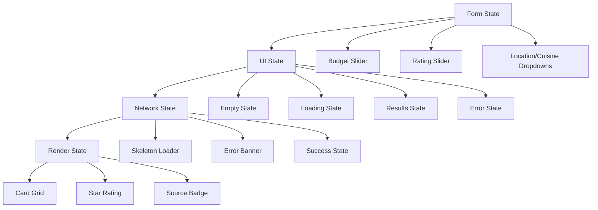

**Diagram sources**
- [app.js:77-179](file://Zomato/architecture/phase_5_response_delivery/frontend/js/app.js#L77-L179)

### Real-time User Feedback
The system provides comprehensive user feedback through multiple UI states:

- **Empty State**: Initial state with welcome message and instructions
- **Loading State**: Skeleton loaders with animated shimmer effects
- **Results State**: Structured recommendation cards with detailed explanations
- **Error State**: Comprehensive error banners with dismiss functionality

### Responsive Design Implementation
The frontend implements a mobile-first responsive design:

- **Desktop Layout**: Two-column layout with preference panel and results
- **Mobile Adaptation**: Single-column layout with stacked elements
- **Touch-Friendly Controls**: Large touch targets for sliders and buttons
- **Performance Optimizations**: Efficient CSS animations and minimal JavaScript overhead

**Section sources**
- [styles.css:587-602](file://Zomato/architecture/phase_5_response_delivery/frontend/css/styles.css#L587-L602)
- [app.js:182-205](file://Zomato/architecture/phase_5_response_delivery/frontend/js/app.js#L182-L205)

## Configuration and Deployment

### Environment Configuration
The system supports flexible deployment through environment variables:

- **Port Configuration**: Default port 5004 with CLI override support
- **Host Binding**: Configurable host binding for development and production
- **Debug Mode**: Optional debug mode for development environments
- **API Keys**: Secure LLM API key management through dotenv

### Metadata Generation
The system supports both static and dynamic metadata generation:

- **Static Metadata**: Pre-generated JSON file for immediate deployment
- **Dynamic Generation**: Script to extract locations and cuisines from live datasets
- **Fallback Behavior**: Automatic fallback when live datasets are unavailable

### Deployment Options
The system supports multiple deployment scenarios:

- **Development**: Local Flask development server with hot reloading
- **Production**: Standalone deployment with static asset serving
- **Containerization**: Docker-ready configuration for containerized deployments

**Section sources**
- [__main__.py:17-44](file://Zomato/architecture/phase_5_response_delivery/__main__.py#L17-L44)
- [generate_metadata.py:1-43](file://Zomato/architecture/phase_5_response_delivery/generate_metadata.py#L1-L43)

## Security Considerations

### CORS Configuration
The application enables Cross-Origin Resource Sharing for development and testing scenarios:

- **Universal CORS**: Enabled for all origins during development
- **Production Hardening**: Consider restricting to specific origins in production
- **Security Implications**: Evaluate CORS policy based on deployment environment

### Input Validation
The API implements comprehensive input validation:

- **JSON Body Validation**: Ensures request bodies are valid JSON
- **Required Field Validation**: Validates presence of essential parameters
- **Type and Range Validation**: Validates data types and acceptable ranges
- **Error Reporting**: Provides specific error messages for validation failures

### Error Handling
The system implements robust error handling:

- **Graceful Degradation**: Fallback to sample data when LLM is unavailable
- **Structured Error Responses**: Consistent error response format
- **Logging Integration**: Comprehensive error logging for debugging

**Section sources**
- [api.py:56-83](file://Zomato/architecture/phase_5_response_delivery/backend/api.py#L56-L83)
- [orchestrator.py:266-291](file://Zomato/architecture/phase_5_response_delivery/backend/orchestrator.py#L266-L291)

## Performance Optimizations

### Frontend Performance
The frontend implements several performance optimizations:

- **CSS Animations**: Hardware-accelerated animations for smooth transitions
- **Lazy Loading**: Skeleton loaders prevent layout shifts during loading
- **Efficient DOM Updates**: Minimal DOM manipulation through template rendering
- **Responsive Images**: Optimized image loading for different screen sizes

### Backend Performance
The backend includes strategic performance considerations:

- **Fresh Module Imports**: Dynamic imports for each request to avoid memory leaks
- **Caching Strategy**: No persistent caching to ensure fresh recommendations
- **Resource Management**: Proper cleanup of imported modules and environment variables

### API Performance
The API layer supports high-performance operation:

- **Minimal Dependencies**: Lightweight Flask implementation with essential extensions
- **Efficient JSON Processing**: Direct JSON serialization without unnecessary transformations
- **Connection Handling**: Standard Flask connection handling suitable for small-scale deployment

**Section sources**
- [app.py:20](file://Zomato/architecture/phase_5_response_delivery/backend/app.py#L20)
- [orchestrator.py:132-134](file://Zomato/architecture/phase_5_response_delivery/backend/orchestrator.py#L132-L134)

## Troubleshooting Guide

### Common Issues and Solutions

#### API Endpoint Failures
- **Health Check Failing**: Verify Flask application startup and port availability
- **Recommendation Endpoint Errors**: Check LLM API key configuration and network connectivity
- **Metadata Endpoint Issues**: Ensure restaurant dataset is available and properly formatted

#### Frontend Integration Problems
- **Form Not Submitting**: Verify JavaScript is enabled and network requests are not blocked
- **Recommendations Not Loading**: Check browser developer console for JavaScript errors
- **Styling Issues**: Ensure CSS files are loading correctly and not blocked by CSP

#### Performance Issues
- **Slow Response Times**: Monitor LLM API latency and consider rate limiting
- **Memory Leaks**: Verify proper module cleanup in production environments
- **Browser Compatibility**: Test across different browsers and versions

### Debugging Strategies
The system provides comprehensive debugging capabilities:

- **Console Logging**: Extensive logging throughout the recommendation pipeline
- **Error Boundaries**: Comprehensive error handling with user-friendly messages
- **State Inspection**: Easy-to-read state management for debugging UI issues

**Section sources**
- [app.js:187-205](file://Zomato/architecture/phase_5_response_delivery/frontend/js/app.js#L187-L205)
- [orchestrator.py:163-164](file://Zomato/architecture/phase_5_response_delivery/backend/orchestrator.py#L163-L164)

## Conclusion

Phase 5 Response Delivery represents a sophisticated integration of backend orchestration and frontend user experience, delivering a production-ready recommendation system that gracefully handles various operational conditions. The system's modular architecture, comprehensive error handling, and responsive design create a robust foundation for restaurant recommendation delivery.

Key strengths of the implementation include:

- **Robust Fallback Mechanisms**: Multiple layers of fallback ensure users always receive meaningful results
- **Clean Separation of Concerns**: Clear boundaries between API, orchestration, and presentation layers
- **User-Centric Design**: Sophisticated UI patterns provide immediate feedback and engaging interactions
- **Production-Ready Architecture**: Well-structured codebase suitable for extension and customization

The system provides an excellent foundation for extending recommendation capabilities, integrating additional data sources, or implementing advanced personalization features while maintaining reliability and user experience excellence.