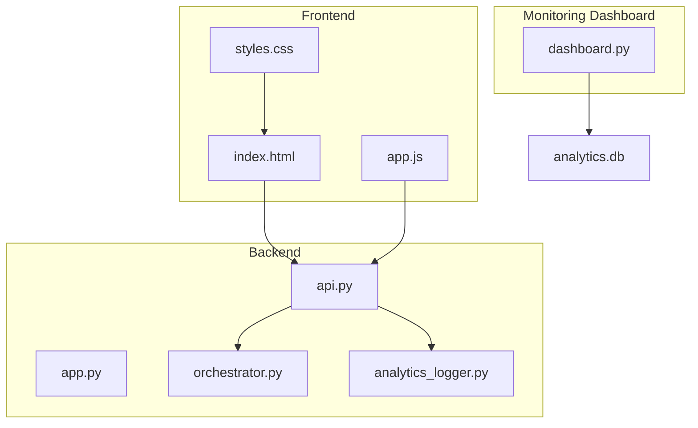
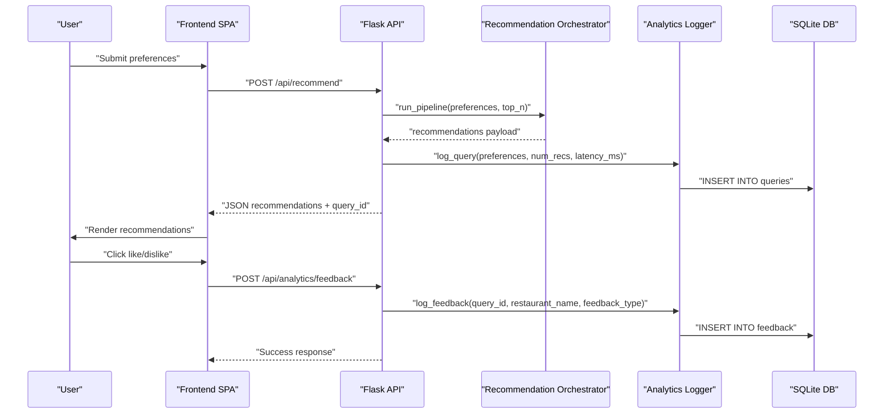
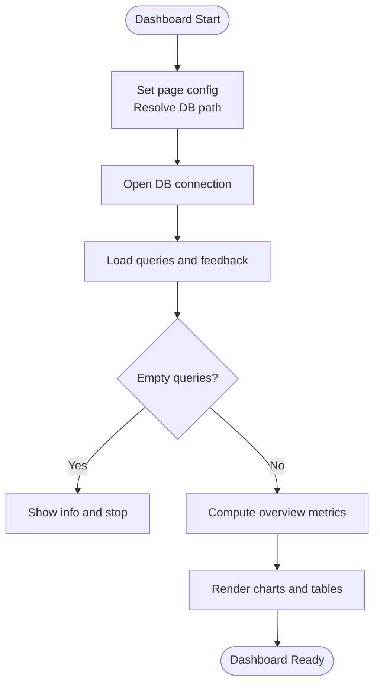
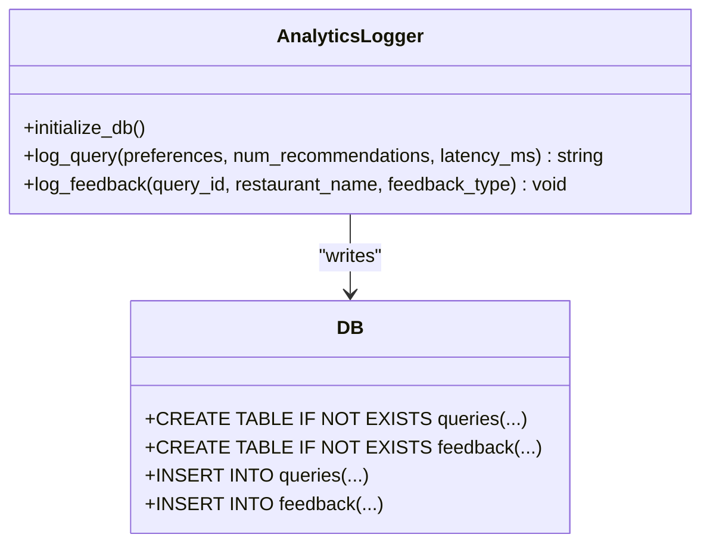
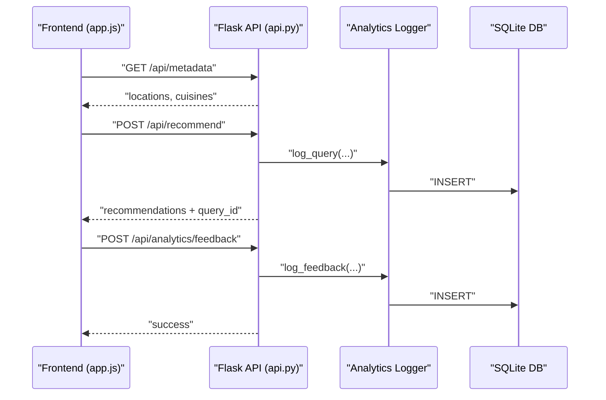
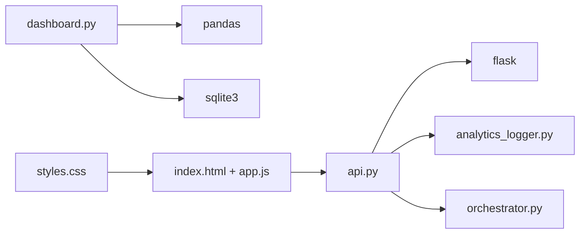

# Analytics Dashboard

<cite>
**Referenced Files in This Document**
- [dashboard.py](file://architecture/phase_6_monitoring/dashboard/dashboard.py)
- [analytics_logger.py](file://architecture/phase_6_monitoring/backend/analytics_logger.py)
- [api.py](file://architecture/phase_6_monitoring/backend/api.py)
- [app.py](file://architecture/phase_6_monitoring/backend/app.py)
- [orchestrator.py](file://architecture/phase_6_monitoring/backend/orchestrator.py)
- [index.html](file://architecture/phase_6_monitoring/frontend/index.html)
- [app.js](file://architecture/phase_6_monitoring/frontend/js/app.js)
- [styles.css](file://architecture/phase_6_monitoring/frontend/css/styles.css)
- [__main__.py](file://architecture/phase_6_monitoring/__main__.py)
- [.env](file://architecture/phase_6_monitoring/.env)
</cite>

## Table of Contents
1. [Introduction](#introduction)
2. [Project Structure](#project-structure)
3. [Core Components](#core-components)
4. [Architecture Overview](#architecture-overview)
5. [Detailed Component Analysis](#detailed-component-analysis)
6. [Dependency Analysis](#dependency-analysis)
7. [Performance Considerations](#performance-considerations)
8. [Troubleshooting Guide](#troubleshooting-guide)
9. [Conclusion](#conclusion)
10. [Appendices](#appendices)

## Introduction
This document describes the Analytics Dashboard implementation for Phase 6 of the Zomato AI Recommendation System. It focuses on the Streamlit-based dashboard that visualizes analytics data, the data rendering logic, and interactive chart generation. It also explains the dashboard layout, widget organization, real-time data updates, supported chart types, filtering capabilities, export functionality, integration with the analytics database, data refresh cycles, performance optimization for large datasets, responsive design considerations, accessibility compliance, cross-browser compatibility, and customization options for themes, metrics, and alerts.

## Project Structure
The Analytics Dashboard resides under the monitoring phase and integrates with the backend analytics logger and the frontend recommendation app. The key elements are:
- Streamlit dashboard script that loads analytics data from a local SQLite database and renders metrics and charts.
- Backend analytics logger that persists queries and feedback into the analytics database.
- Flask API that serves the frontend and exposes endpoints for logging feedback.
- Frontend SPA that collects user preferences, requests recommendations, and submits feedback.
- CSS and JS assets that provide responsive design and interactivity.

**Diagram sources**
- [dashboard.py:1-102](file://architecture/phase_6_monitoring/dashboard/dashboard.py#L1-L102)
- [api.py:1-119](file://architecture/phase_6_monitoring/backend/api.py#L1-L119)
- [app.py:1-41](file://architecture/phase_6_monitoring/backend/app.py#L1-L41)
- [orchestrator.py:1-303](file://architecture/phase_6_monitoring/backend/orchestrator.py#L1-L303)
- [analytics_logger.py:1-87](file://architecture/phase_6_monitoring/backend/analytics_logger.py#L1-L87)
- [index.html:1-198](file://architecture/phase_6_monitoring/frontend/index.html#L1-L198)
- [app.js:1-324](file://architecture/phase_6_monitoring/frontend/js/app.js#L1-L324)
- [styles.css:1-646](file://architecture/phase_6_monitoring/frontend/css/styles.css#L1-L646)

**Section sources**
- [dashboard.py:1-102](file://architecture/phase_6_monitoring/dashboard/dashboard.py#L1-L102)
- [api.py:1-119](file://architecture/phase_6_monitoring/backend/api.py#L1-L119)
- [app.py:1-41](file://architecture/phase_6_monitoring/backend/app.py#L1-L41)
- [orchestrator.py:1-303](file://architecture/phase_6_monitoring/backend/orchestrator.py#L1-L303)
- [analytics_logger.py:1-87](file://architecture/phase_6_monitoring/backend/analytics_logger.py#L1-L87)
- [index.html:1-198](file://architecture/phase_6_monitoring/frontend/index.html#L1-L198)
- [app.js:1-324](file://architecture/phase_6_monitoring/frontend/js/app.js#L1-L324)
- [styles.css:1-646](file://architecture/phase_6_monitoring/frontend/css/styles.css#L1-L646)

## Core Components
- Analytics Dashboard (Streamlit): Loads analytics data from the SQLite database, computes overview metrics, and renders time-series and categorical visualizations.
- Analytics Logger (Backend): Initializes the analytics database and persists queries and feedback entries.
- Flask API: Serves the frontend and exposes endpoints for feedback logging.
- Frontend SPA: Collects preferences, requests recommendations, and submits feedback to the backend.
- Styles and Interactions: CSS and JS provide responsive layouts, animations, and user interactions.

Key responsibilities:
- Dashboard: Metrics display, time-series charting, categorical bar charting, and tabular presentation of problematic queries.
- Logger: Ensures database tables exist and inserts query and feedback records.
- API: Validates inputs, runs the recommendation pipeline, logs queries, and accepts feedback submissions.
- Frontend: Renders preference forms, handles user actions, and communicates with the backend.

**Section sources**
- [dashboard.py:17-102](file://architecture/phase_6_monitoring/dashboard/dashboard.py#L17-L102)
- [analytics_logger.py:13-87](file://architecture/phase_6_monitoring/backend/analytics_logger.py#L13-L87)
- [api.py:43-119](file://architecture/phase_6_monitoring/backend/api.py#L43-L119)
- [index.html:1-198](file://architecture/phase_6_monitoring/frontend/index.html#L1-L198)
- [app.js:167-195](file://architecture/phase_6_monitoring/frontend/js/app.js#L167-L195)

## Architecture Overview
The dashboard reads analytics data from a local SQLite database. The backend analytics logger writes to this database upon user interactions. The frontend SPA sends requests to the backend API and receives recommendations, while also submitting feedback that is persisted via the logger.

**Diagram sources**
- [api.py:43-119](file://architecture/phase_6_monitoring/backend/api.py#L43-L119)
- [orchestrator.py:112-303](file://architecture/phase_6_monitoring/backend/orchestrator.py#L112-L303)
- [analytics_logger.py:46-87](file://architecture/phase_6_monitoring/backend/analytics_logger.py#L46-L87)
- [app.js:167-195](file://architecture/phase_6_monitoring/frontend/js/app.js#L167-L195)

## Detailed Component Analysis

### Dashboard (Streamlit) Analysis
The dashboard script performs:
- Page configuration and database path resolution.
- Connection validation and error handling.
- Data loading via SQL queries for queries and feedback tables.
- Overview metrics computation: total queries, average latency, total feedback, and like ratio.
- Visualization rendering: line chart for hourly queries and bar chart for feedback distribution.
- Tabular display of problematic recommendations (dislikes) joined with query details.
- Recent queries listing.

**Diagram sources**
- [dashboard.py:7-102](file://architecture/phase_6_monitoring/dashboard/dashboard.py#L7-L102)

**Section sources**
- [dashboard.py:7-102](file://architecture/phase_6_monitoring/dashboard/dashboard.py#L7-L102)

### Analytics Logger Analysis
The logger initializes the analytics database and ensures required tables exist. It provides functions to:
- Initialize tables for queries and feedback.
- Log a query with preferences, number of recommendations, and latency.
- Log user feedback for a specific restaurant recommendation.

**Diagram sources**
- [analytics_logger.py:13-87](file://architecture/phase_6_monitoring/backend/analytics_logger.py#L13-L87)

**Section sources**
- [analytics_logger.py:13-87](file://architecture/phase_6_monitoring/backend/analytics_logger.py#L13-L87)

### API and Frontend Interaction Analysis
The frontend SPA interacts with the backend API to:
- Fetch metadata for locations and cuisines.
- Submit preferences and receive recommendations.
- Submit feedback for recommendations.

**Diagram sources**
- [app.js:294-324](file://architecture/phase_6_monitoring/frontend/js/app.js#L294-L324)
- [api.py:43-119](file://architecture/phase_6_monitoring/backend/api.py#L43-L119)
- [analytics_logger.py:46-87](file://architecture/phase_6_monitoring/backend/analytics_logger.py#L46-L87)

**Section sources**
- [app.js:294-324](file://architecture/phase_6_monitoring/frontend/js/app.js#L294-L324)
- [api.py:43-119](file://architecture/phase_6_monitoring/backend/api.py#L43-L119)
- [analytics_logger.py:46-87](file://architecture/phase_6_monitoring/backend/analytics_logger.py#L46-L87)

### Visualization Components and Rendering Logic
The dashboard uses Streamlit’s built-in chart widgets:
- Line chart for hourly query counts over time.
- Bar chart for feedback type distribution.
- DataFrames for displaying recent queries and problematic recommendations.

Rendering logic:
- Convert timestamps to datetime and group by floored hour for time-series.
- Compute value counts for feedback categories.
- Merge feedback with queries to show context for dislikes.
- Present dataframes with container width for responsiveness.

Supported chart types:
- Line chart (time-series trend).
- Bar chart (categorical distribution).

Filtering capabilities:
- Dashboard currently aggregates all data; no explicit filters are applied in the dashboard code.

Export functionality:
- No explicit export buttons are present in the dashboard code.

**Section sources**
- [dashboard.py:39-102](file://architecture/phase_6_monitoring/dashboard/dashboard.py#L39-L102)

### Real-Time Data Updates and Refresh Cycles
- The dashboard script reads analytics data on page load and does not implement periodic refreshes.
- The frontend submits feedback asynchronously; the dashboard would require manual reload to reflect new data.
- There is no polling mechanism in the dashboard for continuous updates.

**Section sources**
- [dashboard.py:23-35](file://architecture/phase_6_monitoring/dashboard/dashboard.py#L23-L35)
- [app.js:167-195](file://architecture/phase_6_monitoring/frontend/js/app.js#L167-L195)

### Responsive Design, Accessibility, and Cross-Browser Compatibility
Responsive design:
- The frontend CSS defines media queries for tablet and mobile breakpoints to adjust layout and spacing.
- The Streamlit dashboard uses a wide page configuration suitable for desktop viewing.

Accessibility:
- The frontend includes ARIA attributes for feedback buttons and error banners.
- The Streamlit dashboard leverages Streamlit’s internal accessibility features for widgets.

Cross-browser compatibility:
- The frontend uses widely supported CSS and JavaScript features with no browser-specific extensions.

**Section sources**
- [styles.css:630-646](file://architecture/phase_6_monitoring/frontend/css/styles.css#L630-L646)
- [app.js:160-162](file://architecture/phase_6_monitoring/frontend/js/app.js#L160-L162)

### Customization Options
Dashboard themes and metrics:
- The dashboard uses Streamlit’s default theme; no custom theme toggles are implemented.
- Metrics displayed include total queries, average latency, total feedback, and like ratio.

Visualization configurations:
- Chart types are fixed to line and bar charts; no dynamic chart type selection is present.

Alert configurations:
- The dashboard does not implement custom alert notifications; it relies on Streamlit’s built-in error/info messages.

**Section sources**
- [dashboard.py:47-51](file://architecture/phase_6_monitoring/dashboard/dashboard.py#L47-L51)
- [dashboard.py:61-73](file://architecture/phase_6_monitoring/dashboard/dashboard.py#L61-L73)

## Dependency Analysis
The dashboard depends on:
- Streamlit for UI and charting.
- Pandas for data manipulation and aggregation.
- SQLite for local analytics storage.

The backend depends on:
- Flask for serving the API and frontend.
- The analytics logger for persistence.
- The orchestrator for recommendation processing.

**Diagram sources**
- [dashboard.py:1-6](file://architecture/phase_6_monitoring/dashboard/dashboard.py#L1-L6)
- [api.py:10-13](file://architecture/phase_6_monitoring/backend/api.py#L10-L13)
- [app.py:7-20](file://architecture/phase_6_monitoring/backend/app.py#L7-L20)
- [index.html:11](file://architecture/phase_6_monitoring/frontend/index.html#L11)
- [app.js:1-324](file://architecture/phase_6_monitoring/frontend/js/app.js#L1-L324)
- [styles.css:1-646](file://architecture/phase_6_monitoring/frontend/css/styles.css#L1-L646)

**Section sources**
- [dashboard.py:1-6](file://architecture/phase_6_monitoring/dashboard/dashboard.py#L1-L6)
- [api.py:10-13](file://architecture/phase_6_monitoring/backend/api.py#L10-L13)
- [app.py:7-20](file://architecture/phase_6_monitoring/backend/app.py#L7-L20)

## Performance Considerations
- Data volume: The dashboard loads entire tables into memory for aggregation. For large datasets, consider:
  - Pagination or chunked retrieval.
  - Server-side aggregation and downsampling.
  - Indexing on timestamp and foreign keys in the analytics database.
- Chart rendering: Large time-series may benefit from pre-aggregated buckets or client-side virtualization.
- Database I/O: Ensure the analytics database is on fast storage; avoid concurrent heavy writes during dashboard refresh.
- Frontend responsiveness: Debounce frequent user actions and avoid unnecessary re-renders.

[No sources needed since this section provides general guidance]

## Troubleshooting Guide
Common issues and resolutions:
- Database not found: The dashboard checks for the presence of the analytics database and stops with an informative error if missing. Ensure the backend has been executed and analytics data exists.
- Empty queries: If no queries are logged, the dashboard informs the user and halts further rendering.
- Data loading errors: The dashboard catches exceptions during SQL reads and displays an error message.
- Feedback submission failures: The frontend disables feedback buttons temporarily and shows an error banner on failure.

**Section sources**
- [dashboard.py:11-15](file://architecture/phase_6_monitoring/dashboard/dashboard.py#L11-L15)
- [dashboard.py:23-30](file://architecture/phase_6_monitoring/dashboard/dashboard.py#L23-L30)
- [app.js:167-195](file://architecture/phase_6_monitoring/frontend/js/app.js#L167-L195)

## Conclusion
The Analytics Dashboard provides a concise overview of user queries and feedback, with time-series and categorical visualizations. It integrates tightly with the backend analytics logger and the frontend recommendation app. While the current implementation focuses on simplicity and readability, enhancements such as filtering, export, and automatic refresh cycles can improve usability for operational monitoring.

[No sources needed since this section summarizes without analyzing specific files]

## Appendices

### Supported Chart Types
- Line chart: Hourly query trends.
- Bar chart: Feedback distribution.

**Section sources**
- [dashboard.py:61-73](file://architecture/phase_6_monitoring/dashboard/dashboard.py#L61-L73)

### Filtering Capabilities
- The dashboard aggregates all data without explicit filters. To add filters, extend the dashboard to accept date ranges, location filters, or feedback types and re-run SQL queries accordingly.

**Section sources**
- [dashboard.py:25-26](file://architecture/phase_6_monitoring/dashboard/dashboard.py#L25-L26)

### Export Functionality
- Not implemented in the dashboard. To add export, integrate with pandas exporters or external libraries to download charts and tables as images or CSV.

**Section sources**
- [dashboard.py:83-91](file://architecture/phase_6_monitoring/dashboard/dashboard.py#L83-L91)

### Integration with Analytics Database
- The dashboard connects to a local SQLite database and executes SQL queries to load analytics data. Ensure the database file exists and is readable by the dashboard process.

**Section sources**
- [dashboard.py:9](file://architecture/phase_6_monitoring/dashboard/dashboard.py#L9)
- [dashboard.py:24-27](file://architecture/phase_6_monitoring/dashboard/dashboard.py#L24-L27)

### Data Refresh Cycles
- Manual refresh: Reload the dashboard page to reflect new analytics data.
- Automatic refresh: Not implemented. Consider adding a timer and a refresh button to periodically reload data.

**Section sources**
- [dashboard.py:23-35](file://architecture/phase_6_monitoring/dashboard/dashboard.py#L23-L35)

### Performance Optimization for Large Datasets
- Pre-aggregate data at ingestion time.
- Use indexed columns for time-series queries.
- Paginate or limit the number of rows returned for recent queries.

**Section sources**
- [analytics_logger.py:18-41](file://architecture/phase_6_monitoring/backend/analytics_logger.py#L18-L41)

### Responsive Design Considerations
- Frontend CSS includes responsive breakpoints for tablets and phones.
- Streamlit’s wide layout is suitable for desktop dashboards.

**Section sources**
- [styles.css:630-646](file://architecture/phase_6_monitoring/frontend/css/styles.css#L630-L646)
- [dashboard.py:7](file://architecture/phase_6_monitoring/dashboard/dashboard.py#L7)

### Accessibility Compliance
- Frontend uses ARIA attributes for feedback controls and error banners.
- Streamlit widgets provide built-in accessibility features.

**Section sources**
- [app.js:160-162](file://architecture/phase_6_monitoring/frontend/js/app.js#L160-L162)

### Cross-Browser Compatibility
- Uses standard CSS and JavaScript features; no browser-specific extensions.

**Section sources**
- [styles.css:1-646](file://architecture/phase_6_monitoring/frontend/css/styles.css#L1-L646)

### Customization Options
- Theme: Use Streamlit’s theming configuration to customize colors and fonts.
- Metrics: Add KPIs such as NPS, conversion rates, or error rates.
- Alerts: Integrate with external alerting systems or add local thresholds.

**Section sources**
- [dashboard.py:47-51](file://architecture/phase_6_monitoring/dashboard/dashboard.py#L47-L51)