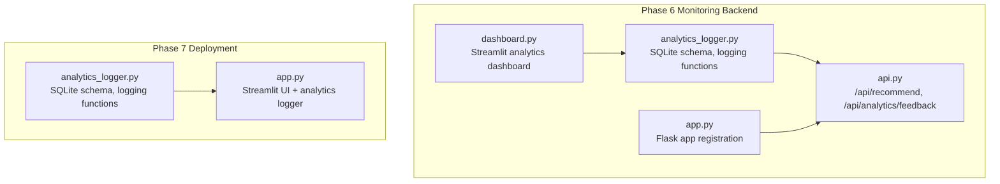
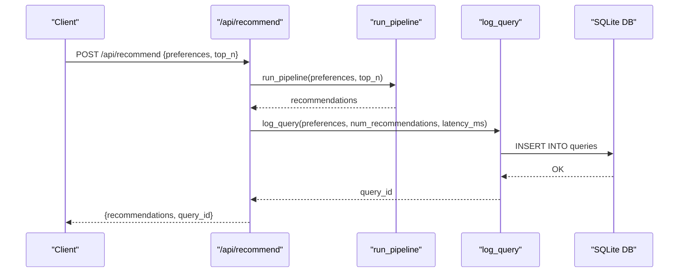
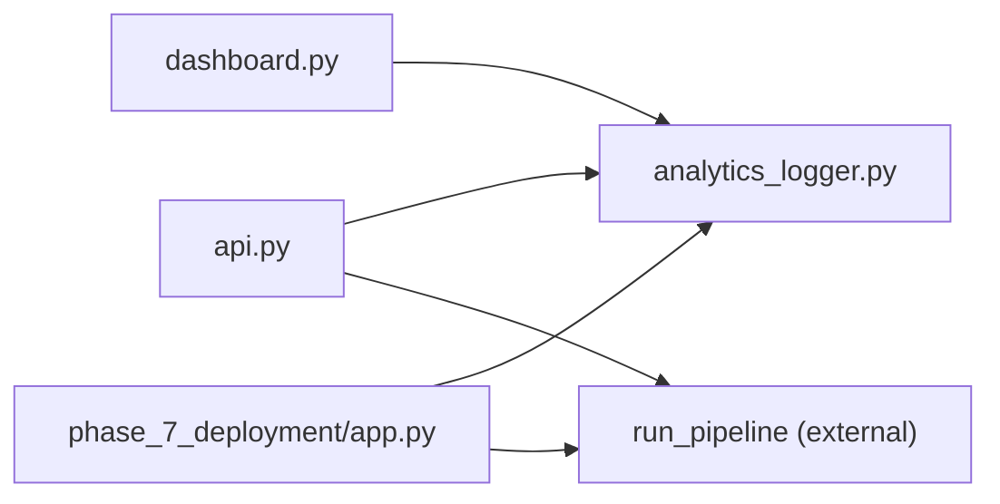

# Analytics Logging

<cite>
**Referenced Files in This Document**
- [analytics_logger.py](file://Zomato/architecture/phase_6_monitoring/backend/analytics_logger.py)
- [api.py](file://Zomato/architecture/phase_6_monitoring/backend/api.py)
- [app.py](file://Zomato/architecture/phase_6_monitoring/backend/app.py)
- [dashboard.py](file://Zomato/architecture/phase_6_monitoring/dashboard/dashboard.py)
- [analytics_logger.py](file://Zomato/architecture/phase_7_deployment/analytics_logger.py)
- [app.py](file://Zomato/architecture/phase_7_deployment/app.py)
- [metadata.json](file://Zomato/architecture/phase_6_monitoring/metadata.json)
- [metadata.json](file://Zomato/architecture/phase_7_deployment/metadata.json)
- [sample_recommendations.json](file://Zomato/architecture/phase_6_monitoring/sample_recommendations.json)
</cite>

## Table of Contents
1. [Introduction](#introduction)
2. [Project Structure](#project-structure)
3. [Core Components](#core-components)
4. [Architecture Overview](#architecture-overview)
5. [Detailed Component Analysis](#detailed-component-analysis)
6. [Dependency Analysis](#dependency-analysis)
7. [Performance Considerations](#performance-considerations)
8. [Troubleshooting Guide](#troubleshooting-guide)
9. [Conclusion](#conclusion)
10. [Appendices](#appendices)

## Introduction
This document describes the Analytics Logging subsystem responsible for capturing user query preferences and feedback sentiment for continuous improvement. It documents the SQLite database schema, the logging functions, JSON serialization of complex preference fields, connection management, and the analytics dashboard. It also provides guidance on data retention, query optimization, and performance considerations for high-volume logging.

## Project Structure
The Analytics Logging subsystem spans two environments:
- Phase 6 Monitoring Backend: exposes REST endpoints to log queries and feedback, initializes the SQLite database, and powers a Streamlit dashboard.
- Phase 7 Deployment: integrates analytics logging into a standalone Streamlit app for end-user interaction.

**Diagram sources**
- [analytics_logger.py:1-87](file://Zomato/architecture/phase_6_monitoring/backend/analytics_logger.py#L1-L87)
- [api.py:1-119](file://Zomato/architecture/phase_6_monitoring/backend/api.py#L1-L119)
- [app.py:1-41](file://Zomato/architecture/phase_6_monitoring/backend/app.py#L1-L41)
- [dashboard.py:1-102](file://Zomato/architecture/phase_6_monitoring/dashboard/dashboard.py#L1-L102)
- [analytics_logger.py:1-87](file://Zomato/architecture/phase_7_deployment/analytics_logger.py#L1-L87)
- [app.py:1-123](file://Zomato/architecture/phase_7_deployment/app.py#L1-L123)

**Section sources**
- [analytics_logger.py:1-87](file://Zomato/architecture/phase_6_monitoring/backend/analytics_logger.py#L1-L87)
- [api.py:1-119](file://Zomato/architecture/phase_6_monitoring/backend/api.py#L1-L119)
- [app.py:1-41](file://Zomato/architecture/phase_6_monitoring/backend/app.py#L1-L41)
- [dashboard.py:1-102](file://Zomato/architecture/phase_6_monitoring/dashboard/dashboard.py#L1-L102)
- [analytics_logger.py:1-87](file://Zomato/architecture/phase_7_deployment/analytics_logger.py#L1-L87)
- [app.py:1-123](file://Zomato/architecture/phase_7_deployment/app.py#L1-L123)

## Core Components
- SQLite database with two tables:
  - queries: stores query metadata and preferences.
  - feedback: stores user sentiment for recommendations linked to queries.
- Logging functions:
  - log_query: serializes preferences, measures latency, generates a UUID, and inserts a row into queries.
  - log_feedback: inserts a row into feedback with a foreign key to queries.
- Initialization:
  - initialize_db creates tables on first import and ensures schema readiness.

Key behaviors:
- UUID-based query tracking for correlation across logs and feedback.
- JSON serialization for complex fields (cuisines and optional_preferences).
- Timestamps captured automatically by SQLite.
- Foreign key constraint linking feedback.query_id to queries.query_id.

**Section sources**
- [analytics_logger.py:13-86](file://Zomato/architecture/phase_6_monitoring/backend/analytics_logger.py#L13-L86)
- [analytics_logger.py:13-86](file://Zomato/architecture/phase_7_deployment/analytics_logger.py#L13-L86)

## Architecture Overview
End-to-end flow for logging queries and feedback:

**Diagram sources**
- [api.py:43-95](file://Zomato/architecture/phase_6_monitoring/backend/api.py#L43-L95)
- [analytics_logger.py:46-70](file://Zomato/architecture/phase_6_monitoring/backend/analytics_logger.py#L46-L70)

## Detailed Component Analysis

### Database Schema
Tables and fields:
- queries
  - query_id: TEXT PRIMARY KEY (UUID)
  - timestamp: DATETIME DEFAULT CURRENT_TIMESTAMP
  - location: TEXT
  - budget: TEXT
  - cuisines: TEXT (JSON array)
  - min_rating: REAL
  - optional_preferences: TEXT (JSON array)
  - num_recommendations: INTEGER
  - latency_ms: REAL

- feedback
  - id: INTEGER PRIMARY KEY AUTOINCREMENT
  - query_id: TEXT (foreign key to queries.query_id)
  - timestamp: DATETIME DEFAULT CURRENT_TIMESTAMP
  - restaurant_name: TEXT
  - feedback_type: TEXT ('like' or 'dislike')

Schema creation SQL:
- See CREATE TABLE statements in:
  - [queries table:18-30](file://Zomato/architecture/phase_6_monitoring/backend/analytics_logger.py#L18-L30)
  - [feedback table:32-41](file://Zomato/architecture/phase_6_monitoring/backend/analytics_logger.py#L32-L41)

Foreign key relationship:
- feedback.query_id references queries.query_id.

**Section sources**
- [analytics_logger.py:18-41](file://Zomato/architecture/phase_6_monitoring/backend/analytics_logger.py#L18-L41)
- [analytics_logger.py:18-41](file://Zomato/architecture/phase_7_deployment/analytics_logger.py#L18-L41)

### log_query Function
Purpose:
- Serialize preferences to JSON, compute latency, generate UUID, insert into queries, and return query_id.

Parameters:
- preferences: dict containing keys:
  - location: string
  - budget: string (low|medium|high)
  - cuisines: list of strings
  - min_rating: float
  - optional_preferences: list of strings
- num_recommendations: integer count of recommendations returned
- latency_ms: float measured in milliseconds

Processing steps:
- Generate UUID for query_id.
- Serialize cuisines and optional_preferences to JSON strings.
- Insert into queries with computed values.
- Commit and close connection.

Return value:
- query_id (string UUID) for correlating feedback.

**Section sources**
- [analytics_logger.py:46-70](file://Zomato/architecture/phase_6_monitoring/backend/analytics_logger.py#L46-L70)
- [analytics_logger.py:46-70](file://Zomato/architecture/phase_7_deployment/analytics_logger.py#L46-L70)

### log_feedback Function
Purpose:
- Record user sentiment for a specific recommendation.

Parameters:
- query_id: string (UUID from log_query)
- restaurant_name: string
- feedback_type: string ('like' or 'dislike')

Processing steps:
- Insert a new row into feedback with the provided values.
- Commit and close connection.

Constraints:
- query_id must reference an existing query in queries.

**Section sources**
- [analytics_logger.py:72-84](file://Zomato/architecture/phase_6_monitoring/backend/analytics_logger.py#L72-L84)
- [analytics_logger.py:72-84](file://Zomato/architecture/phase_7_deployment/analytics_logger.py#L72-L84)

### Database Initialization and Table Creation
- initialize_db creates both tables if they do not exist.
- Called on module import to ensure schema readiness.

SQL statements:
- [queries table creation:18-30](file://Zomato/architecture/phase_6_monitoring/backend/analytics_logger.py#L18-L30)
- [feedback table creation:32-41](file://Zomato/architecture/phase_6_monitoring/backend/analytics_logger.py#L32-L41)

**Section sources**
- [analytics_logger.py:13-44](file://Zomato/architecture/phase_6_monitoring/backend/analytics_logger.py#L13-L44)
- [analytics_logger.py:13-44](file://Zomato/architecture/phase_7_deployment/analytics_logger.py#L13-L44)

### JSON Serialization of Complex Preference Fields
- cuisines: serialized as JSON array string.
- optional_preferences: serialized as JSON array string.
- Deserialization is performed by the consuming applications (dashboard and deployment UI) when reading from the database.

Example usage:
- [JSON serialization in log_query:61-63](file://Zomato/architecture/phase_6_monitoring/backend/analytics_logger.py#L61-L63)
- [JSON serialization in log_query:61-63](file://Zomato/architecture/phase_7_deployment/analytics_logger.py#L61-L63)

**Section sources**
- [analytics_logger.py:61-63](file://Zomato/architecture/phase_6_monitoring/backend/analytics_logger.py#L61-L63)
- [analytics_logger.py:61-63](file://Zomato/architecture/phase_7_deployment/analytics_logger.py#L61-L63)

### API Integration and Latency Measurement
- /api/recommend validates input, runs the pipeline, measures latency, logs the query, and returns recommendations with query_id.
- /api/analytics/feedback validates feedback payload and logs feedback.

Latency measurement:
- Start time before pipeline execution.
- End time after pipeline execution.
- Computed as elapsed time multiplied by 1000.0.

**Section sources**
- [api.py:82-88](file://Zomato/architecture/phase_6_monitoring/backend/api.py#L82-L88)
- [api.py:97-118](file://Zomato/architecture/phase_6_monitoring/backend/api.py#L97-L118)

### Analytics Dashboard
- Reads queries and feedback from SQLite.
- Computes metrics: total queries, average latency, total feedback, like ratio.
- Visualizations: hourly queries trend, feedback distribution, problematic recommendations (dislikes), recent queries.

Data access:
- Uses pandas.read_sql to load tables into DataFrames.

**Section sources**
- [dashboard.py:23-30](file://Zomato/architecture/phase_6_monitoring/dashboard/dashboard.py#L23-L30)
- [dashboard.py:39-51](file://Zomato/architecture/phase_6_monitoring/dashboard/dashboard.py#L39-L51)
- [dashboard.py:61-73](file://Zomato/architecture/phase_6_monitoring/dashboard/dashboard.py#L61-L73)
- [dashboard.py:83-93](file://Zomato/architecture/phase_6_monitoring/dashboard/dashboard.py#L83-L93)
- [dashboard.py:100-101](file://Zomato/architecture/phase_6_monitoring/dashboard/dashboard.py#L100-L101)

### Database Connection Management and Transactions
- Connection lifecycle:
  - _get_connection opens a connection per operation.
  - Each write operation (INSERT) is committed immediately.
  - Connections are closed after each operation.
- Transaction handling:
  - Single-row INSERTs are implicitly atomic per statement.
  - No explicit BEGIN/COMMIT blocks are used; each commit occurs after an INSERT.
- Error recovery:
  - Exceptions are caught and surfaced to clients in API endpoints.
  - The dashboard stops execution if the database file is missing.

**Section sources**
- [_get_connection and commit/close:9-11](file://Zomato/architecture/phase_6_monitoring/backend/analytics_logger.py#L9-L11)
- [commit/close in log_query/log_feedback:68-69](file://Zomato/architecture/phase_6_monitoring/backend/analytics_logger.py#L68-L69)
- [commit/close in log_query/log_feedback:82-83](file://Zomato/architecture/phase_6_monitoring/backend/analytics_logger.py#L82-L83)
- [Exception handling in API:94-95](file://Zomato/architecture/phase_6_monitoring/backend/api.py#L94-L95)
- [Exception handling in API:117-118](file://Zomato/architecture/phase_6_monitoring/backend/api.py#L117-L118)
- [Dashboard database presence check:12-14](file://Zomato/architecture/phase_6_monitoring/dashboard/dashboard.py#L12-L14)

### Data Retention Policies
- No explicit retention policy is implemented in the logging code.
- Recommendation: implement periodic cleanup jobs to remove old rows older than N days/months to control database growth.
- Consider partitioning by date or archiving historical data externally.

[No sources needed since this section provides general guidance]

### Query Optimization for Analytics
- Indexes:
  - Consider adding indexes on queries.timestamp and queries.location for frequent analytics queries.
- Aggregation:
  - Prefer server-side aggregation in SQL for dashboard metrics to reduce client-side computation overhead.
- Sampling:
  - For very high volume, consider sampling or downsampling strategies to keep the database size manageable.

[No sources needed since this section provides general guidance]

### Performance Considerations for High-Volume Logging
- Connection pooling:
  - Current implementation opens/closes connections per operation. For high throughput, consider a connection pool or batching writes.
- Batching:
  - Batch multiple INSERTs into a single transaction to reduce commit overhead.
- JSON serialization:
  - Keep preference lists concise; avoid overly large optional_preferences arrays.
- Latency measurement:
  - Ensure timing captures only pipeline execution, not network overhead.

[No sources needed since this section provides general guidance]

## Dependency Analysis
Inter-module dependencies and relationships:

**Diagram sources**
- [api.py:12-13](file://Zomato/architecture/phase_6_monitoring/backend/api.py#L12-L13)
- [analytics_logger.py:1-7](file://Zomato/architecture/phase_6_monitoring/backend/analytics_logger.py#L1-L7)
- [dashboard.py:1-6](file://Zomato/architecture/phase_6_monitoring/dashboard/dashboard.py#L1-L6)
- [app.py:16-17](file://Zomato/architecture/phase_7_deployment/app.py#L16-L17)

**Section sources**
- [api.py:12-13](file://Zomato/architecture/phase_6_monitoring/backend/api.py#L12-L13)
- [analytics_logger.py:1-7](file://Zomato/architecture/phase_6_monitoring/backend/analytics_logger.py#L1-L7)
- [dashboard.py:1-6](file://Zomato/architecture/phase_6_monitoring/dashboard/dashboard.py#L1-L6)
- [app.py:16-17](file://Zomato/architecture/phase_7_deployment/app.py#L16-L17)

## Performance Considerations
- Connection lifecycle: Opening and closing connections per operation is simple but can be a bottleneck under high load. Consider a connection pool or batching.
- Transaction boundaries: Each INSERT is committed individually. For bulk logging, wrap multiple INSERTs in a single transaction to reduce disk I/O.
- JSON serialization cost: Serializing preference lists is lightweight, but avoid extremely large lists.
- Dashboard queries: Use SQL-level aggregations and limit result sets to improve responsiveness.

[No sources needed since this section provides general guidance]

## Troubleshooting Guide
Common issues and resolutions:
- Database not found:
  - The dashboard checks for the presence of the analytics database file and stops if missing. Ensure the backend is started and a query has been logged.
  - Reference: [dashboard database check:12-14](file://Zomato/architecture/phase_6_monitoring/dashboard/dashboard.py#L12-L14)
- Missing GROQ API key:
  - The orchestrator requires a valid GROQ API key; otherwise, it falls back to sample recommendations. Ensure the environment variable is configured.
  - Reference: [orchestrator API key handling:210-213](file://Zomato/architecture/phase_6_monitoring/backend/orchestrator.py#L210-L213)
- Invalid feedback payload:
  - The feedback endpoint requires query_id, restaurant_name, and feedback_type. Ensure these fields are present and feedback_type is 'like' or 'dislike'.
  - Reference: [feedback validation:104-112](file://Zomato/architecture/phase_6_monitoring/backend/api.py#L104-L112)
- JSON deserialization:
  - When reading from the database, ensure JSON fields (cuisines, optional_preferences) are parsed before use.
  - Reference: [JSON serialization in logging:61-63](file://Zomato/architecture/phase_6_monitoring/backend/analytics_logger.py#L61-L63)

**Section sources**
- [dashboard.py:12-14](file://Zomato/architecture/phase_6_monitoring/dashboard/dashboard.py#L12-L14)
- [api.py:104-112](file://Zomato/architecture/phase_6_monitoring/backend/api.py#L104-L112)
- [analytics_logger.py:61-63](file://Zomato/architecture/phase_6_monitoring/backend/analytics_logger.py#L61-L63)

## Conclusion
The Analytics Logging subsystem provides a straightforward, robust mechanism for capturing user queries and feedback with minimal operational overhead. The SQLite schema is simple and extensible, and the logging functions handle preference serialization and UUID-based correlation. For production-scale deployments, consider connection pooling, batching, and retention policies to maintain performance and storage efficiency.

## Appendices

### Appendix A: Endpoints and Payloads
- POST /api/recommend
  - Body fields: location, budget, cuisines, min_rating, optional_preferences, top_n
  - Response includes recommendations and query_id
  - Reference: [recommend endpoint:43-95](file://Zomato/architecture/phase_6_monitoring/backend/api.py#L43-L95)

- POST /api/analytics/feedback
  - Body fields: query_id, restaurant_name, feedback_type
  - Reference: [feedback endpoint:97-118](file://Zomato/architecture/phase_6_monitoring/backend/api.py#L97-L118)

### Appendix B: Example Data Insertion Patterns
- Inserting a query:
  - Use log_query(preferences, num_recommendations, latency_ms)
  - Reference: [log_query:46-70](file://Zomato/architecture/phase_6_monitoring/backend/analytics_logger.py#L46-L70)

- Inserting feedback:
  - Use log_feedback(query_id, restaurant_name, feedback_type)
  - Reference: [log_feedback:72-84](file://Zomato/architecture/phase_6_monitoring/backend/analytics_logger.py#L72-L84)

### Appendix C: Metadata Sources
- Locations and cuisines metadata are loaded from metadata.json for UI and fallback logic.
- References:
  - [Phase 6 metadata:1-196](file://Zomato/architecture/phase_6_monitoring/metadata.json#L1-L196)
  - [Phase 7 metadata:1-196](file://Zomato/architecture/phase_7_deployment/metadata.json#L1-L196)

### Appendix D: Sample Recommendation Payload
- Sample payload shape for testing and demonstration.
- Reference: [sample_recommendations.json:1-53](file://Zomato/architecture/phase_6_monitoring/sample_recommendations.json#L1-L53)