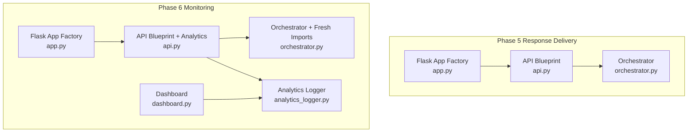
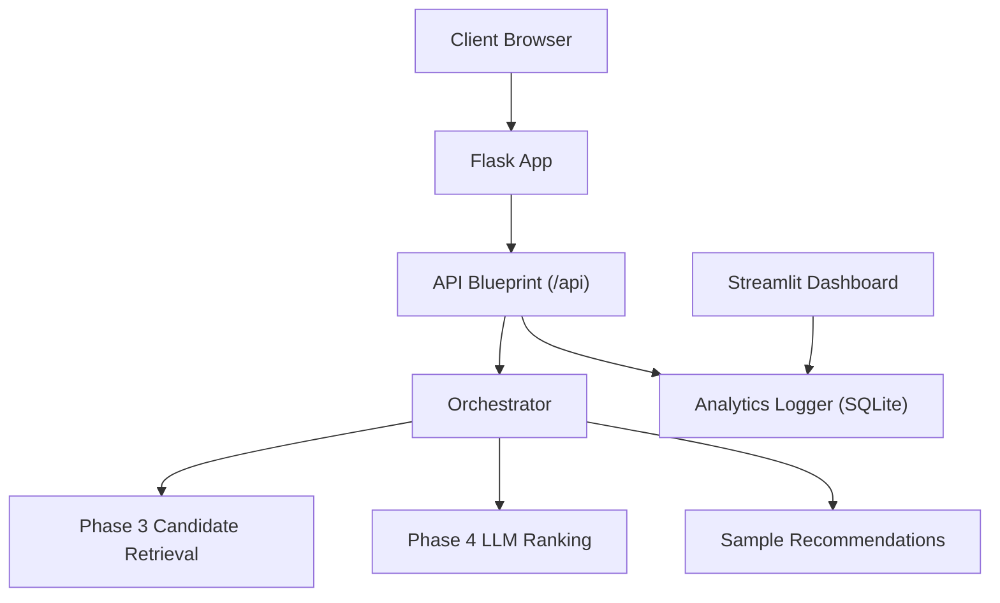
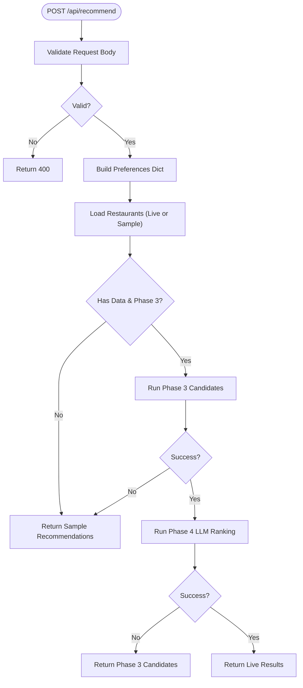
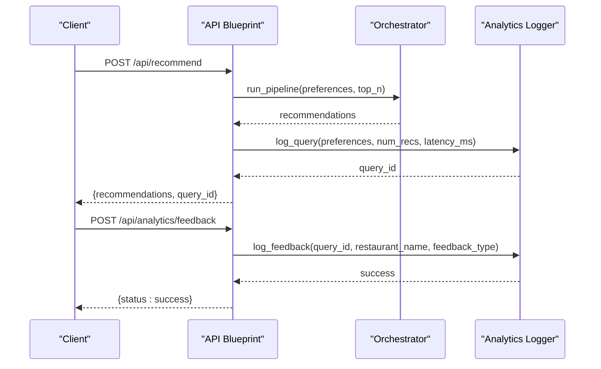
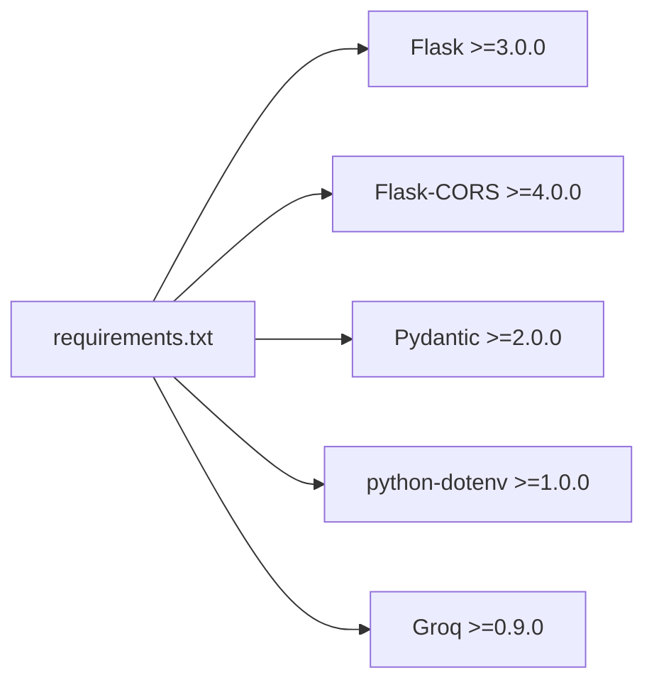

# Backend Orchestration

<cite>
**Referenced Files in This Document**
- [app.py](file://Zomato/architecture/phase_5_response_delivery/backend/app.py)
- [api.py](file://Zomato/architecture/phase_5_response_delivery/backend/api.py)
- [orchestrator.py](file://Zomato/architecture/phase_5_response_delivery/backend/orchestrator.py)
- [app.py](file://Zomato/architecture/phase_6_monitoring/backend/app.py)
- [api.py](file://Zomato/architecture/phase_6_monitoring/backend/api.py)
- [orchestrator.py](file://Zomato/architecture/phase_6_monitoring/backend/orchestrator.py)
- [analytics_logger.py](file://Zomato/architecture/phase_6_monitoring/backend/analytics_logger.py)
- [dashboard.py](file://Zomato/architecture/phase_6_monitoring/dashboard/dashboard.py)
- [requirements.txt](file://Zomato/architecture/phase_5_response_delivery/requirements.txt)
</cite>

## Table of Contents
1. [Introduction](#introduction)
2. [Project Structure](#project-structure)
3. [Core Components](#core-components)
4. [Architecture Overview](#architecture-overview)
5. [Detailed Component Analysis](#detailed-component-analysis)
6. [Dependency Analysis](#dependency-analysis)
7. [Performance Considerations](#performance-considerations)
8. [Troubleshooting Guide](#troubleshooting-guide)
9. [Conclusion](#conclusion)
10. [Appendices](#appendices)

## Introduction
This document describes the Backend Orchestration layer responsible for coordinating recommendation pipeline phases, serving REST APIs, and integrating monitoring and analytics. It covers Flask application configuration, WSGI deployment setup, environment variable management, orchestrator coordination, request routing, middleware integration, application factory patterns, logging initialization, component lifecycle management, health checks, graceful shutdown strategies, error handling, analytics integration, API endpoints, and dashboard rendering. It also addresses scalability, load balancing, and distributed monitoring patterns.

## Project Structure
The orchestration layer spans two phases:
- Phase 5 Response Delivery: basic orchestration, API endpoints, and SPA serving.
- Phase 6 Monitoring: extended orchestration with analytics logging and a Streamlit dashboard.

Key backend modules:
- Application factory for Flask apps
- API blueprints for endpoints
- Orchestrator for pipeline coordination
- Analytics logger for SQLite-backed telemetry
- Dashboard for analytics visualization

**Diagram sources**
- [app.py:14-41](file://Zomato/architecture/phase_5_response_delivery/backend/app.py#L14-L41)
- [api.py:1-84](file://Zomato/architecture/phase_5_response_delivery/backend/api.py#L1-L84)
- [orchestrator.py:1-292](file://Zomato/architecture/phase_5_response_delivery/backend/orchestrator.py#L1-L292)
- [app.py:14-41](file://Zomato/architecture/phase_6_monitoring/backend/app.py#L14-L41)
- [api.py:1-119](file://Zomato/architecture/phase_6_monitoring/backend/api.py#L1-L119)
- [orchestrator.py:1-303](file://Zomato/architecture/phase_6_monitoring/backend/orchestrator.py#L1-L303)
- [analytics_logger.py:1-87](file://Zomato/architecture/phase_6_monitoring/backend/analytics_logger.py#L1-L87)
- [dashboard.py:1-102](file://Zomato/architecture/phase_6_monitoring/dashboard/dashboard.py#L1-L102)

**Section sources**
- [app.py:14-41](file://Zomato/architecture/phase_5_response_delivery/backend/app.py#L14-L41)
- [api.py:1-84](file://Zomato/architecture/phase_5_response_delivery/backend/api.py#L1-L84)
- [orchestrator.py:1-292](file://Zomato/architecture/phase_5_response_delivery/backend/orchestrator.py#L1-L292)
- [app.py:14-41](file://Zomato/architecture/phase_6_monitoring/backend/app.py#L14-L41)
- [api.py:1-119](file://Zomato/architecture/phase_6_monitoring/backend/api.py#L1-L119)
- [orchestrator.py:1-303](file://Zomato/architecture/phase_6_monitoring/backend/orchestrator.py#L1-L303)
- [analytics_logger.py:1-87](file://Zomato/architecture/phase_6_monitoring/backend/analytics_logger.py#L1-L87)
- [dashboard.py:1-102](file://Zomato/architecture/phase_6_monitoring/dashboard/dashboard.py#L1-L102)

## Core Components
- Flask Application Factory: Creates a configured Flask app with CORS enabled, registers the API blueprint, and serves the SPA for non-API routes.
- API Blueprint: Defines health checks, metadata retrieval, sample recommendations, and the recommendation endpoint.
- Orchestrator: Loads datasets, runs candidate retrieval and LLM ranking, manages module imports, handles fallbacks, and returns structured recommendations.
- Analytics Logger: Initializes SQLite tables and logs queries and feedback for monitoring.
- Dashboard: Visualizes analytics via Streamlit using data from the analytics database.

**Section sources**
- [app.py:14-41](file://Zomato/architecture/phase_5_response_delivery/backend/app.py#L14-L41)
- [api.py:18-84](file://Zomato/architecture/phase_5_response_delivery/backend/api.py#L18-L84)
- [orchestrator.py:112-292](file://Zomato/architecture/phase_5_response_delivery/backend/orchestrator.py#L112-L292)
- [analytics_logger.py:13-87](file://Zomato/architecture/phase_6_monitoring/backend/analytics_logger.py#L13-L87)
- [dashboard.py:17-102](file://Zomato/architecture/phase_6_monitoring/dashboard/dashboard.py#L17-L102)

## Architecture Overview
The orchestration layer integrates:
- Frontend SPA served by Flask
- REST API endpoints under /api
- Pipeline orchestration with deterministic imports and fallbacks
- Optional analytics logging and feedback collection
- Streamlit dashboard for analytics visualization

**Diagram sources**
- [app.py:14-41](file://Zomato/architecture/phase_5_response_delivery/backend/app.py#L14-L41)
- [api.py:13-84](file://Zomato/architecture/phase_5_response_delivery/backend/api.py#L13-L84)
- [orchestrator.py:112-292](file://Zomato/architecture/phase_5_response_delivery/backend/orchestrator.py#L112-L292)
- [analytics_logger.py:46-83](file://Zomato/architecture/phase_6_monitoring/backend/analytics_logger.py#L46-L83)
- [dashboard.py:23-35](file://Zomato/architecture/phase_6_monitoring/dashboard/dashboard.py#L23-L35)

## Detailed Component Analysis

### Flask Application Factory Pattern
- Creates a Flask app with static folder pointing to the frontend assets.
- Enables CORS for cross-origin requests.
- Registers the API blueprint under /api.
- Serves SPA routes for index and static assets.

Environment and configuration:
- Static assets served from the frontend directory resolved relative to the backend package.
- No environment-specific configuration is loaded here; environment variables are managed per-phase.

**Section sources**
- [app.py:14-41](file://Zomato/architecture/phase_5_response_delivery/backend/app.py#L14-L41)
- [app.py:14-41](file://Zomato/architecture/phase_6_monitoring/backend/app.py#L14-L41)

### API Endpoints and Middleware Integration
Endpoints:
- GET /api/health: Returns service health with phase identification.
- GET /api/sample: Returns prebuilt sample recommendations.
- GET /api/metadata: Returns computed metadata (locations and cuisines).
- POST /api/recommend: Validates input preferences, invokes orchestrator, and returns recommendations.
- POST /api/analytics/feedback: Logs user feedback linked to a query ID.

Middleware:
- CORS is enabled at the application level.
- JSON parsing and validation are performed in the blueprint.

Error handling:
- Validation errors return 400 with structured messages.
- Runtime exceptions are caught and returned as 500 with stack traces.

**Section sources**
- [api.py:18-84](file://Zomato/architecture/phase_5_response_delivery/backend/api.py#L18-L84)
- [api.py:20-119](file://Zomato/architecture/phase_6_monitoring/backend/api.py#L20-L119)

### Orchestrator Coordination
Responsibilities:
- Resolve dataset path and load restaurants (full dataset or sample).
- Run Phase 3 candidate retrieval and ranking with optional location filtering.
- Run Phase 4 LLM ranking with environment variable validation.
- Fallback to sample or Phase 3 results when upstream services are unavailable.
- Return structured recommendations with metadata and provenance.

Lifecycle management:
- Dynamically imports Phase 3 and Phase 4 modules with controlled sys.path manipulation and cache invalidation to ensure deterministic behavior.
- Clears module caches before importing to avoid stale state.

Environment variable management:
- Loads .env from the Phase 5 directory and reads GROQ_API_KEY for LLM access.

**Diagram sources**
- [api.py:41-84](file://Zomato/architecture/phase_5_response_delivery/backend/api.py#L41-L84)
- [orchestrator.py:112-292](file://Zomato/architecture/phase_5_response_delivery/backend/orchestrator.py#L112-L292)

**Section sources**
- [orchestrator.py:19-82](file://Zomato/architecture/phase_5_response_delivery/backend/orchestrator.py#L19-L82)
- [orchestrator.py:112-292](file://Zomato/architecture/phase_5_response_delivery/backend/orchestrator.py#L112-L292)

### Analytics Logger and Dashboard Integration
Analytics logger:
- Initializes SQLite tables for queries and feedback.
- Logs query metadata and latency, returning a query ID.
- Logs feedback events linked to a query ID.

Dashboard:
- Reads analytics data from SQLite and renders metrics, trends, and recent queries.
- Provides insights into likes/dislikes and problematic recommendations.

**Diagram sources**
- [api.py:43-96](file://Zomato/architecture/phase_6_monitoring/backend/api.py#L43-L96)
- [analytics_logger.py:46-83](file://Zomato/architecture/phase_6_monitoring/backend/analytics_logger.py#L46-L83)
- [dashboard.py:23-35](file://Zomato/architecture/phase_6_monitoring/dashboard/dashboard.py#L23-L35)

**Section sources**
- [analytics_logger.py:13-87](file://Zomato/architecture/phase_6_monitoring/backend/analytics_logger.py#L13-L87)
- [api.py:97-119](file://Zomato/architecture/phase_6_monitoring/backend/api.py#L97-L119)
- [dashboard.py:17-102](file://Zomato/architecture/phase_6_monitoring/dashboard/dashboard.py#L17-L102)

### Health Checks and Graceful Shutdown
- Health endpoint: Returns service status and phase identifier.
- Graceful shutdown: Not implemented in the current code; consider signal handlers and application teardown hooks in production deployments.

**Section sources**
- [api.py:18-21](file://Zomato/architecture/phase_5_response_delivery/backend/api.py#L18-L21)
- [api.py:20-23](file://Zomato/architecture/phase_6_monitoring/backend/api.py#L20-L23)

### Environment Variable Management
- Phase 5 orchestrator loads environment variables from a .env file located in the Phase 5 backend directory and validates the presence of the LLM API key before invoking Phase 4.
- Ensure the .env file is present and contains the required keys for production-like environments.

**Section sources**
- [orchestrator.py:209-213](file://Zomato/architecture/phase_5_response_delivery/backend/orchestrator.py#L209-L213)

### Logging Initialization
- Analytics logger initializes SQLite tables on import.
- Use a persistent analytics database path resolved relative to the backend directory.

**Section sources**
- [analytics_logger.py:13-44](file://Zomato/architecture/phase_6_monitoring/backend/analytics_logger.py#L13-L44)

### Component Lifecycle Management
- Deterministic imports: The orchestrator clears module caches and reloads Phase 3 and Phase 4 modules to ensure consistent behavior across invocations.
- Fallback mechanisms: When upstream services fail or data is unavailable, the system falls back to sample or Phase 3 results.

**Section sources**
- [orchestrator.py:126-134](file://Zomato/architecture/phase_5_response_delivery/backend/orchestrator.py#L126-L134)
- [orchestrator.py:194-213](file://Zomato/architecture/phase_5_response_delivery/backend/orchestrator.py#L194-L213)

## Dependency Analysis
External dependencies include Flask, CORS, Pydantic, python-dotenv, and Groq. These are declared in the Phase 5 requirements.

**Diagram sources**
- [requirements.txt:1-6](file://Zomato/architecture/phase_5_response_delivery/requirements.txt#L1-L6)

**Section sources**
- [requirements.txt:1-6](file://Zomato/architecture/phase_5_response_delivery/requirements.txt#L1-L6)

## Performance Considerations
- Module reloading: Frequent dynamic imports and cache invalidation can add overhead; consider optimizing imports and caching strategies in high-throughput scenarios.
- Dataset I/O: Reading large JSONL files can be expensive; precompute metadata and cache frequently accessed resources.
- LLM calls: Batch and retry with backoff; monitor latency and availability.
- Caching: Introduce in-memory or Redis caching for metadata and common queries.
- Concurrency: Use asynchronous workers for long-running tasks and queue-based processing.

[No sources needed since this section provides general guidance]

## Troubleshooting Guide
Common issues and resolutions:
- Missing GROQ_API_KEY: Ensure the .env file exists and contains the key; otherwise, Phase 4 will be skipped and the system falls back to sample or Phase 3 results.
- No Phase 1 dataset: If the expected dataset is not found, the orchestrator falls back to sample data.
- Validation errors: Ensure the request body includes required fields and conforms to expected formats.
- Analytics database not found: Start the backend service to initialize the database and submit a query before launching the dashboard.

**Section sources**
- [orchestrator.py:210-213](file://Zomato/architecture/phase_5_response_delivery/backend/orchestrator.py#L210-L213)
- [orchestrator.py:166-169](file://Zomato/architecture/phase_5_response_delivery/backend/orchestrator.py#L166-L169)
- [api.py:56-77](file://Zomato/architecture/phase_5_response_delivery/backend/api.py#L56-L77)
- [dashboard.py:12-15](file://Zomato/architecture/phase_6_monitoring/dashboard/dashboard.py#L12-L15)

## Conclusion
The Backend Orchestration layer provides a robust foundation for recommendation delivery, with clear separation of concerns between the application factory, API endpoints, orchestrator, and monitoring components. It supports deterministic pipeline execution, environment-driven configuration, and extensible analytics. For production, consider adding graceful shutdown, structured logging, circuit breakers, and horizontal scaling behind a load balancer.

[No sources needed since this section summarizes without analyzing specific files]

## Appendices

### API Definitions
- GET /api/health
  - Purpose: Health check
  - Response: Service status and phase identifier
- GET /api/sample
  - Purpose: Return prebuilt sample recommendations
  - Response: JSON payload with recommendations
- GET /api/metadata
  - Purpose: Return unique locations and cuisines
  - Response: JSON payload with arrays
- POST /api/recommend
  - Purpose: Compute recommendations
  - Request body: Location, budget, cuisines, min_rating, optional_preferences, top_n
  - Response: Recommendations with summary, explanations, and provenance
- POST /api/analytics/feedback
  - Purpose: Record user feedback
  - Request body: query_id, restaurant_name, feedback_type
  - Response: Success status

**Section sources**
- [api.py:18-84](file://Zomato/architecture/phase_5_response_delivery/backend/api.py#L18-L84)
- [api.py:43-119](file://Zomato/architecture/phase_6_monitoring/backend/api.py#L43-L119)

### Environment Variables
- GROQ_API_KEY: Required for Phase 4 LLM ranking
- .env location: Phase 5 backend directory

**Section sources**
- [orchestrator.py:209-213](file://Zomato/architecture/phase_5_response_delivery/backend/orchestrator.py#L209-L213)

### Monitoring Schema
- Queries table: query_id, timestamp, location, budget, cuisines, min_rating, optional_preferences, num_recommendations, latency_ms
- Feedback table: id, query_id, timestamp, restaurant_name, feedback_type

**Section sources**
- [analytics_logger.py:18-41](file://Zomato/architecture/phase_6_monitoring/backend/analytics_logger.py#L18-L41)