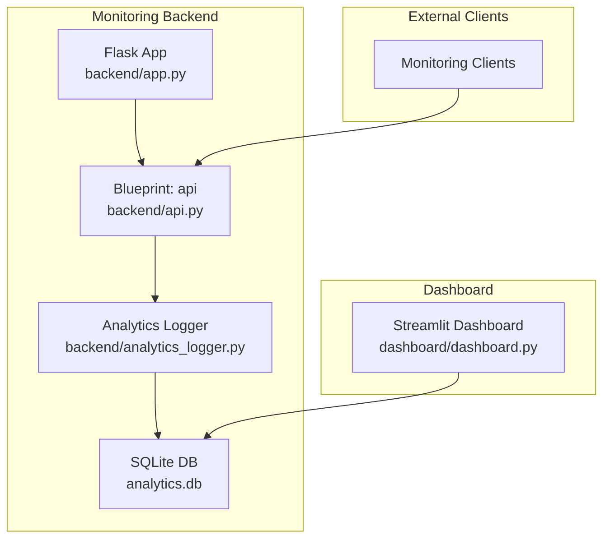
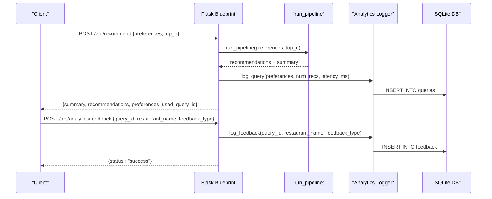
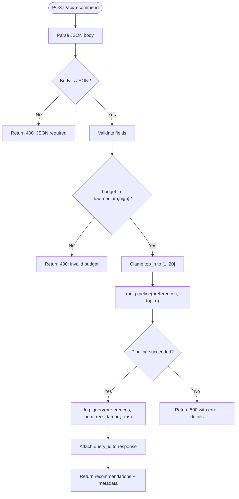
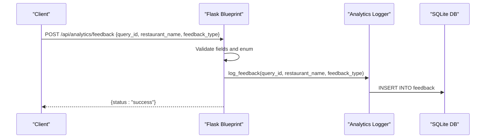
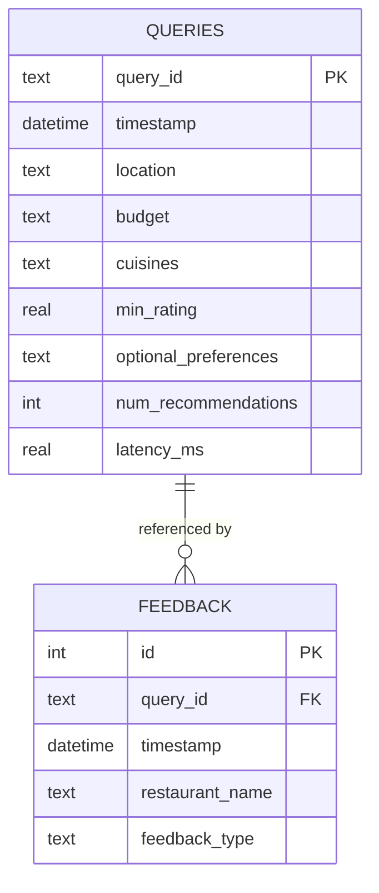
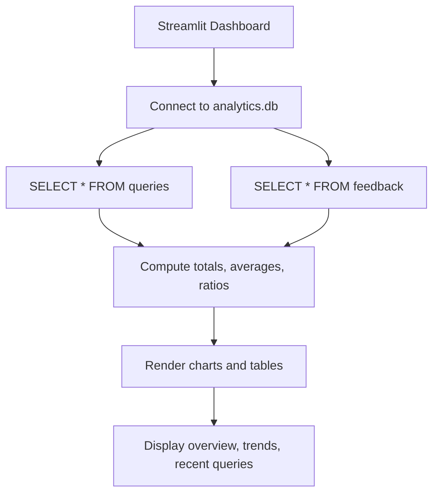
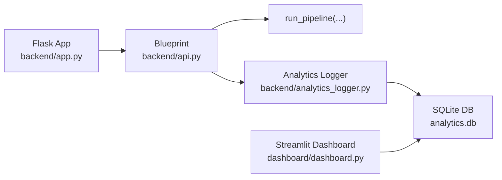

# Monitoring API Endpoints

<cite>
**Referenced Files in This Document**
- [api.py](file://architecture/phase_6_monitoring/backend/api.py)
- [app.py](file://architecture/phase_6_monitoring/backend/app.py)
- [analytics_logger.py](file://architecture/phase_6_monitoring/backend/analytics_logger.py)
- [dashboard.py](file://architecture/phase_6_monitoring/dashboard/dashboard.py)
- [__main__.py](file://architecture/phase_6_monitoring/__main__.py)
- [metadata.json](file://architecture/phase_6_monitoring/metadata.json)
- [sample_recommendations.json](file://architecture/phase_6_monitoring/sample_recommendations.json)
</cite>

## Table of Contents
1. [Introduction](#introduction)
2. [Project Structure](#project-structure)
3. [Core Components](#core-components)
4. [Architecture Overview](#architecture-overview)
5. [Detailed Component Analysis](#detailed-component-analysis)
6. [Dependency Analysis](#dependency-analysis)
7. [Performance Considerations](#performance-considerations)
8. [Troubleshooting Guide](#troubleshooting-guide)
9. [Conclusion](#conclusion)
10. [Appendices](#appendices)

## Introduction
This document describes the Monitoring API endpoints for Phase 6 of the Zomato recommendation system. It focuses on the REST endpoints that support analytics data retrieval, query statistics, and feedback metrics collection. It also documents request/response schemas, parameter validation, filtering options, authentication and security considerations, rate limiting posture, data export capabilities, real-time analytics streaming, API versioning and deprecation policies, and client integration patterns for external monitoring systems.

## Project Structure
The monitoring backend is implemented as a Flask blueprint mounted under /api. It integrates with an analytics logger that persists queries and feedback into an SQLite database. A Streamlit dashboard consumes the same database to visualize trends and recent activity.

**Diagram sources**
- [app.py:14-41](file://architecture/phase_6_monitoring/backend/app.py#L14-L41)
- [api.py:15-119](file://architecture/phase_6_monitoring/backend/api.py#L15-L119)
- [analytics_logger.py:1-87](file://architecture/phase_6_monitoring/backend/analytics_logger.py#L1-L87)
- [dashboard.py:1-102](file://architecture/phase_6_monitoring/dashboard/dashboard.py#L1-L102)

**Section sources**
- [app.py:14-41](file://architecture/phase_6_monitoring/backend/app.py#L14-L41)
- [api.py:15-119](file://architecture/phase_6_monitoring/backend/api.py#L15-L119)
- [analytics_logger.py:1-87](file://architecture/phase_6_monitoring/backend/analytics_logger.py#L1-L87)
- [dashboard.py:1-102](file://architecture/phase_6_monitoring/dashboard/dashboard.py#L1-L102)

## Core Components
- REST API Blueprint: Provides health checks, sample data, metadata, recommendation requests, and feedback submission.
- Analytics Logger: Initializes SQLite tables and logs queries and feedback with structured persistence.
- Dashboard: Reads analytics data from SQLite and renders overview metrics, trends, and recent queries.

Key endpoints:
- GET /api/health: Health status of the monitoring service.
- GET /api/sample: Prebuilt sample recommendations for frontend demos.
- GET /api/metadata: Unique locations and cuisines for frontend dropdowns.
- POST /api/recommend: Executes the recommendation pipeline and logs the query.
- POST /api/analytics/feedback: Records user feedback for a given query.

**Section sources**
- [api.py:20-119](file://architecture/phase_6_monitoring/backend/api.py#L20-L119)
- [analytics_logger.py:13-87](file://architecture/phase_6_monitoring/backend/analytics_logger.py#L13-L87)
- [dashboard.py:23-102](file://architecture/phase_6_monitoring/dashboard/dashboard.py#L23-L102)

## Architecture Overview
The monitoring API is a thin Flask layer that orchestrates recommendation execution and logging. The analytics logger writes to an SQLite database. The dashboard reads from the same database to present analytics.

**Diagram sources**
- [api.py:43-119](file://architecture/phase_6_monitoring/backend/api.py#L43-L119)
- [analytics_logger.py:46-83](file://architecture/phase_6_monitoring/backend/analytics_logger.py#L46-L83)

## Detailed Component Analysis

### REST API Endpoints

#### GET /api/health
- Purpose: Health check for the monitoring service.
- Response: JSON object containing status, phase, and service identifier.
- Typical success response keys: status, phase, service.

**Section sources**
- [api.py:20-24](file://architecture/phase_6_monitoring/backend/api.py#L20-L24)

#### GET /api/sample
- Purpose: Returns prebuilt sample recommendations for frontend demos.
- Response: JSON object containing summary, recommendations, preferences_used, and source marker.
- Notes: Adds a source field to indicate sample data.

**Section sources**
- [api.py:26-31](file://architecture/phase_6_monitoring/backend/api.py#L26-L31)
- [sample_recommendations.json:1-53](file://architecture/phase_6_monitoring/sample_recommendations.json#L1-L53)

#### GET /api/metadata
- Purpose: Supplies unique locations and cuisines for frontend dropdowns.
- Response: JSON object with locations and cuisines arrays.
- Error handling: Returns error details on failure.

**Section sources**
- [api.py:34-41](file://architecture/phase_6_monitoring/backend/api.py#L34-L41)
- [metadata.json:1-196](file://architecture/phase_6_monitoring/metadata.json#L1-L196)

#### POST /api/recommend
- Purpose: Executes the full recommendation pipeline and logs the query.
- Request body schema:
  - location: string, required
  - budget: string, enum(low, medium, high), defaults to medium
  - cuisines: array of strings, optional
  - min_rating: number, optional
  - optional_preferences: array of strings, optional
  - top_n: integer, constrained between 1 and 20
- Validation:
  - Rejects non-JSON bodies.
  - Validates budget enum.
  - Clamps top_n to [1, 20].
- Response:
  - summary: string
  - recommendations: array of recommendation objects
  - preferences_used: object reflecting inputs
  - source: string indicating live vs sample
  - query_id: string injected for feedback correlation
- Logging:
  - On success, logs query with preferences, number of recommendations, and latency in milliseconds.

**Diagram sources**
- [api.py:43-96](file://architecture/phase_6_monitoring/backend/api.py#L43-L96)
- [analytics_logger.py:46-70](file://architecture/phase_6_monitoring/backend/analytics_logger.py#L46-L70)

**Section sources**
- [api.py:43-96](file://architecture/phase_6_monitoring/backend/api.py#L43-L96)
- [analytics_logger.py:46-70](file://architecture/phase_6_monitoring/backend/analytics_logger.py#L46-L70)

#### POST /api/analytics/feedback
- Purpose: Accepts explicit user feedback on recommendations.
- Request body schema:
  - query_id: string, required
  - restaurant_name: string, required
  - feedback_type: enum(like, dislike), required
- Validation:
  - Rejects non-JSON bodies.
  - Requires all three fields and enforces feedback_type enum.
- Response: JSON object confirming success.

**Diagram sources**
- [api.py:97-119](file://architecture/phase_6_monitoring/backend/api.py#L97-L119)
- [analytics_logger.py:72-83](file://architecture/phase_6_monitoring/backend/analytics_logger.py#L72-L83)

**Section sources**
- [api.py:97-119](file://architecture/phase_6_monitoring/backend/api.py#L97-L119)
- [analytics_logger.py:72-83](file://architecture/phase_6_monitoring/backend/analytics_logger.py#L72-L83)

### Analytics Data Model and Persistence
The analytics logger initializes two tables and writes query and feedback events.

**Diagram sources**
- [analytics_logger.py:18-41](file://architecture/phase_6_monitoring/backend/analytics_logger.py#L18-L41)

**Section sources**
- [analytics_logger.py:13-87](file://architecture/phase_6_monitoring/backend/analytics_logger.py#L13-L87)

### Dashboard and Real-Time Analytics Streaming
- The dashboard reads from the analytics database to compute overview metrics, trends, and recent queries.
- It groups queries by hour and displays feedback ratios via charts.
- It surfaces problematic recommendations (dislikes) for improvement triage.
- The dashboard is a Streamlit app that connects to the same SQLite database used by the API.

**Diagram sources**
- [dashboard.py:23-102](file://architecture/phase_6_monitoring/dashboard/dashboard.py#L23-L102)
- [analytics_logger.py:18-41](file://architecture/phase_6_monitoring/backend/analytics_logger.py#L18-L41)

**Section sources**
- [dashboard.py:17-102](file://architecture/phase_6_monitoring/dashboard/dashboard.py#L17-L102)

## Dependency Analysis
- Flask app registers the monitoring blueprint and serves static assets for the frontend.
- The blueprint depends on the orchestrator for recommendation execution and the analytics logger for persistence.
- The dashboard depends on the analytics database for visualization.

**Diagram sources**
- [app.py:22-25](file://architecture/phase_6_monitoring/backend/app.py#L22-L25)
- [api.py:12-13](file://architecture/phase_6_monitoring/backend/api.py#L12-L13)
- [analytics_logger.py:7-11](file://architecture/phase_6_monitoring/backend/analytics_logger.py#L7-L11)
- [dashboard.py:9,11-15](file://architecture/phase_6_monitoring/dashboard/dashboard.py#L9,L11-L15)

**Section sources**
- [app.py:14-41](file://architecture/phase_6_monitoring/backend/app.py#L14-L41)
- [api.py:12-13](file://architecture/phase_6_monitoring/backend/api.py#L12-L13)
- [analytics_logger.py:7-11](file://architecture/phase_6_monitoring/backend/analytics_logger.py#L7-L11)
- [dashboard.py:9,11-15](file://architecture/phase_6_monitoring/dashboard/dashboard.py#L9,L11-L15)

## Performance Considerations
- Query logging is synchronous and lightweight; latency is measured around the pipeline execution.
- SQLite is embedded and suitable for development and small-scale monitoring; production deployments should consider scaling storage and indexing strategies.
- Dashboard rendering is optimized for local analytics consumption; for large datasets, consider pagination or server-side aggregation.

[No sources needed since this section provides general guidance]

## Troubleshooting Guide
- Health endpoint returns ok when the service is up.
- If metadata endpoint fails, verify database connectivity and initialization.
- If recommendation endpoint returns errors, confirm the request body conforms to the schema and budget enum.
- Feedback endpoint requires all three fields and a valid feedback type; ensure query_id matches a previously logged query.

**Section sources**
- [api.py:20-24](file://architecture/phase_6_monitoring/backend/api.py#L20-L24)
- [api.py:34-41](file://architecture/phase_6_monitoring/backend/api.py#L34-L41)
- [api.py:43-96](file://architecture/phase_6_monitoring/backend/api.py#L43-L96)
- [api.py:97-119](file://architecture/phase_6_monitoring/backend/api.py#L97-L119)

## Conclusion
The Monitoring API provides essential observability for the recommendation pipeline by capturing query metadata and user feedback. It exposes straightforward endpoints for health checks, sample data, metadata, recommendations, and feedback. The analytics logger persists data in SQLite, enabling dashboards and external clients to derive insights. For production-grade deployments, consider adding authentication, rate limiting, and scalable storage.

[No sources needed since this section summarizes without analyzing specific files]

## Appendices

### Authentication, Rate Limiting, and Security
- Authentication: No authentication is enforced on the monitoring endpoints in the current implementation.
- Rate limiting: Not implemented in the current blueprint.
- Security considerations:
  - Restrict exposure of the monitoring endpoints to trusted networks.
  - Validate and sanitize inputs rigorously (already performed for budget and top_n).
  - Avoid exposing sensitive fields in responses.
  - Use HTTPS in production and rotate secrets.

[No sources needed since this section provides general guidance]

### Data Export Capabilities and CSV Generation
- The analytics database is SQLite-backed. Clients can export tables via SQL queries:
  - SELECT * FROM queries
  - SELECT * FROM feedback
- For CSV generation, clients can:
  - Issue SQL queries from their monitoring systems.
  - Use database connectors to stream results and write CSV files.
- The dashboard demonstrates reading tables and computing aggregates; similar patterns apply for exports.

**Section sources**
- [analytics_logger.py:18-41](file://architecture/phase_6_monitoring/backend/analytics_logger.py#L18-L41)
- [dashboard.py:23-31](file://architecture/phase_6_monitoring/dashboard/dashboard.py#L23-L31)

### Real-Time Analytics Streaming
- The current implementation uses periodic dashboard refreshes and does not expose a streaming endpoint.
- To enable streaming:
  - Add a WebSocket or Server-Sent Events endpoint.
  - Emit incremental updates on new queries or feedback entries.
  - Ensure efficient polling or event-driven updates.

[No sources needed since this section provides general guidance]

### API Versioning and Deprecation Policy
- Current state: No explicit versioning scheme is present in the blueprint or endpoints.
- Recommended policy:
  - Use URL versioning (e.g., /api/v1/recommend).
  - Maintain backward compatibility by supporting older versions for a defined period.
  - Announce deprecations with timelines and migration paths.
  - Return appropriate deprecation headers and status codes for deprecated endpoints.

[No sources needed since this section provides general guidance]

### Client Integration Examples and SDK Usage Patterns
- Example client flow:
  - Health check: GET /api/health
  - Fetch metadata: GET /api/metadata
  - Submit recommendation request: POST /api/recommend with preferences
  - Record feedback: POST /api/analytics/feedback with query_id
- SDK patterns:
  - Wrap HTTP calls with retry/backoff and timeout handling.
  - Cache metadata endpoints periodically.
  - Correlate query_id from recommendations with feedback submissions.
  - Export analytics periodically using SQL queries against the analytics database.

[No sources needed since this section provides general guidance]