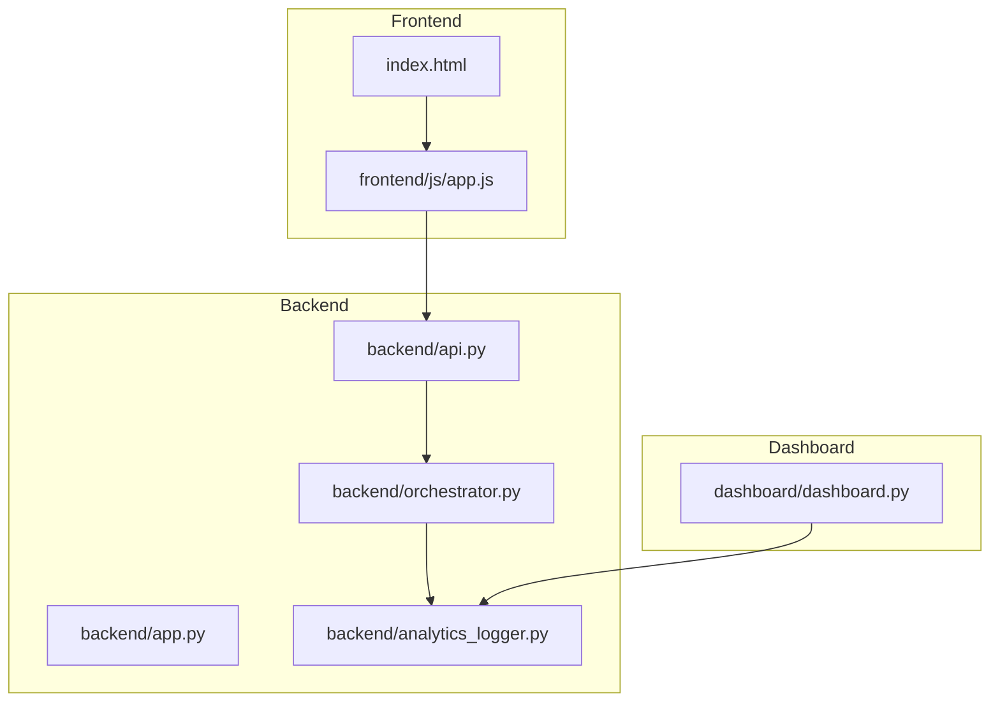
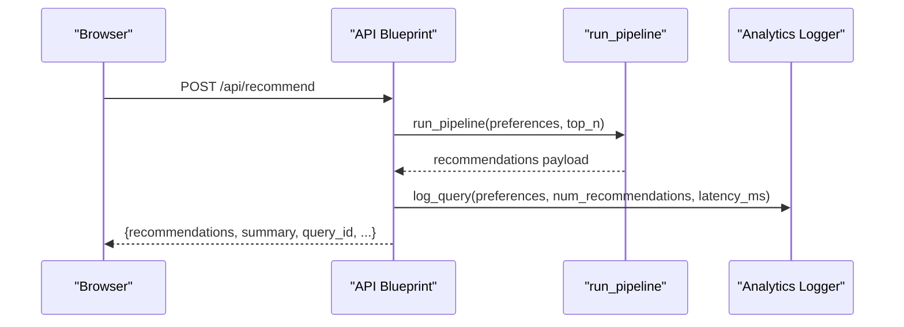
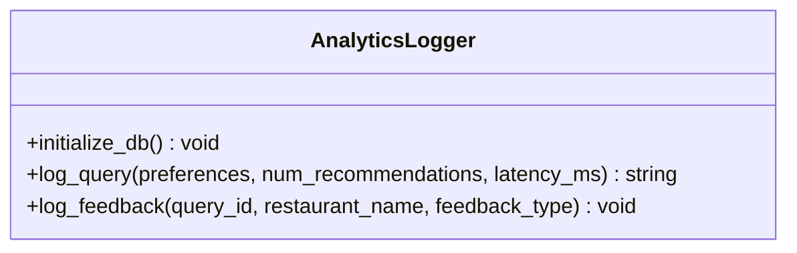
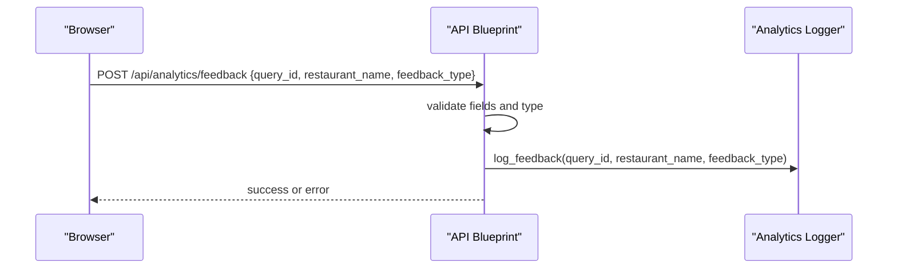
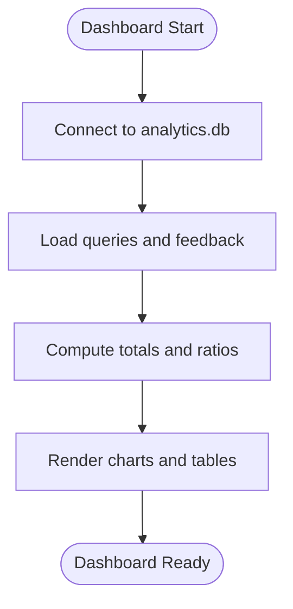
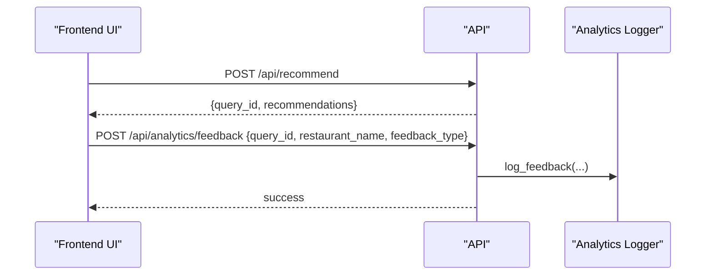
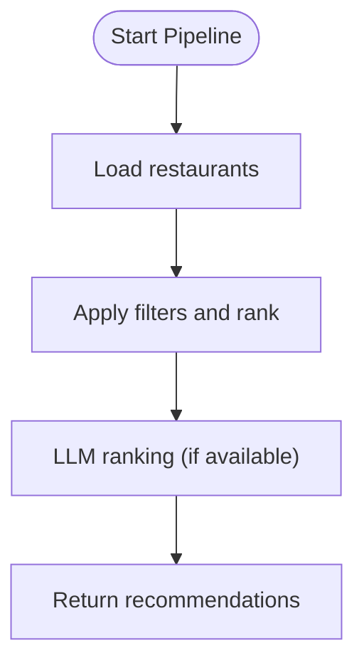
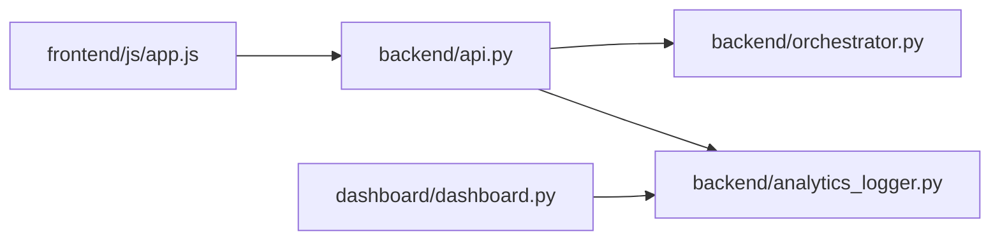
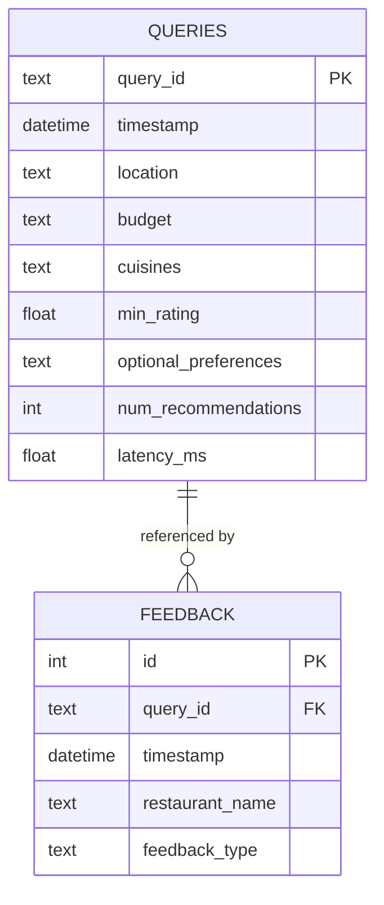

# Phase 6: Monitoring

<cite>
**Referenced Files in This Document**
- [analytics_logger.py](file://architecture/phase_6_monitoring/backend/analytics_logger.py)
- [api.py](file://architecture/phase_6_monitoring/backend/api.py)
- [dashboard.py](file://architecture/phase_6_monitoring/dashboard/dashboard.py)
- [app.py](file://architecture/phase_6_monitoring/backend/app.py)
- [orchestrator.py](file://architecture/phase_6_monitoring/backend/orchestrator.py)
- [__main__.py](file://architecture/phase_6_monitoring/__main__.py)
- [metadata.json](file://architecture/phase_6_monitoring/metadata.json)
- [sample_recommendations.json](file://architecture/phase_6_monitoring/sample_recommendations.json)
- [index.html](file://architecture/phase_6_monitoring/frontend/index.html)
- [app.js](file://architecture/phase_6_monitoring/frontend/js/app.js)
</cite>

## Table of Contents
1. [Introduction](#introduction)
2. [Project Structure](#project-structure)
3. [Core Components](#core-components)
4. [Architecture Overview](#architecture-overview)
5. [Detailed Component Analysis](#detailed-component-analysis)
6. [Dependency Analysis](#dependency-analysis)
7. [Performance Considerations](#performance-considerations)
8. [Troubleshooting Guide](#troubleshooting-guide)
9. [Conclusion](#conclusion)
10. [Appendices](#appendices)

## Introduction
Phase 6 Monitoring establishes a lightweight analytics and observability layer for the recommendation system. It captures user query logs, tracks performance metrics (latency), collects explicit feedback, persists data locally, and exposes a Streamlit-based dashboard for insights. The monitoring stack integrates seamlessly with the recommendation pipeline and frontend, enabling continuous improvement by surfacing trends, problematic recommendations, and system performance indicators.

## Project Structure
The monitoring subsystem is organized into three primary areas:
- Backend analytics logger and API: persistent storage, ingestion, and analytics endpoints
- Orchestrator and API integration: pipeline orchestration and analytics hooks
- Dashboard: real-time visualization of queries, feedback, and trends
- Frontend: user-driven feedback submission and query initiation

**Diagram sources**
- [app.py:14-41](file://architecture/phase_6_monitoring/backend/app.py#L14-L41)
- [api.py:15-119](file://architecture/phase_6_monitoring/backend/api.py#L15-L119)
- [orchestrator.py:77-228](file://architecture/phase_6_monitoring/backend/orchestrator.py#L77-L228)
- [analytics_logger.py:13-87](file://architecture/phase_6_monitoring/backend/analytics_logger.py#L13-L87)
- [dashboard.py:11-102](file://architecture/phase_6_monitoring/dashboard/dashboard.py#L11-L102)

**Section sources**
- [app.py:14-41](file://architecture/phase_6_monitoring/backend/app.py#L14-L41)
- [api.py:15-119](file://architecture/phase_6_monitoring/backend/api.py#L15-L119)
- [dashboard.py:11-102](file://architecture/phase_6_monitoring/dashboard/dashboard.py#L11-L102)

## Core Components
- Analytics Logger: Creates and maintains SQLite tables for queries and feedback, and provides functions to log queries and feedback.
- API Layer: Exposes endpoints for health checks, sample data, metadata, recommendation runs, and feedback submission. Integrates analytics logging during recommendation requests.
- Dashboard: Reads analytics data from SQLite and renders overview metrics, trend charts, problematic recommendations, and recent queries.
- Frontend: Submits feedback via a dedicated endpoint and injects the returned query_id into results for traceability.
- Orchestrator: Executes the recommendation pipeline and returns results; latency is measured around the pipeline execution.

Key responsibilities:
- Data collection: queries and feedback persisted to a local SQLite database
- Performance tracking: latency_ms captured per recommendation request
- Feedback collection: explicit likes/dislikes per recommendation
- Dashboard: overview metrics, temporal trends, and actionable insights

**Section sources**
- [analytics_logger.py:13-87](file://architecture/phase_6_monitoring/backend/analytics_logger.py#L13-L87)
- [api.py:43-96](file://architecture/phase_6_monitoring/backend/api.py#L43-L96)
- [dashboard.py:23-102](file://architecture/phase_6_monitoring/dashboard/dashboard.py#L23-L102)
- [app.js:167-195](file://architecture/phase_6_monitoring/frontend/js/app.js#L167-L195)

## Architecture Overview
The monitoring architecture follows a simple, cohesive pattern:
- Frontend sends a recommendation request and receives a response containing a query_id
- Backend orchestrates the pipeline, measures latency, and logs the query to analytics
- Frontend optionally submits feedback for individual recommendations
- Dashboard reads analytics data from the local database and visualizes trends and insights

**Diagram sources**
- [api.py:82-91](file://architecture/phase_6_monitoring/backend/api.py#L82-L91)
- [orchestrator.py:77-228](file://architecture/phase_6_monitoring/backend/orchestrator.py#L77-L228)
- [analytics_logger.py:46-70](file://architecture/phase_6_monitoring/backend/analytics_logger.py#L46-L70)

## Detailed Component Analysis

### Analytics Logger
Responsibilities:
- Initialize SQLite tables for queries and feedback
- Log user queries with normalized preferences and performance metrics
- Record explicit feedback for recommendations

Data model:
- queries table: stores query identifiers, timestamps, normalized preferences, number of recommendations, and latency
- feedback table: stores feedback entries linked to a query_id

Operational flow:
- On import, ensure tables exist
- Insert query rows with JSON-serialized arrays and numeric ratings
- Insert feedback rows with foreign key linkage to queries

**Diagram sources**
- [analytics_logger.py:13-87](file://architecture/phase_6_monitoring/backend/analytics_logger.py#L13-L87)

**Section sources**
- [analytics_logger.py:13-87](file://architecture/phase_6_monitoring/backend/analytics_logger.py#L13-L87)

### Backend API Endpoints
Endpoints:
- GET /api/health: service health status
- GET /api/sample: sample recommendations payload
- GET /api/metadata: locations and cuisines for frontend dropdowns
- POST /api/recommend: executes the pipeline, measures latency, logs query, and returns results with query_id
- POST /api/analytics/feedback: accepts feedback for a specific recommendation and query_id

Processing logic:
- Validation of request body and required fields
- Pipeline execution timing around run_pipeline
- Injection of query_id into the response for frontend feedback
- Feedback validation and persistence

**Diagram sources**
- [api.py:97-119](file://architecture/phase_6_monitoring/backend/api.py#L97-L119)
- [analytics_logger.py:72-83](file://architecture/phase_6_monitoring/backend/analytics_logger.py#L72-L83)

**Section sources**
- [api.py:20-119](file://architecture/phase_6_monitoring/backend/api.py#L20-L119)

### Dashboard Visualization
Dashboard components:
- Data loading: connects to the local SQLite database and loads queries and feedback
- Overview metrics: total queries, average latency, total feedback, like ratio
- Trends: hourly query volume and feedback distribution
- Problematic recommendations: joined feedback with queries to highlight dislikes
- Recent queries: latest entries ordered by timestamp

**Diagram sources**
- [dashboard.py:23-102](file://architecture/phase_6_monitoring/dashboard/dashboard.py#L23-L102)

**Section sources**
- [dashboard.py:23-102](file://architecture/phase_6_monitoring/dashboard/dashboard.py#L23-L102)

### Frontend Integration
Frontend behaviors:
- Loads metadata (locations and cuisines) on initialization
- Sends recommendation requests and displays results with a query_id
- Submits feedback via POST /api/analytics/feedback when users click like/dislike buttons
- Uses the injected query_id to associate feedback with the original query

**Diagram sources**
- [app.js:228-251](file://architecture/phase_6_monitoring/frontend/js/app.js#L228-L251)
- [app.js:167-195](file://architecture/phase_6_monitoring/frontend/js/app.js#L167-L195)
- [api.py:97-119](file://architecture/phase_6_monitoring/backend/api.py#L97-L119)
- [analytics_logger.py:72-83](file://architecture/phase_6_monitoring/backend/analytics_logger.py#L72-L83)

**Section sources**
- [app.js:294-324](file://architecture/phase_6_monitoring/frontend/js/app.js#L294-L324)
- [app.js:167-195](file://architecture/phase_6_monitoring/frontend/js/app.js#L167-L195)

### Orchestrator and Pipeline Timing
The orchestrator executes the recommendation pipeline and returns results. The API measures latency around this call and passes it to the analytics logger along with the number of recommendations.

**Diagram sources**
- [orchestrator.py:77-228](file://architecture/phase_6_monitoring/backend/orchestrator.py#L77-L228)

**Section sources**
- [orchestrator.py:77-228](file://architecture/phase_6_monitoring/backend/orchestrator.py#L77-L228)
- [api.py:82-88](file://architecture/phase_6_monitoring/backend/api.py#L82-L88)

## Dependency Analysis
- Frontend depends on backend endpoints for metadata, recommendations, and feedback
- API depends on the orchestrator for recommendation execution and on the analytics logger for logging
- Dashboard depends on the analytics database for visualization
- Analytics logger depends on SQLite for persistence

**Diagram sources**
- [app.js:228-251](file://architecture/phase_6_monitoring/frontend/js/app.js#L228-L251)
- [api.py:82-91](file://architecture/phase_6_monitoring/backend/api.py#L82-L91)
- [analytics_logger.py:46-83](file://architecture/phase_6_monitoring/backend/analytics_logger.py#L46-L83)
- [dashboard.py:23-30](file://architecture/phase_6_monitoring/dashboard/dashboard.py#L23-L30)

**Section sources**
- [app.py:23-25](file://architecture/phase_6_monitoring/backend/app.py#L23-L25)
- [api.py:12-13](file://architecture/phase_6_monitoring/backend/api.py#L12-L13)
- [dashboard.py:9-15](file://architecture/phase_6_monitoring/dashboard/dashboard.py#L9-L15)

## Performance Considerations
- Latency measurement: The API measures elapsed time around the pipeline execution and logs it as latency_ms for each query.
- Lightweight storage: SQLite is used for simplicity and minimal overhead; suitable for development and small-scale deployments.
- Query volume: Dashboard aggregates hourly query counts; this helps identify traffic spikes and tuning needs.
- Feedback ratio: The dashboard computes like/dislike ratios to gauge user satisfaction trends.

Practical tips:
- Monitor average latency and feedback ratios over time to detect regressions
- Use dashboard insights to guide improvements in filtering and prompting
- Consider indexing strategies if scaling beyond development usage

[No sources needed since this section provides general guidance]

## Troubleshooting Guide
Common issues and resolutions:
- Database not found: The dashboard checks for the presence of the analytics database and stops with an informative message if missing. Ensure the backend is started and at least one recommendation request is made so the database is initialized.
- Missing query_id: Feedback submission requires a valid query_id. Verify that the recommendation response includes query_id and that the frontend attaches it to feedback events.
- Validation errors: The API validates request bodies and feedback types. Ensure requests conform to expected shapes and feedback_type is either like or dislike.
- Metadata loading failures: The frontend attempts to load locations and cuisines from the metadata endpoint. Confirm the endpoint is reachable and returns valid JSON.

**Section sources**
- [dashboard.py:12-15](file://architecture/phase_6_monitoring/dashboard/dashboard.py#L12-L15)
- [api.py:58-79](file://architecture/phase_6_monitoring/backend/api.py#L58-L79)
- [api.py:104-112](file://architecture/phase_6_monitoring/backend/api.py#L104-L112)
- [app.js:294-324](file://architecture/phase_6_monitoring/frontend/js/app.js#L294-L324)

## Conclusion
Phase 6 Monitoring provides a practical foundation for observability and continuous improvement. By capturing query logs, performance metrics, and explicit feedback, and visualizing trends through a simple dashboard, teams can iteratively refine filtering and prompting logic. The modular design allows easy extension for additional metrics, richer dashboards, or migration to centralized analytics backends as the system scales.

[No sources needed since this section summarizes without analyzing specific files]

## Appendices

### Configuration Options and Parameters
- Logging and persistence
  - Database path: The analytics database path is derived from the backend directory and used consistently across modules.
  - Tables: Automatically initialized on import; no manual setup required.
- API parameters
  - POST /api/recommend: Accepts location, budget, cuisines, min_rating, optional_preferences, and top_n. Returns recommendations and query_id.
  - POST /api/analytics/feedback: Requires query_id, restaurant_name, and feedback_type (like or dislike).
- Dashboard parameters
  - Page configuration: Wide layout and page title set for analytics presentation.
  - Data refresh: Dashboard reads from the database on startup; restart the dashboard after new data is written.
- Frontend parameters
  - Metadata endpoints: Used to populate location and cuisine dropdowns.
  - Feedback submission: Uses the injected query_id to associate feedback with the original query.

**Section sources**
- [analytics_logger.py:7-86](file://architecture/phase_6_monitoring/backend/analytics_logger.py#L7-L86)
- [api.py:43-96](file://architecture/phase_6_monitoring/backend/api.py#L43-L96)
- [api.py:97-119](file://architecture/phase_6_monitoring/backend/api.py#L97-L119)
- [dashboard.py:7-15](file://architecture/phase_6_monitoring/dashboard/dashboard.py#L7-L15)
- [app.js:294-324](file://architecture/phase_6_monitoring/frontend/js/app.js#L294-L324)

### Data Model and Relationships

**Diagram sources**
- [analytics_logger.py:18-41](file://architecture/phase_6_monitoring/backend/analytics_logger.py#L18-L41)

### Example Workflows

- Query logging pattern
  - The API measures latency around the pipeline execution and logs the query with normalized preferences and the number of recommendations.
  - The response includes query_id for subsequent feedback association.

- Feedback collection
  - The frontend submits feedback to the analytics endpoint with the query_id, restaurant name, and feedback type.
  - The backend validates inputs and persists feedback linked to the query.

- Dashboard rendering
  - The dashboard connects to the analytics database, loads queries and feedback, computes metrics, and renders charts and tables.

**Section sources**
- [api.py:82-91](file://architecture/phase_6_monitoring/backend/api.py#L82-L91)
- [analytics_logger.py:46-83](file://architecture/phase_6_monitoring/backend/analytics_logger.py#L46-L83)
- [app.js:167-195](file://architecture/phase_6_monitoring/frontend/js/app.js#L167-L195)
- [dashboard.py:23-102](file://architecture/phase_6_monitoring/dashboard/dashboard.py#L23-L102)