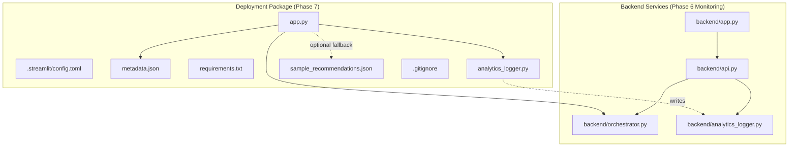
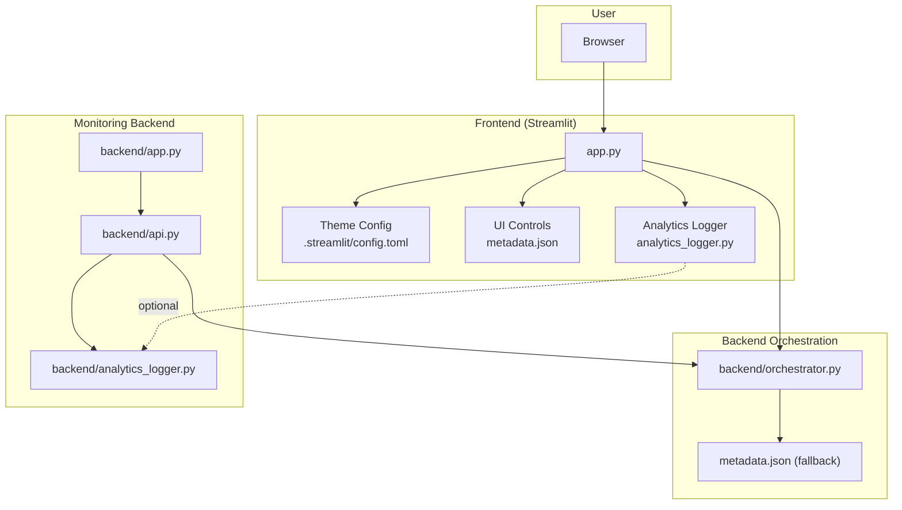
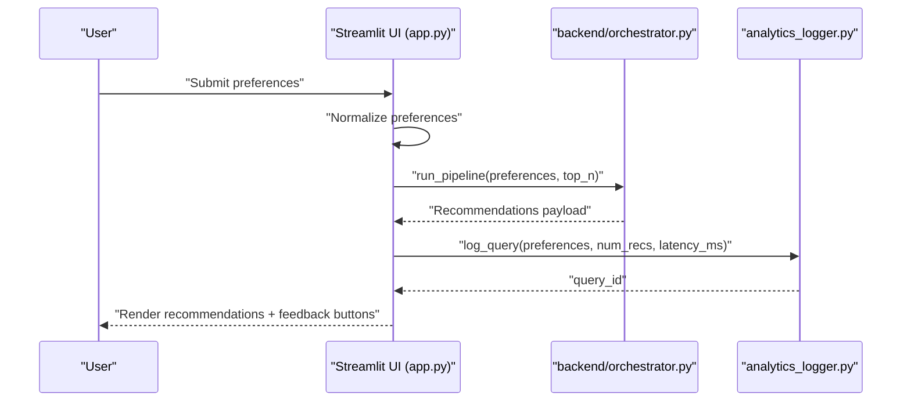
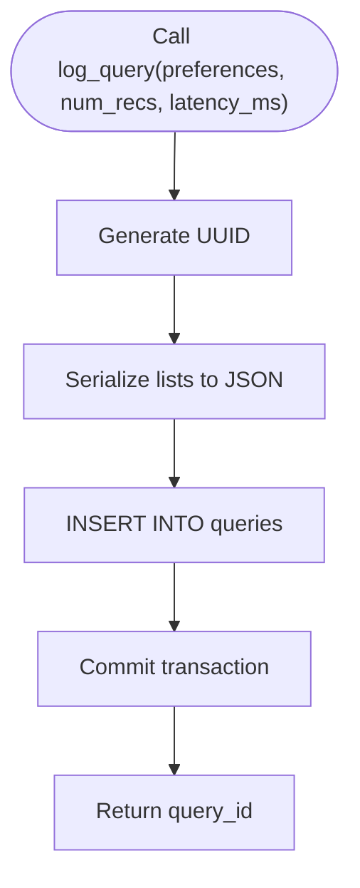
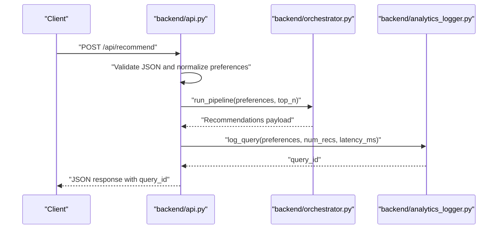
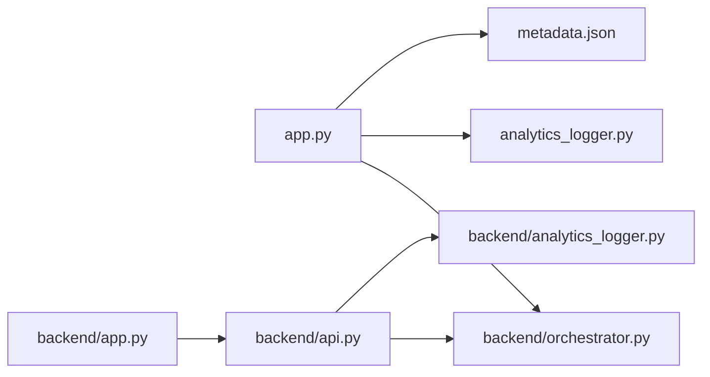

# Phase 7: Deployment

<cite>
**Referenced Files in This Document**
- [app.py](file://Zomato/architecture/phase_7_deployment/app.py)
- [.streamlit/config.toml](file://Zomato/architecture/phase_7_deployment/.streamlit/config.toml)
- [analytics_logger.py](file://Zomato/architecture/phase_7_deployment/analytics_logger.py)
- [metadata.json](file://Zomato/architecture/phase_7_deployment/metadata.json)
- [requirements.txt](file://Zomato/architecture/phase_7_deployment/requirements.txt)
- [orchestrator.py](file://Zomato/architecture/phase_6_monitoring/backend/orchestrator.py)
- [api.py](file://Zomato/architecture/phase_6_monitoring/backend/api.py)
- [app.py (Flask)](file://Zomato/architecture/phase_6_monitoring/backend/app.py)
- [analytics_logger.py (Monitoring)](file://Zomato/architecture/phase_6_monitoring/backend/analytics_logger.py)
- [.gitignore](file://Zomato/architecture/phase_7_deployment/.gitignore)
- [sample_recommendations.json](file://Zomato/architecture/phase_7_deployment/sample_recommendations.json)
</cite>

## Table of Contents
1. [Introduction](#introduction)
2. [Project Structure](#project-structure)
3. [Core Components](#core-components)
4. [Architecture Overview](#architecture-overview)
5. [Detailed Component Analysis](#detailed-component-analysis)
6. [Dependency Analysis](#dependency-analysis)
7. [Performance Considerations](#performance-considerations)
8. [Troubleshooting Guide](#troubleshooting-guide)
9. [Conclusion](#conclusion)
10. [Appendices](#appendices)

## Introduction
This document explains the Phase 7 Deployment component of the Zomato recommendation system. It focuses on the Streamlit application structure, configuration management via .streamlit/config.toml, production monitoring integration through analytics_logger.py, and how the deployment integrates with backend services. It also covers environment variable management, deployment targets (Streamlit Cloud, Heroku), and practical steps to prepare the app for production.

## Project Structure
The deployment package centers around a single-page Streamlit application that orchestrates user preferences, invokes the backend recommendation pipeline, and logs analytics for production monitoring. Supporting assets include metadata, requirements, and a SQLite-backed analytics logger.

**Diagram sources**
- [app.py:1-123](file://Zomato/architecture/phase_7_deployment/app.py#L1-L123)
- [.streamlit/config.toml:1-7](file://Zomato/architecture/phase_7_deployment/.streamlit/config.toml#L1-L7)
- [metadata.json:1-196](file://Zomato/architecture/phase_7_deployment/metadata.json#L1-L196)
- [requirements.txt:1-6](file://Zomato/architecture/phase_7_deployment/requirements.txt#L1-L6)
- [analytics_logger.py:1-87](file://Zomato/architecture/phase_7_deployment/analytics_logger.py#L1-L87)
- [sample_recommendations.json:1-53](file://Zomato/architecture/phase_7_deployment/sample_recommendations.json#L1-L53)
- [orchestrator.py:1-228](file://Zomato/architecture/phase_6_monitoring/backend/orchestrator.py#L1-L228)
- [api.py:1-119](file://Zomato/architecture/phase_6_monitoring/backend/api.py#L1-L119)
- [app.py (Flask):1-41](file://Zomato/architecture/phase_6_monitoring/backend/app.py#L1-L41)
- [analytics_logger.py (Monitoring):1-87](file://Zomato/architecture/phase_6_monitoring/backend/analytics_logger.py#L1-L87)

**Section sources**
- [app.py:1-123](file://Zomato/architecture/phase_7_deployment/app.py#L1-L123)
- [.streamlit/config.toml:1-7](file://Zomato/architecture/phase_7_deployment/.streamlit/config.toml#L1-L7)
- [metadata.json:1-196](file://Zomato/architecture/phase_7_deployment/metadata.json#L1-L196)
- [requirements.txt:1-6](file://Zomato/architecture/phase_7_deployment/requirements.txt#L1-L6)
- [analytics_logger.py:1-87](file://Zomato/architecture/phase_7_deployment/analytics_logger.py#L1-L87)
- [sample_recommendations.json:1-53](file://Zomato/architecture/phase_7_deployment/sample_recommendations.json#L1-L53)

## Core Components
- Streamlit Application (app.py): Single-page UI that collects user preferences, renders recommendations, and logs analytics.
- Theme and UI Configuration (.streamlit/config.toml): Defines Streamlit theme colors, fonts, and page configuration.
- Analytics Logger (analytics_logger.py): SQLite-backed logging for queries and feedback; supports production monitoring.
- Metadata (metadata.json): Predefined locations and cuisines for UI dropdowns.
- Backend Orchestration (backend/orchestrator.py): Loads datasets, applies candidate filtering/ranking, and integrates LLM ranking.
- REST API (backend/api.py): Exposes endpoints for health checks, metadata, recommendations, and feedback.
- Flask App Factory (backend/app.py): Serves the API and static frontend assets.

Key responsibilities:
- app.py loads metadata, validates user inputs, runs the pipeline, and logs analytics.
- Orchestrator coordinates dataset loading, candidate filtering/ranking, and LLM ranking.
- API exposes recommendation endpoints and integrates analytics logging.
- Analytics logger persists query and feedback events for monitoring dashboards.

**Section sources**
- [app.py:1-123](file://Zomato/architecture/phase_7_deployment/app.py#L1-L123)
- [.streamlit/config.toml:1-7](file://Zomato/architecture/phase_7_deployment/.streamlit/config.toml#L1-L7)
- [analytics_logger.py:1-87](file://Zomato/architecture/phase_7_deployment/analytics_logger.py#L1-L87)
- [metadata.json:1-196](file://Zomato/architecture/phase_7_deployment/metadata.json#L1-L196)
- [orchestrator.py:1-228](file://Zomato/architecture/phase_6_monitoring/backend/orchestrator.py#L1-L228)
- [api.py:1-119](file://Zomato/architecture/phase_6_monitoring/backend/api.py#L1-L119)
- [app.py (Flask):1-41](file://Zomato/architecture/phase_6_monitoring/backend/app.py#L1-L41)

## Architecture Overview
The Streamlit frontend consumes the orchestration pipeline and logs analytics locally. The monitoring backend maintains a separate analytics logger and REST API for production-grade observability.

**Diagram sources**
- [app.py:1-123](file://Zomato/architecture/phase_7_deployment/app.py#L1-L123)
- [.streamlit/config.toml:1-7](file://Zomato/architecture/phase_7_deployment/.streamlit/config.toml#L1-L7)
- [metadata.json:1-196](file://Zomato/architecture/phase_7_deployment/metadata.json#L1-L196)
- [analytics_logger.py:1-87](file://Zomato/architecture/phase_7_deployment/analytics_logger.py#L1-L87)
- [orchestrator.py:1-228](file://Zomato/architecture/phase_6_monitoring/backend/orchestrator.py#L1-L228)
- [api.py:1-119](file://Zomato/architecture/phase_6_monitoring/backend/api.py#L1-L119)
- [app.py (Flask):1-41](file://Zomato/architecture/phase_6_monitoring/backend/app.py#L1-L41)
- [analytics_logger.py (Monitoring):1-87](file://Zomato/architecture/phase_6_monitoring/backend/analytics_logger.py#L1-L87)

## Detailed Component Analysis

### Streamlit Application (app.py)
Responsibilities:
- Sets Streamlit page configuration and custom CSS.
- Loads metadata from a JSON file or falls back to orchestrator-provided metadata.
- Renders a form for user preferences and displays recommendations.
- Logs queries and feedback via analytics_logger and shows latency metrics.

Key behaviors:
- Preference normalization: Converts raw budget slider to categorical buckets and parses optional preferences.
- Pipeline invocation: Calls orchestrator.run_pipeline with validated preferences and top-N selection.
- Analytics logging: Records query metadata and latency; attaches a query ID for feedback.
- Error handling: Displays user-friendly messages and logs exceptions.

**Diagram sources**
- [app.py:77-123](file://Zomato/architecture/phase_7_deployment/app.py#L77-L123)
- [orchestrator.py:77-228](file://Zomato/architecture/phase_6_monitoring/backend/orchestrator.py#L77-L228)
- [analytics_logger.py:46-70](file://Zomato/architecture/phase_7_deployment/analytics_logger.py#L46-L70)

**Section sources**
- [app.py:1-123](file://Zomato/architecture/phase_7_deployment/app.py#L1-L123)

### Streamlit Theme and UI Configuration (.streamlit/config.toml)
Highlights:
- Primary color, background, secondary background, and text color define a dark theme.
- Font setting adjusts typography for readability.
- Page configuration sets title, layout, and icon for the Streamlit app.

Practical impact:
- Ensures consistent branding and accessibility in the deployed UI.
- Supports rapid iteration by centralizing theme overrides.

**Section sources**
- [.streamlit/config.toml:1-7](file://Zomato/architecture/phase_7_deployment/.streamlit/config.toml#L1-L7)

### Analytics Logger (analytics_logger.py)
Capabilities:
- Initializes SQLite tables for queries and feedback.
- Generates a UUID per query and stores normalized preferences, number of recommendations, and latency.
- Records feedback events keyed by query_id.

Production monitoring:
- Provides a lightweight, file-backed persistence layer for analytics.
- Integrates with the monitoring backend’s analytics logger for centralized dashboards.

**Diagram sources**
- [analytics_logger.py:46-70](file://Zomato/architecture/phase_7_deployment/analytics_logger.py#L46-L70)

**Section sources**
- [analytics_logger.py:1-87](file://Zomato/architecture/phase_7_deployment/analytics_logger.py#L1-L87)

### Metadata Management (metadata.json)
Purpose:
- Supplies predefined locations and cuisines for dropdowns in the UI.
- Enables immediate operation without backend dependencies during development or minimal deployments.

Fallback behavior:
- If metadata.json is missing, the Streamlit app attempts to fetch metadata from the orchestrator.

**Section sources**
- [metadata.json:1-196](file://Zomato/architecture/phase_7_deployment/metadata.json#L1-L196)
- [app.py:39-55](file://Zomato/architecture/phase_7_deployment/app.py#L39-L55)

### Backend Orchestration and API Integration
The Streamlit app directly calls the orchestrator for recommendations. The monitoring backend exposes a REST API that:
- Validates inputs for recommendations.
- Invokes the orchestrator.
- Logs queries and returns a query_id for feedback.
- Provides health checks and metadata endpoints.

**Diagram sources**
- [api.py:43-95](file://Zomato/architecture/phase_6_monitoring/backend/api.py#L43-L95)
- [orchestrator.py:77-228](file://Zomato/architecture/phase_6_monitoring/backend/orchestrator.py#L77-L228)
- [analytics_logger.py (Monitoring):46-70](file://Zomato/architecture/phase_6_monitoring/backend/analytics_logger.py#L46-L70)

**Section sources**
- [api.py:1-119](file://Zomato/architecture/phase_6_monitoring/backend/api.py#L1-L119)
- [orchestrator.py:1-228](file://Zomato/architecture/phase_6_monitoring/backend/orchestrator.py#L1-L228)
- [analytics_logger.py (Monitoring):1-87](file://Zomato/architecture/phase_6_monitoring/backend/analytics_logger.py#L1-L87)

### Environment Variables and Secrets
- The monitoring backend loads environment variables using python-dotenv and expects a GROQ API key for LLM ranking.
- The deployment package ignores .env and analytics.db in version control to protect secrets.

Recommended practice:
- Store GROQ_API_KEY in a secure environment variable on the deployment platform.
- Use platform-specific secret management (e.g., Streamlit Cloud or Heroku config vars).

**Section sources**
- [api.py:151-156](file://Zomato/architecture/phase_6_monitoring/backend/api.py#L151-L156)
- [.gitignore:1-5](file://Zomato/architecture/phase_7_deployment/.gitignore#L1-L5)

## Dependency Analysis
- app.py depends on:
  - backend/orchestrator.py for recommendation logic.
  - analytics_logger.py for query and feedback logging.
  - metadata.json for UI dropdowns.
- backend/api.py depends on:
  - backend/orchestrator.py for recommendations.
  - backend/analytics_logger.py for logging.
- backend/app.py registers the API blueprint and serves static assets.

**Diagram sources**
- [app.py:1-17](file://Zomato/architecture/phase_7_deployment/app.py#L1-L17)
- [orchestrator.py:1-228](file://Zomato/architecture/phase_6_monitoring/backend/orchestrator.py#L1-L228)
- [analytics_logger.py:1-87](file://Zomato/architecture/phase_7_deployment/analytics_logger.py#L1-L87)
- [api.py:1-119](file://Zomato/architecture/phase_6_monitoring/backend/api.py#L1-L119)
- [app.py (Flask):1-41](file://Zomato/architecture/phase_6_monitoring/backend/app.py#L1-L41)

**Section sources**
- [app.py:1-17](file://Zomato/architecture/phase_7_deployment/app.py#L1-L17)
- [api.py:12-13](file://Zomato/architecture/phase_6_monitoring/backend/api.py#L12-L13)

## Performance Considerations
- Local analytics logging uses SQLite; for high-throughput production, consider migrating to a managed database and adding indexing on frequently queried columns (e.g., timestamps, location).
- Recommendation latency is measured and logged; monitor trends to identify slow paths (dataset loading, LLM calls).
- Streamlit caching can reduce repeated computations; evaluate caching strategies for metadata and static assets.
- Keep dependencies lean; review requirements.txt to minimize cold-start times on serverless platforms.

[No sources needed since this section provides general guidance]

## Troubleshooting Guide
Common issues and resolutions:
- Missing GROQ_API_KEY:
  - Symptom: LLM ranking fails and the pipeline falls back to sample recommendations.
  - Resolution: Set the environment variable on the deployment platform.
- Analytics database path:
  - Symptom: Analytics logger cannot write to analytics.db.
  - Resolution: Ensure the working directory is writable and the path resolves correctly.
- Metadata not found:
  - Symptom: UI dropdowns show defaults; recommendations may be limited.
  - Resolution: Provide metadata.json or ensure orchestrator metadata generation succeeds.
- CORS errors (if serving frontend separately):
  - Symptom: Browser blocks API requests.
  - Resolution: Enable CORS in the Flask app factory and configure allowed origins.

**Section sources**
- [api.py:151-156](file://Zomato/architecture/phase_6_monitoring/backend/api.py#L151-L156)
- [analytics_logger.py:7-11](file://Zomato/architecture/phase_7_deployment/analytics_logger.py#L7-L11)
- [app.py:39-55](file://Zomato/architecture/phase_7_deployment/app.py#L39-L55)
- [app.py (Flask):8-20](file://Zomato/architecture/phase_6_monitoring/backend/app.py#L8-L20)

## Conclusion
The Phase 7 Deployment component integrates a Streamlit UI with backend orchestration and analytics logging. It emphasizes simplicity for development and scalability for production by leveraging environment variables, centralized configuration, and modular backend services. With proper environment setup and optional migration of analytics storage, the system supports reliable deployment on Streamlit Cloud or Heroku.

[No sources needed since this section summarizes without analyzing specific files]

## Appendices

### Streamlit App Configuration Options
- Page configuration: title, layout, icon.
- Custom CSS: button styling, slider spacing.
- Theme overrides: primary color, backgrounds, text color, font.

**Section sources**
- [app.py:19-36](file://Zomato/architecture/phase_7_deployment/app.py#L19-L36)
- [.streamlit/config.toml:1-7](file://Zomato/architecture/phase_7_deployment/.streamlit/config.toml#L1-L7)

### Deployment Targets and Setup
- Streamlit Cloud:
  - Upload repository and set environment variables (e.g., GROQ_API_KEY).
  - Streamlit app runs automatically; ensure .streamlit/config.toml is committed.
- Heroku:
  - Use a Python buildpack and a Procfile to run the Streamlit app.
  - Configure config vars for secrets and ensure analytics.db is persisted if needed.

[No sources needed since this section provides general guidance]

### Production Monitoring Setup
- Local analytics logger:
  - Stores queries and feedback in analytics.db.
  - Use for lightweight, embedded monitoring during early stages.
- Monitoring backend:
  - REST API endpoints for health, metadata, recommendations, and feedback.
  - Centralized analytics logger for dashboards and reporting.

**Section sources**
- [analytics_logger.py:1-87](file://Zomato/architecture/phase_7_deployment/analytics_logger.py#L1-L87)
- [api.py:1-119](file://Zomato/architecture/phase_6_monitoring/backend/api.py#L1-L119)
- [analytics_logger.py (Monitoring):1-87](file://Zomato/architecture/phase_6_monitoring/backend/analytics_logger.py#L1-L87)