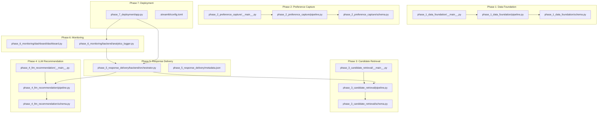
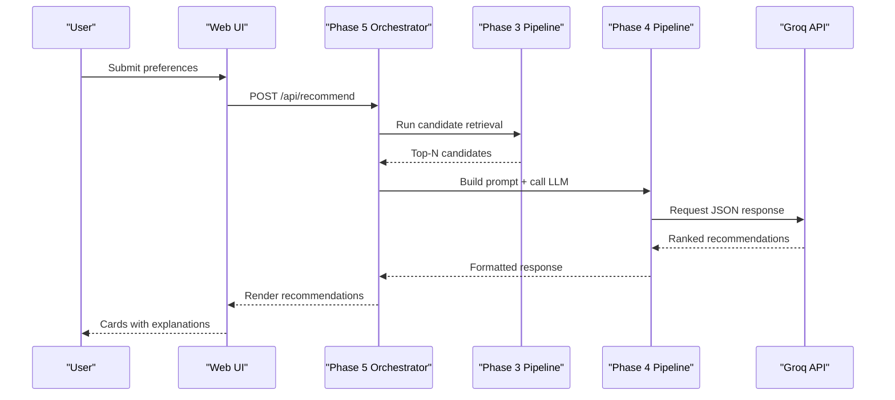
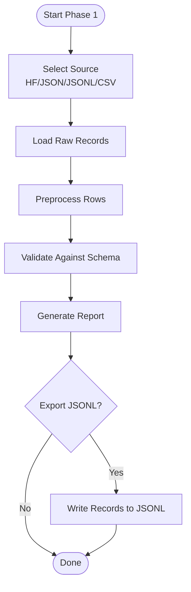
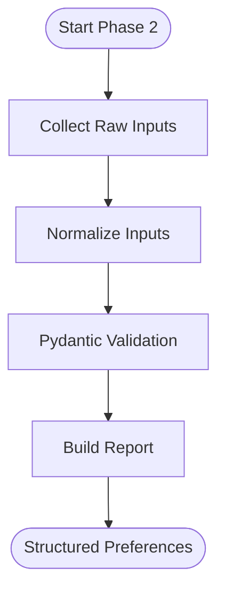
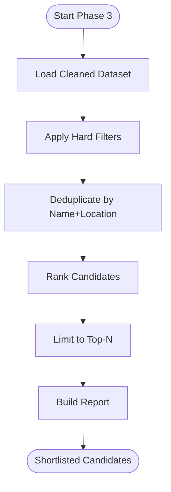
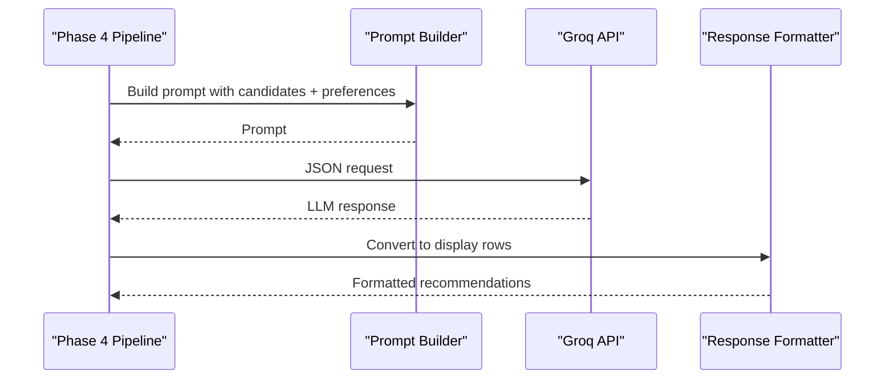
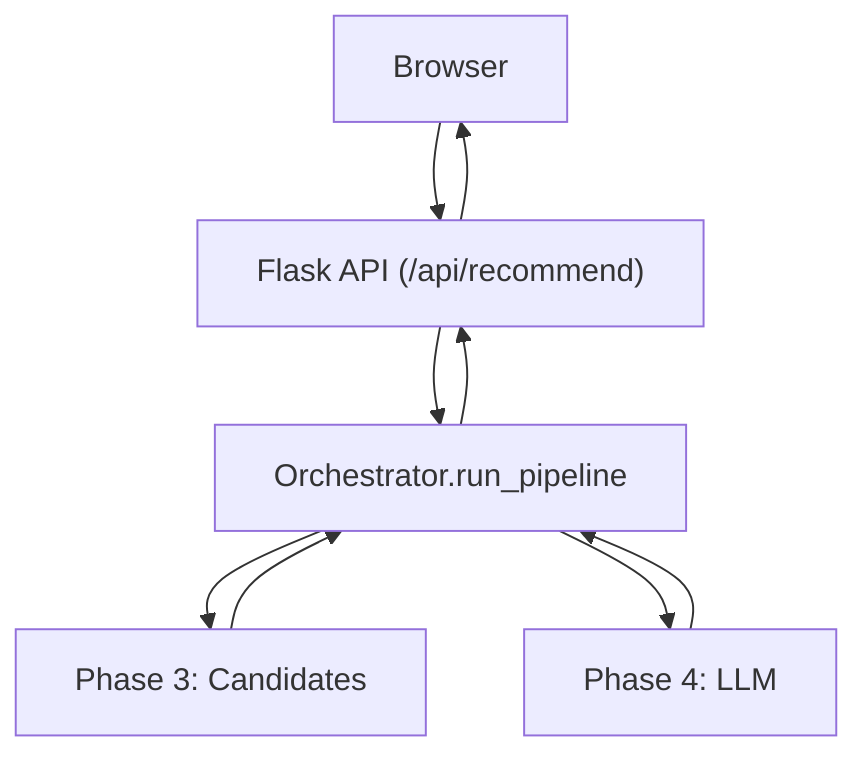
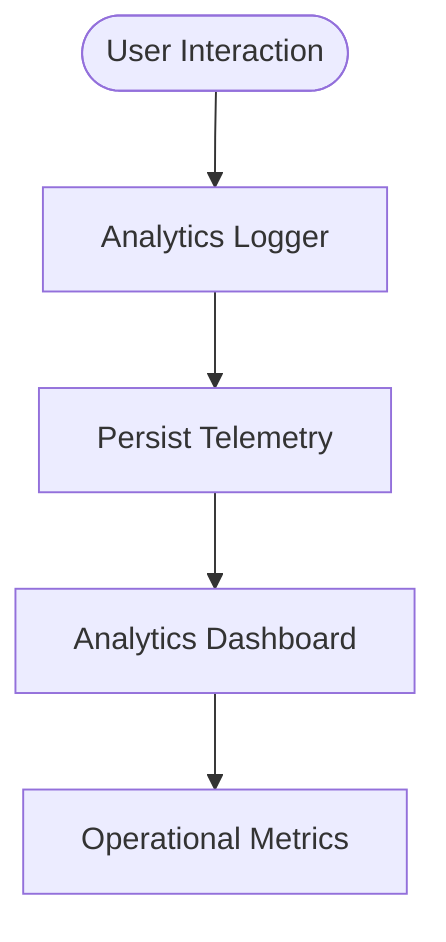
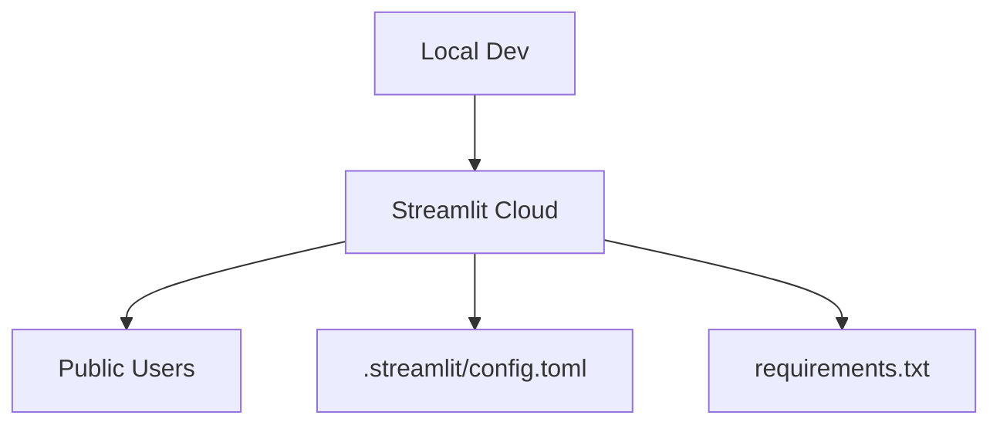
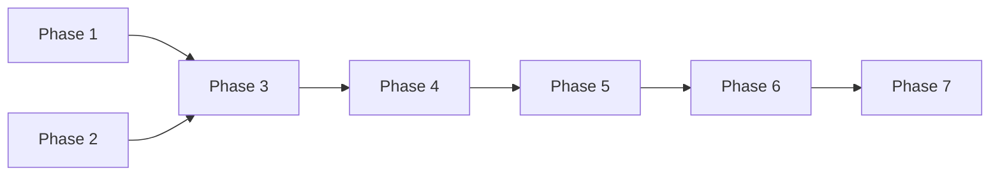

# Project Overview

<cite>
**Referenced Files in This Document**
- [problemstatement.md](file://problemstatement.md)
- [phase-wise-architecture.md](file://architecture/phase-wise-architecture.md)
- [__main__.py](file://architecture/phase_1_data_foundation/__main__.py)
- [pipeline.py](file://architecture/phase_1_data_foundation/pipeline.py)
- [schema.py](file://architecture/phase_1_data_foundation/schema.py)
- [__main__.py](file://architecture/phase_2_preference_capture/__main__.py)
- [pipeline.py](file://architecture/phase_2_preference_capture/pipeline.py)
- [schema.py](file://architecture/phase_2_preference_capture/schema.py)
- [__main__.py](file://architecture/phase_3_candidate_retrieval/__main__.py)
- [pipeline.py](file://architecture/phase_3_candidate_retrieval/pipeline.py)
- [schema.py](file://architecture/phase_3_candidate_retrieval/schema.py)
- [__main__.py](file://architecture/phase_4_llm_recommendation/__main__.py)
- [pipeline.py](file://architecture/phase_4_llm_recommendation/pipeline.py)
- [schema.py](file://architecture/phase_4_llm_recommendation/schema.py)
- [orchestrator.py](file://architecture/phase_5_response_delivery/backend/orchestrator.py)
- [metadata.json](file://architecture/phase_5_response_delivery/metadata.json)
</cite>

## Table of Contents
1. [Introduction](#introduction)
2. [Project Structure](#project-structure)
3. [Core Components](#core-components)
4. [Architecture Overview](#architecture-overview)
5. [Detailed Component Analysis](#detailed-component-analysis)
6. [Dependency Analysis](#dependency-analysis)
7. [Performance Considerations](#performance-considerations)
8. [Troubleshooting Guide](#troubleshooting-guide)
9. [Conclusion](#conclusion)
10. [Appendices](#appendices)

## Introduction
This document presents a comprehensive overview of the Zomato AI Restaurant Recommendation System, an AI-powered application designed to deliver personalized restaurant suggestions by combining structured data with Large Language Models (LLM). The system follows a seven-phase pipeline: Data Foundation, Preference Capture, Candidate Retrieval, LLM Recommendation, Response Delivery, Monitoring, and Deployment. It supports both guided web UIs per phase and command-line interfaces for automation, enabling end-to-end experimentation and production deployment.

The project’s purpose aligns with the problem statement: collect user preferences, process a real-world restaurant dataset, filter and rank candidates, and generate natural-language explanations using an LLM. The result is a user-friendly recommendation interface with optional analytics and a streamlined Streamlit deployment.

**Section sources**
- [problemstatement.md:1-65](file://problemstatement.md#L1-L65)

## Project Structure
The repository is organized by processing phases, each encapsulating a focused responsibility:
- Phase 1: Data Foundation — loads, cleans, validates, and exports a standardized restaurant dataset.
- Phase 2: Preference Capture — collects, normalizes, and validates user preferences.
- Phase 3: Candidate Retrieval — applies hard filters and ranks candidates for LLM reasoning.
- Phase 4: LLM Recommendation — constructs prompts, calls Groq, and formats results.
- Phase 5: Response Delivery — orchestrates the backend API and frontend UI.
- Phase 6: Monitoring — logs telemetry and provides an analytics dashboard.
- Phase 7: Deployment — hosts the unified Streamlit app with a Zomato-themed UI.

**Diagram sources**
- [__main__.py:1-54](file://architecture/phase_1_data_foundation/__main__.py#L1-L54)
- [pipeline.py:1-81](file://architecture/phase_1_data_foundation/pipeline.py#L1-L81)
- [schema.py:1-54](file://architecture/phase_1_data_foundation/schema.py#L1-L54)
- [__main__.py:1-46](file://architecture/phase_2_preference_capture/__main__.py#L1-L46)
- [pipeline.py:1-21](file://architecture/phase_2_preference_capture/pipeline.py#L1-L21)
- [schema.py:1-72](file://architecture/phase_2_preference_capture/schema.py#L1-L72)
- [__main__.py:1-51](file://architecture/phase_3_candidate_retrieval/__main__.py#L1-L51)
- [pipeline.py:1-51](file://architecture/phase_3_candidate_retrieval/pipeline.py#L1-L51)
- [schema.py:1-35](file://architecture/phase_3_candidate_retrieval/schema.py#L1-L35)
- [__main__.py:1-41](file://architecture/phase_4_llm_recommendation/__main__.py#L1-L41)
- [pipeline.py:1-47](file://architecture/phase_4_llm_recommendation/pipeline.py#L1-L47)
- [schema.py:1-38](file://architecture/phase_4_llm_recommendation/schema.py#L1-L38)
- [orchestrator.py:1-292](file://architecture/phase_5_response_delivery/backend/orchestrator.py#L1-L292)
- [metadata.json:1-196](file://architecture/phase_5_response_delivery/metadata.json#L1-L196)

**Section sources**
- [phase-wise-architecture.md:1-113](file://architecture/phase-wise-architecture.md#L1-L113)

## Core Components
- Phase 1 Data Foundation: Loads datasets from multiple sources, preprocesses and validates records, and writes standardized JSONL outputs with reports.
- Phase 2 Preference Capture: Normalizes and validates user preferences into a structured schema.
- Phase 3 Candidate Retrieval: Applies hard filters and ranking to produce a shortlist of candidates.
- Phase 4 LLM Recommendation: Builds prompts, calls Groq, and formats LLM responses into display-ready recommendations.
- Phase 5 Response Delivery: Orchestrates end-to-end execution, handles fallbacks, and exposes a REST API with a modern SPA.
- Phase 6 Monitoring: Logs interactions and provides a dashboard for operational insights.
- Phase 7 Deployment: Packages the system for Streamlit Cloud with a branded theme.

**Section sources**
- [phase-wise-architecture.md:3-113](file://architecture/phase-wise-architecture.md#L3-L113)
- [pipeline.py:21-67](file://architecture/phase_1_data_foundation/pipeline.py#L21-L67)
- [pipeline.py:11-20](file://architecture/phase_2_preference_capture/pipeline.py#L11-L20)
- [pipeline.py:24-50](file://architecture/phase_3_candidate_retrieval/pipeline.py#L24-L50)
- [pipeline.py:29-46](file://architecture/phase_4_llm_recommendation/pipeline.py#L29-L46)
- [orchestrator.py:112-291](file://architecture/phase_5_response_delivery/backend/orchestrator.py#L112-L291)

## Architecture Overview
The system is a multi-phase pipeline with clear boundaries and deterministic data exchange points. Each phase exposes a CLI entrypoint and a basic web UI for interactive exploration. Phase 5 orchestrator integrates the candidate retrieval and LLM recommendation stages, returning either live LLM results or a robust fallback.

**Diagram sources**
- [phase-wise-architecture.md:67-76](file://architecture/phase-wise-architecture.md#L67-L76)
- [orchestrator.py:112-291](file://architecture/phase_5_response_delivery/backend/orchestrator.py#L112-L291)
- [pipeline.py:24-50](file://architecture/phase_3_candidate_retrieval/pipeline.py#L24-L50)
- [pipeline.py:29-46](file://architecture/phase_4_llm_recommendation/pipeline.py#L29-L46)

## Detailed Component Analysis

### Phase 1: Data Foundation
Purpose: Establish a clean, queryable restaurant dataset by loading, cleaning, validating, and exporting records.

Key responsibilities:
- Accept multiple input formats (Hugging Face, JSON, JSONL, CSV).
- Preprocess and normalize fields.
- Validate against a strict schema and produce a report.

**Diagram sources**
- [pipeline.py:21-67](file://architecture/phase_1_data_foundation/pipeline.py#L21-L67)
- [__main__.py:10-50](file://architecture/phase_1_data_foundation/__main__.py#L10-L50)

**Section sources**
- [phase-wise-architecture.md:3-15](file://architecture/phase-wise-architecture.md#L3-L15)
- [pipeline.py:21-67](file://architecture/phase_1_data_foundation/pipeline.py#L21-L67)
- [schema.py:10-54](file://architecture/phase_1_data_foundation/schema.py#L10-L54)

### Phase 2: Preference Capture
Purpose: Normalize and validate user preferences into a structured object for downstream processing.

Key responsibilities:
- Normalize location, budget, cuisines, and optional preferences.
- Validate against the UserPreferences schema.

**Diagram sources**
- [pipeline.py:11-20](file://architecture/phase_2_preference_capture/pipeline.py#L11-L20)
- [schema.py:8-72](file://architecture/phase_2_preference_capture/schema.py#L8-L72)

**Section sources**
- [phase-wise-architecture.md:17-29](file://architecture/phase-wise-architecture.md#L17-L29)
- [pipeline.py:11-20](file://architecture/phase_2_preference_capture/pipeline.py#L11-L20)
- [schema.py:8-72](file://architecture/phase_2_preference_capture/schema.py#L8-L72)

### Phase 3: Candidate Retrieval
Purpose: Filter and rank restaurants based on user preferences to produce a shortlist for LLM reasoning.

Key responsibilities:
- Apply hard filters (location, budget, rating).
- Deduplicate candidates by restaurant and location.
- Rank candidates and limit to top-N.

**Diagram sources**
- [pipeline.py:24-50](file://architecture/phase_3_candidate_retrieval/pipeline.py#L24-L50)
- [schema.py:10-35](file://architecture/phase_3_candidate_retrieval/schema.py#L10-L35)

**Section sources**
- [phase-wise-architecture.md:30-42](file://architecture/phase-wise-architecture.md#L30-L42)
- [pipeline.py:24-50](file://architecture/phase_3_candidate_retrieval/pipeline.py#L24-L50)
- [schema.py:10-35](file://architecture/phase_3_candidate_retrieval/schema.py#L10-L35)

### Phase 4: LLM Recommendation
Purpose: Generate personalized, explainable recommendations using an LLM.

Key responsibilities:
- Build a structured prompt from preferences and candidates.
- Call Groq with JSON mode.
- Convert LLM output into a display-friendly format.

**Diagram sources**
- [pipeline.py:29-46](file://architecture/phase_4_llm_recommendation/pipeline.py#L29-L46)
- [schema.py:8-38](file://architecture/phase_4_llm_recommendation/schema.py#L8-L38)

**Section sources**
- [phase-wise-architecture.md:43-55](file://architecture/phase-wise-architecture.md#L43-L55)
- [pipeline.py:29-46](file://architecture/phase_4_llm_recommendation/pipeline.py#L29-L46)
- [schema.py:8-38](file://architecture/phase_4_llm_recommendation/schema.py#L8-L38)

### Phase 5: Response Delivery
Purpose: Orchestrate the end-to-end pipeline, expose APIs, and render recommendations.

Key responsibilities:
- Resolve the latest dataset from Phase 1 output.
- Run Phase 3 and Phase 4 in sequence.
- Fallback gracefully when data or LLM are unavailable.
- Serve a modern SPA with preference form and recommendation cards.

**Diagram sources**
- [phase-wise-architecture.md:67-76](file://architecture/phase-wise-architecture.md#L67-L76)
- [orchestrator.py:112-291](file://architecture/phase_5_response_delivery/backend/orchestrator.py#L112-L291)

**Section sources**
- [phase-wise-architecture.md:56-76](file://architecture/phase-wise-architecture.md#L56-L76)
- [orchestrator.py:112-291](file://architecture/phase_5_response_delivery/backend/orchestrator.py#L112-L291)
- [metadata.json:1-196](file://architecture/phase_5_response_delivery/metadata.json#L1-L196)

### Phase 6: Monitoring
Purpose: Track interactions and improve recommendation quality over time.

Key responsibilities:
- Log telemetry events.
- Provide a dashboard for metrics and feedback.

**Diagram sources**
- [phase-wise-architecture.md:78-89](file://architecture/phase-wise-architecture.md#L78-L89)

**Section sources**
- [phase-wise-architecture.md:78-89](file://architecture/phase-wise-architecture.md#L78-L89)

### Phase 7: Deployment
Purpose: Host the unified application and analytics dashboard on Streamlit.

Key responsibilities:
- Multi-page Streamlit app with recommendation UI and analytics.
- Branded theme and dependency packaging for cloud deployment.

**Diagram sources**
- [phase-wise-architecture.md:94-113](file://architecture/phase-wise-architecture.md#L94-L113)

**Section sources**
- [phase-wise-architecture.md:94-113](file://architecture/phase-wise-architecture.md#L94-L113)

## Dependency Analysis
The system exhibits layered dependencies:
- Phase 1 produces standardized JSONL consumed by Phase 3.
- Phase 2 produces preferences consumed by Phase 3 and later by Phase 4.
- Phase 3 produces candidates consumed by Phase 4.
- Phase 5 orchestrator depends on Phase 3 and Phase 4 modules.
- Phase 6 logging integrates with Phase 5.
- Phase 7 deployment consumes Phase 5 and Phase 6 artifacts.

**Diagram sources**
- [phase-wise-architecture.md:1-113](file://architecture/phase-wise-architecture.md#L1-L113)
- [orchestrator.py:132-244](file://architecture/phase_5_response_delivery/backend/orchestrator.py#L132-L244)

**Section sources**
- [phase-wise-architecture.md:1-113](file://architecture/phase-wise-architecture.md#L1-L113)
- [orchestrator.py:132-244](file://architecture/phase_5_response_delivery/backend/orchestrator.py#L132-L244)

## Performance Considerations
- Data ingestion: Prefer JSONL for streaming and memory efficiency; limit rows during development.
- Candidate retrieval: Deduplication avoids redundant results; tune top-N to balance quality and latency.
- LLM calls: Use JSON mode to reduce parsing overhead; cache prompts and candidates where feasible.
- Backend orchestration: Fresh module imports ensure deterministic behavior but add cold-start latency; consider warming strategies for production.
- Frontend: Skeleton loaders and lazy rendering improve perceived responsiveness.

[No sources needed since this section provides general guidance]

## Troubleshooting Guide
Common issues and resolutions:
- Missing dataset: The orchestrator falls back to sample recommendations when no Phase 1 dataset is found.
- Missing Groq key: The orchestrator returns Phase 3-ranked candidates as a fallback when the LLM API is unavailable.
- Import errors: The orchestrator clears module caches and reloads Phase 3 and Phase 4 modules to avoid stale state.
- Metadata availability: The orchestrator generates metadata if not present, ensuring the UI remains usable.

**Section sources**
- [orchestrator.py:166-190](file://architecture/phase_5_response_delivery/backend/orchestrator.py#L166-L190)
- [orchestrator.py:212-213](file://architecture/phase_5_response_delivery/backend/orchestrator.py#L212-L213)
- [orchestrator.py:266-291](file://architecture/phase_5_response_delivery/backend/orchestrator.py#L266-L291)

## Conclusion
The Zomato AI Restaurant Recommendation System demonstrates a robust, modular pipeline that combines structured data engineering with LLM-driven personalization. Its seven-phase architecture enables clear separation of concerns, strong validation, and graceful degradation. The end-to-end flow from user preferences to AI-generated explanations is supported by a modern UI, monitoring, and a streamlined deployment story.

[No sources needed since this section summarizes without analyzing specific files]

## Appendices

### Practical Example: End-to-End Recommendation Workflow
- Step 1: Run Phase 1 to produce a cleaned dataset.
- Step 2: Run Phase 2 to capture and normalize user preferences.
- Step 3: Run Phase 3 to retrieve and rank candidates.
- Step 4: Run Phase 4 to generate LLM-powered recommendations.
- Step 5: Use Phase 5 to render results in the UI or via API.
- Step 6: Observe and improve via Phase 6 analytics.
- Step 7: Deploy with Phase 7 for public access.

**Diagram sources**
- [phase-wise-architecture.md:90-93](file://architecture/phase-wise-architecture.md#L90-L93)