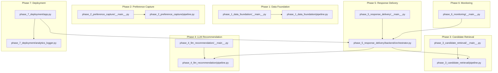
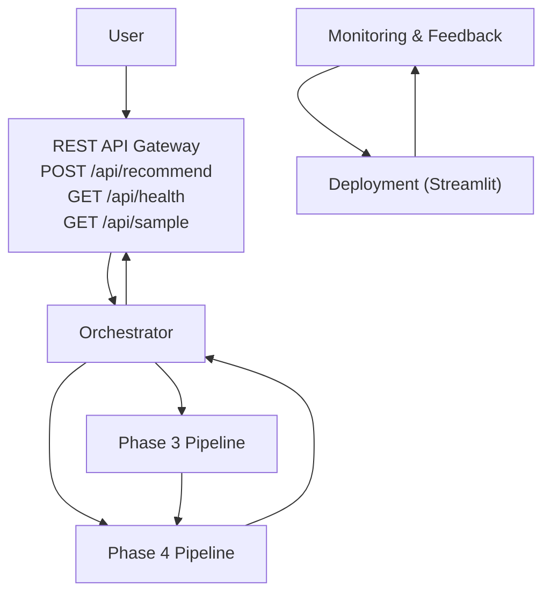
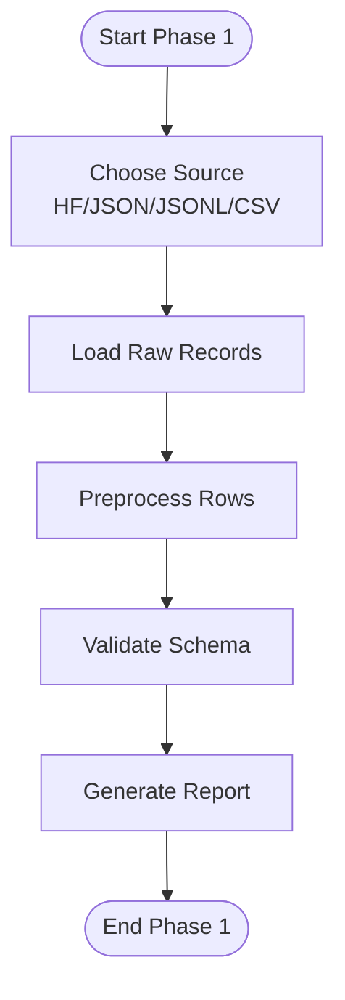
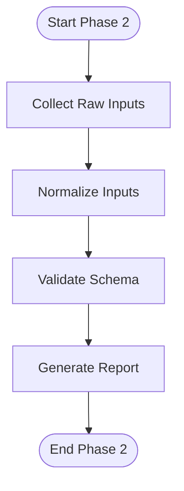
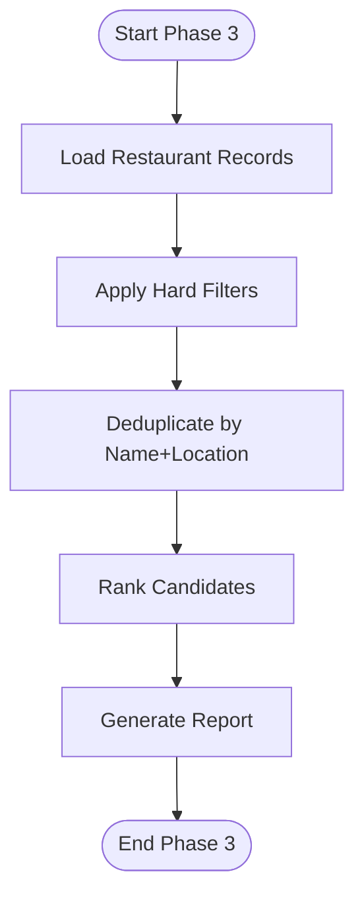
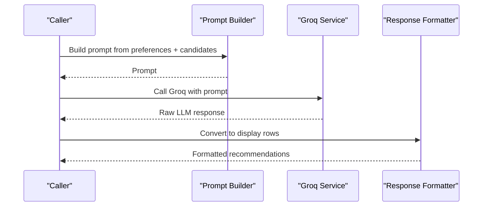
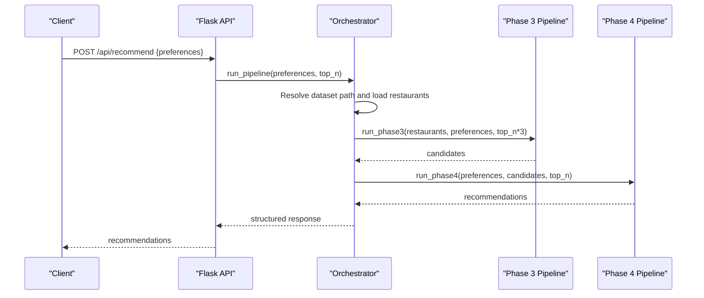
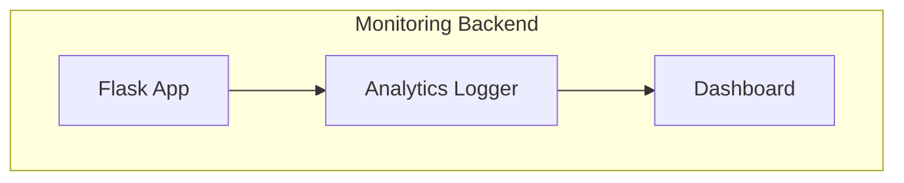
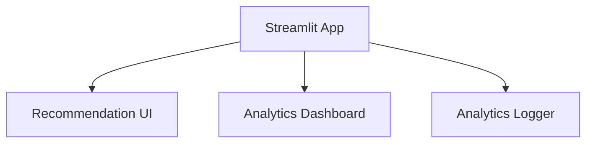
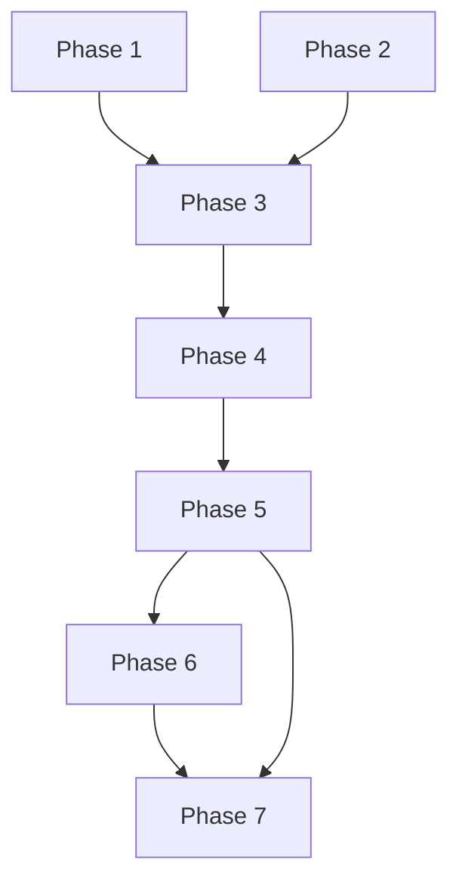

# Component Interactions

<cite>
**Referenced Files in This Document**
- [phase-wise-architecture.md](file://Zomato/architecture/phase-wise-architecture.md)
- [problemstatement.md](file://Zomato/problemstatement.md)
- [phase_1_data_foundation/__main__.py](file://Zomato/architecture/phase_1_data_foundation/__main__.py)
- [phase_1_data_foundation/pipeline.py](file://Zomato/architecture/phase_1_data_foundation/pipeline.py)
- [phase_2_preference_capture/__main__.py](file://Zomato/architecture/phase_2_preference_capture/__main__.py)
- [phase_2_preference_capture/pipeline.py](file://Zomato/architecture/phase_2_preference_capture/pipeline.py)
- [phase_3_candidate_retrieval/__main__.py](file://Zomato/architecture/phase_3_candidate_retrieval/__main__.py)
- [phase_3_candidate_retrieval/pipeline.py](file://Zomato/architecture/phase_3_candidate_retrieval/pipeline.py)
- [phase_4_llm_recommendation/__main__.py](file://Zomato/architecture/phase_4_llm_recommendation/__main__.py)
- [phase_4_llm_recommendation/pipeline.py](file://Zomato/architecture/phase_4_llm_recommendation/pipeline.py)
- [phase_5_response_delivery/__main__.py](file://Zomato/architecture/phase_5_response_delivery/__main__.py)
- [phase_5_response_delivery/backend/orchestrator.py](file://Zomato/architecture/phase_5_response_delivery/backend/orchestrator.py)
- [phase_6_monitoring/__main__.py](file://Zomato/architecture/phase_6_monitoring/__main__.py)
- [phase_7_deployment/app.py](file://Zomato/architecture/phase_7_deployment/app.py)
- [phase_7_deployment/analytics_logger.py](file://Zomato/architecture/phase_7_deployment/analytics_logger.py)
</cite>

## Table of Contents
1. [Introduction](#introduction)
2. [Project Structure](#project-structure)
3. [Core Components](#core-components)
4. [Architecture Overview](#architecture-overview)
5. [Detailed Component Analysis](#detailed-component-analysis)
6. [Dependency Analysis](#dependency-analysis)
7. [Performance Considerations](#performance-considerations)
8. [Troubleshooting Guide](#troubleshooting-guide)
9. [Conclusion](#conclusion)
10. [Appendices](#appendices)

## Introduction
This document explains the component interactions within the Zomato AI Recommendation System across its seven-phase pipeline. It focuses on how data flows from user preferences through the pipeline, how phases communicate and maintain data integrity, the orchestration layer coordinating end-to-end execution, the API gateway pattern for external integrations, and event-driven monitoring and feedback loops. It also covers error propagation, fallback strategies, cross-component dependencies, shared resources, synchronization points, and lifecycle/state management across phase boundaries.

## Project Structure
The system is organized into discrete phases, each with its own CLI entrypoints, pipelines, and optional web UIs. The orchestration layer resides in Phase 5 and coordinates downstream phases. Monitoring and deployment integrate with the unified Streamlit app in Phase 7.

**Diagram sources**
- [phase_1_data_foundation/__main__.py:1-54](file://Zomato/architecture/phase_1_data_foundation/__main__.py#L1-L54)
- [phase_1_data_foundation/pipeline.py:1-81](file://Zomato/architecture/phase_1_data_foundation/pipeline.py#L1-L81)
- [phase_2_preference_capture/__main__.py:1-46](file://Zomato/architecture/phase_2_preference_capture/__main__.py#L1-L46)
- [phase_2_preference_capture/pipeline.py:1-21](file://Zomato/architecture/phase_2_preference_capture/pipeline.py#L1-L21)
- [phase_3_candidate_retrieval/__main__.py:1-51](file://Zomato/architecture/phase_3_candidate_retrieval/__main__.py#L1-L51)
- [phase_3_candidate_retrieval/pipeline.py:1-51](file://Zomato/architecture/phase_3_candidate_retrieval/pipeline.py#L1-L51)
- [phase_4_llm_recommendation/__main__.py:1-41](file://Zomato/architecture/phase_4_llm_recommendation/__main__.py#L1-L41)
- [phase_4_llm_recommendation/pipeline.py:1-47](file://Zomato/architecture/phase_4_llm_recommendation/pipeline.py#L1-L47)
- [phase_5_response_delivery/__main__.py:1-44](file://Zomato/architecture/phase_5_response_delivery/__main__.py#L1-L44)
- [phase_5_response_delivery/backend/orchestrator.py:1-292](file://Zomato/architecture/phase_5_response_delivery/backend/orchestrator.py#L1-L292)
- [phase_6_monitoring/__main__.py:1-44](file://Zomato/architecture/phase_6_monitoring/__main__.py#L1-L44)
- [phase_7_deployment/app.py](file://Zomato/architecture/phase_7_deployment/app.py)
- [phase_7_deployment/analytics_logger.py](file://Zomato/architecture/phase_7_deployment/analytics_logger.py)

**Section sources**
- [phase-wise-architecture.md:1-113](file://Zomato/architecture/phase-wise-architecture.md#L1-L113)
- [problemstatement.md:1-65](file://Zomato/problemstatement.md#L1-L65)

## Core Components
- Phase 1 Data Foundation: Loads, cleans, normalizes, validates, and optionally exports restaurant records.
- Phase 2 Preference Capture: Normalizes and validates user preferences.
- Phase 3 Candidate Retrieval: Applies hard filters and ranks candidates; deduplicates by restaurant name and location.
- Phase 4 LLM Recommendation: Builds prompts, calls Groq, and formats responses.
- Phase 5 Response Delivery: Orchestrates end-to-end execution, exposes REST endpoints, and serves a premium UI.
- Phase 6 Monitoring: Provides analytics logging and a dashboard for feedback and metrics.
- Phase 7 Deployment: Unified Streamlit app integrating recommendation UI and analytics dashboard.

**Section sources**
- [phase-wise-architecture.md:3-112](file://Zomato/architecture/phase-wise-architecture.md#L3-L112)
- [phase_1_data_foundation/pipeline.py:21-67](file://Zomato/architecture/phase_1_data_foundation/pipeline.py#L21-L67)
- [phase_2_preference_capture/pipeline.py:11-20](file://Zomato/architecture/phase_2_preference_capture/pipeline.py#L11-L20)
- [phase_3_candidate_retrieval/pipeline.py:24-50](file://Zomato/architecture/phase_3_candidate_retrieval/pipeline.py#L24-L50)
- [phase_4_llm_recommendation/pipeline.py:29-46](file://Zomato/architecture/phase_4_llm_recommendation/pipeline.py#L29-L46)
- [phase_5_response_delivery/backend/orchestrator.py:112-291](file://Zomato/architecture/phase_5_response_delivery/backend/orchestrator.py#L112-L291)
- [phase_6_monitoring/__main__.py:1-44](file://Zomato/architecture/phase_6_monitoring/__main__.py#L1-L44)
- [phase_7_deployment/app.py](file://Zomato/architecture/phase_7_deployment/app.py)

## Architecture Overview
The system follows a staged pipeline with explicit boundaries and deterministic data exchange:
- Data ingestion and preparation in Phase 1 feed Phase 3.
- Phase 3 output feeds Phase 4.
- Phase 5 orchestrates both Phase 3 and Phase 4, exposing a REST API gateway for external clients.
- Phase 6 consumes telemetry and feedback to improve future recommendations.
- Phase 7 deploys the integrated UI and dashboard.

**Diagram sources**
- [phase_5_response_delivery/backend/orchestrator.py:112-291](file://Zomato/architecture/phase_5_response_delivery/backend/orchestrator.py#L112-L291)
- [phase-wise-architecture.md:67-76](file://Zomato/architecture/phase-wise-architecture.md#L67-L76)
- [phase_6_monitoring/__main__.py:1-44](file://Zomato/architecture/phase_6_monitoring/__main__.py#L1-L44)
- [phase_7_deployment/app.py](file://Zomato/architecture/phase_7_deployment/app.py)

## Detailed Component Analysis

### Phase 1: Data Foundation
- Responsibilities: Load raw datasets, clean and normalize, validate schema, produce a queryable JSONL dataset.
- CLI entrypoint supports web UI and multiple sources (Hugging Face, JSON, JSONL, CSV).
- Outputs validated records and a run report.

**Diagram sources**
- [phase_1_data_foundation/__main__.py:10-50](file://Zomato/architecture/phase_1_data_foundation/__main__.py#L10-L50)
- [phase_1_data_foundation/pipeline.py:21-67](file://Zomato/architecture/phase_1_data_foundation/pipeline.py#L21-L67)

**Section sources**
- [phase_1_data_foundation/__main__.py:1-54](file://Zomato/architecture/phase_1_data_foundation/__main__.py#L1-L54)
- [phase_1_data_foundation/pipeline.py:1-81](file://Zomato/architecture/phase_1_data_foundation/pipeline.py#L1-L81)

### Phase 2: Preference Capture
- Responsibilities: Accept user inputs, normalize, validate into a structured preference object.
- CLI entrypoint supports web UI and direct argument passing.

**Diagram sources**
- [phase_2_preference_capture/__main__.py:11-42](file://Zomato/architecture/phase_2_preference_capture/__main__.py#L11-L42)
- [phase_2_preference_capture/pipeline.py:11-20](file://Zomato/architecture/phase_2_preference_capture/pipeline.py#L11-L20)

**Section sources**
- [phase_2_preference_capture/__main__.py:1-46](file://Zomato/architecture/phase_2_preference_capture/__main__.py#L1-L46)
- [phase_2_preference_capture/pipeline.py:1-21](file://Zomato/architecture/phase_2_preference_capture/pipeline.py#L1-L21)

### Phase 3: Candidate Retrieval and Filtering
- Responsibilities: Load cleaned dataset, apply hard filters, deduplicate, rank candidates, and produce top-N candidates.
- CLI entrypoint requires a dataset path and supports web UI.

**Diagram sources**
- [phase_3_candidate_retrieval/__main__.py:29-46](file://Zomato/architecture/phase_3_candidate_retrieval/__main__.py#L29-L46)
- [phase_3_candidate_retrieval/pipeline.py:24-50](file://Zomato/architecture/phase_3_candidate_retrieval/pipeline.py#L24-L50)

**Section sources**
- [phase_3_candidate_retrieval/__main__.py:1-51](file://Zomato/architecture/phase_3_candidate_retrieval/__main__.py#L1-L51)
- [phase_3_candidate_retrieval/pipeline.py:1-51](file://Zomato/architecture/phase_3_candidate_retrieval/pipeline.py#L1-L51)

### Phase 4: LLM Reasoning and Recommendation
- Responsibilities: Build structured prompts, call Groq, enforce output format, and convert to display rows.
- CLI entrypoint requires candidates and preferences JSON and supports web UI.

**Diagram sources**
- [phase_4_llm_recommendation/pipeline.py:29-46](file://Zomato/architecture/phase_4_llm_recommendation/pipeline.py#L29-L46)

**Section sources**
- [phase_4_llm_recommendation/__main__.py:1-41](file://Zomato/architecture/phase_4_llm_recommendation/__main__.py#L1-L41)
- [phase_4_llm_recommendation/pipeline.py:1-47](file://Zomato/architecture/phase_4_llm_recommendation/pipeline.py#L1-L47)

### Phase 5: Response Delivery and UX
- Responsibilities: Expose REST endpoints, orchestrate end-to-end pipeline, serve premium UI, and handle fallbacks.
- API Gateway pattern: POST /api/recommend, GET /api/health, GET /api/sample.
- Orchestration: Dynamically imports and executes Phase 3 and Phase 4 pipelines, manages environment variables, and ensures deterministic module reloads.

**Diagram sources**
- [phase_5_response_delivery/backend/orchestrator.py:112-291](file://Zomato/architecture/phase_5_response_delivery/backend/orchestrator.py#L112-L291)
- [phase_5_response_delivery/__main__.py:17-39](file://Zomato/architecture/phase_5_response_delivery/__main__.py#L17-L39)

**Section sources**
- [phase_5_response_delivery/__main__.py:1-44](file://Zomato/architecture/phase_5_response_delivery/__main__.py#L1-L44)
- [phase_5_response_delivery/backend/orchestrator.py:1-292](file://Zomato/architecture/phase_5_response_delivery/backend/orchestrator.py#L1-L292)

### Phase 6: Monitoring and Continuous Improvement
- Responsibilities: Track interactions and feedback, measure relevance, and support dashboard insights.
- The monitoring backend exposes a Flask app similar to Phase 5, enabling analytics collection and visualization.

**Diagram sources**
- [phase_6_monitoring/__main__.py:1-44](file://Zomato/architecture/phase_6_monitoring/__main__.py#L1-L44)

**Section sources**
- [phase-wise-architecture.md:78-88](file://Zomato/architecture/phase-wise-architecture.md#L78-L88)
- [phase_6_monitoring/__main__.py:1-44](file://Zomato/architecture/phase_6_monitoring/__main__.py#L1-L44)

### Phase 7: Deployment
- Responsibilities: Unify recommendation UI and analytics dashboard into a single Streamlit app, configure theming, and bundle dependencies.
- Integrates analytics logger and provides multi-page navigation.

**Diagram sources**
- [phase_7_deployment/app.py](file://Zomato/architecture/phase_7_deployment/app.py)
- [phase_7_deployment/analytics_logger.py](file://Zomato/architecture/phase_7_deployment/analytics_logger.py)

**Section sources**
- [phase-wise-architecture.md:94-112](file://Zomato/architecture/phase-wise-architecture.md#L94-L112)
- [phase_7_deployment/app.py](file://Zomato/architecture/phase_7_deployment/app.py)
- [phase_7_deployment/analytics_logger.py](file://Zomato/architecture/phase_7_deployment/analytics_logger.py)

## Dependency Analysis
- Cross-phase dependencies:
  - Phase 1 output (cleaned dataset) is consumed by Phase 3.
  - Phase 3 output (candidates) is consumed by Phase 4.
  - Phase 5 orchestrator depends on both Phase 3 and Phase 4 pipelines.
  - Phase 6 consumes telemetry and integrates with Phase 5.
  - Phase 7 consumes both Phase 5 and Phase 6 artifacts.
- Shared resources:
  - Environment variables (e.g., Groq API key) are loaded per-phase and propagated via orchestrator.
  - Metadata (locations, cuisines) is computed or loaded by Phase 5.
- Synchronization points:
  - Deterministic module reloads ensure fresh imports of Phase 3 and Phase 4 pipelines during orchestration.
  - Fallback logic ensures graceful degradation when upstream dependencies fail.

**Diagram sources**
- [phase_1_data_foundation/pipeline.py:1-81](file://Zomato/architecture/phase_1_data_foundation/pipeline.py#L1-L81)
- [phase_2_preference_capture/pipeline.py:1-21](file://Zomato/architecture/phase_2_preference_capture/pipeline.py#L1-L21)
- [phase_3_candidate_retrieval/pipeline.py:1-51](file://Zomato/architecture/phase_3_candidate_retrieval/pipeline.py#L1-L51)
- [phase_4_llm_recommendation/pipeline.py:1-47](file://Zomato/architecture/phase_4_llm_recommendation/pipeline.py#L1-L47)
- [phase_5_response_delivery/backend/orchestrator.py:1-292](file://Zomato/architecture/phase_5_response_delivery/backend/orchestrator.py#L1-L292)
- [phase_6_monitoring/__main__.py:1-44](file://Zomato/architecture/phase_6_monitoring/__main__.py#L1-L44)
- [phase_7_deployment/app.py](file://Zomato/architecture/phase_7_deployment/app.py)

**Section sources**
- [phase_5_response_delivery/backend/orchestrator.py:132-134](file://Zomato/architecture/phase_5_response_delivery/backend/orchestrator.py#L132-L134)
- [phase_5_response_delivery/backend/orchestrator.py:194-202](file://Zomato/architecture/phase_5_response_delivery/backend/orchestrator.py#L194-L202)

## Performance Considerations
- Deterministic module reloading avoids stale imports and reduces runtime overhead in orchestrated calls.
- Deduplication in Phase 3 prevents redundant candidates and improves downstream LLM efficiency.
- Top-N scaling in Phase 3 (multiplied by a factor) increases recall before LLM ranking.
- Graceful fallbacks minimize latency spikes and ensure consistent UX under failures.

[No sources needed since this section provides general guidance]

## Troubleshooting Guide
- Missing Groq API key:
  - Symptom: LLM call fails in Phase 5.
  - Behavior: Orchestrator falls back to returning Phase 3-ranked candidates.
- Missing Phase 1 dataset:
  - Symptom: No restaurants loaded.
  - Behavior: Orchestrator falls back to sample recommendations.
- Phase 3 import failure:
  - Symptom: Exception during dynamic import.
  - Behavior: Orchestrator falls back to sample recommendations.
- LLM unavailability:
  - Symptom: LLM API error.
  - Behavior: Orchestrator returns Phase 3-ranked candidates with synthesized explanations.

**Section sources**
- [phase_5_response_delivery/backend/orchestrator.py:210-213](file://Zomato/architecture/phase_5_response_delivery/backend/orchestrator.py#L210-L213)
- [phase_5_response_delivery/backend/orchestrator.py:166-169](file://Zomato/architecture/phase_5_response_delivery/backend/orchestrator.py#L166-L169)
- [phase_5_response_delivery/backend/orchestrator.py:183-190](file://Zomato/architecture/phase_5_response_delivery/backend/orchestrator.py#L183-L190)
- [phase_5_response_delivery/backend/orchestrator.py:266-291](file://Zomato/architecture/phase_5_response_delivery/backend/orchestrator.py#L266-L291)

## Conclusion
The Zomato AI Recommendation System is designed as a modular, staged pipeline with clear data boundaries and robust fallbacks. Phase 5 orchestrator acts as the central coordination layer, implementing an API gateway pattern and ensuring resilience through deterministic imports and graceful degradation. Monitoring and deployment layers enable continuous improvement and public accessibility, while shared resources and synchronization points maintain consistency across phase transitions.

[No sources needed since this section summarizes without analyzing specific files]

## Appendices
- Typical user journey flows:
  - Web UI → REST API → Orchestrator → Phase 3 → Phase 4 → Response delivery.
  - Monitoring dashboard receives telemetry from deployed system and informs improvements.
- Event-driven communication:
  - Telemetry events are logged and visualized in the monitoring dashboard.
  - Feedback buttons in the UI feed into analytics logger for continuous learning.

[No sources needed since this section provides general guidance]