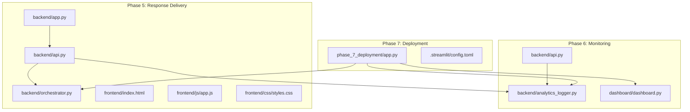
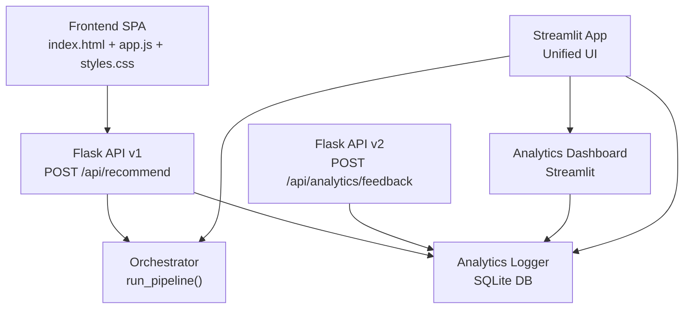
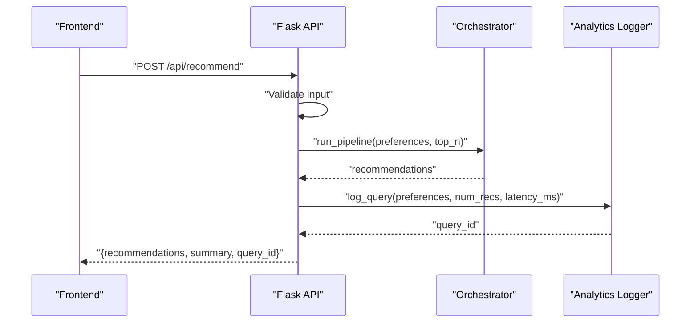
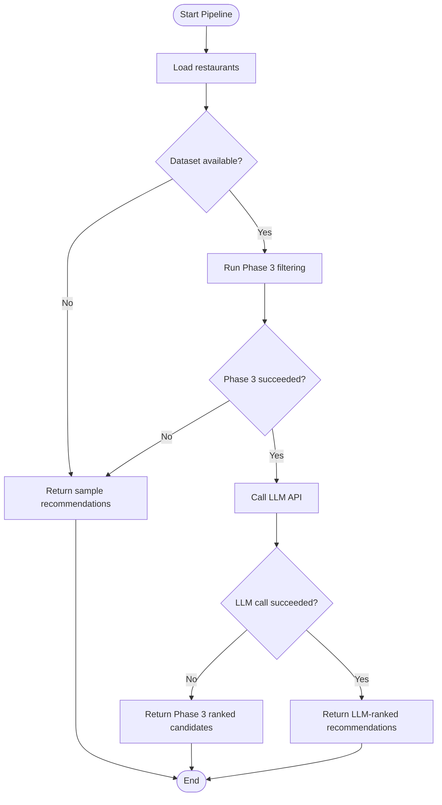
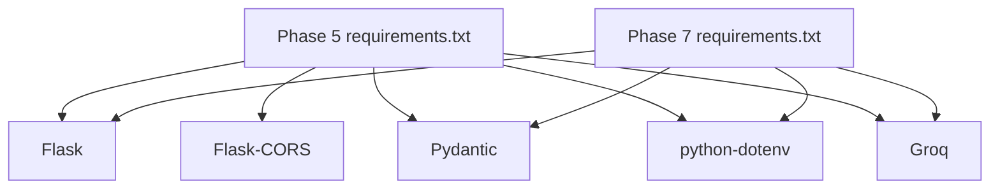

# Cross-Cutting Concerns

<cite>
**Referenced Files in This Document**
- [phase-wise-architecture.md](file://Zomato/architecture/phase-wise-architecture.md)
- [analytics_logger.py](file://Zomato/architecture/phase_6_monitoring/backend/analytics_logger.py)
- [api.py](file://Zomato/architecture/phase_5_response_delivery/backend/api.py)
- [app.py](file://Zomato/architecture/phase_5_response_delivery/backend/app.py)
- [orchestrator.py](file://Zomato/architecture/phase_5_response_delivery/backend/orchestrator.py)
- [api.py](file://Zomato/architecture/phase_6_monitoring/backend/api.py)
- [dashboard.py](file://Zomato/architecture/phase_6_monitoring/dashboard/dashboard.py)
- [app.py](file://Zomato/architecture/phase_7_deployment/app.py)
- [index.html](file://Zomato/architecture/phase_5_response_delivery/frontend/index.html)
- [app.js](file://Zomato/architecture/phase_5_response_delivery/frontend/js/app.js)
- [styles.css](file://Zomato/architecture/phase_5_response_delivery/frontend/css/styles.css)
- [config.toml](file://Zomato/architecture/phase_7_deployment/.streamlit/config.toml)
- [requirements.txt](file://Zomato/architecture/phase_5_response_delivery/requirements.txt)
- [requirements.txt](file://Zomato/architecture/phase_7_deployment/requirements.txt)
</cite>

## Table of Contents
1. [Introduction](#introduction)
2. [Project Structure](#project-structure)
3. [Core Components](#core-components)
4. [Architecture Overview](#architecture-overview)
5. [Detailed Component Analysis](#detailed-component-analysis)
6. [Dependency Analysis](#dependency-analysis)
7. [Performance Considerations](#performance-considerations)
8. [Troubleshooting Guide](#troubleshooting-guide)
9. [Conclusion](#conclusion)
10. [Appendices](#appendices)

## Introduction
This document focuses on the cross-cutting concerns implemented in the Zomato AI Recommendation System across Phases 5, 6, and 7. It covers security (authentication, input validation, data protection), monitoring and logging (analytics logger, performance metrics, error tracking), caching and rate limiting strategies, graceful degradation, internationalization and accessibility, mobile responsiveness, disaster recovery and resilience, audit trails, and compliance-related data handling. Implementation examples and integration patterns are provided with precise file references.

## Project Structure
The system is organized into distinct phases, each encapsulating a functional layer. Phase 5 delivers the recommendation API and SPA. Phase 6 adds analytics and feedback logging. Phase 7 deploys a unified Streamlit application that integrates the recommendation UI and the analytics dashboard.

**Diagram sources**
- [app.py:14-41](file://Zomato/architecture/phase_5_response_delivery/backend/app.py#L14-L41)
- [api.py:1-84](file://Zomato/architecture/phase_5_response_delivery/backend/api.py#L1-L84)
- [orchestrator.py:112-292](file://Zomato/architecture/phase_5_response_delivery/backend/orchestrator.py#L112-L292)
- [index.html:1-198](file://Zomato/architecture/phase_5_response_delivery/frontend/index.html#L1-L198)
- [app.js:1-278](file://Zomato/architecture/phase_5_response_delivery/frontend/js/app.js#L1-L278)
- [styles.css:1-602](file://Zomato/architecture/phase_5_response_delivery/frontend/css/styles.css#L1-L602)
- [api.py:1-119](file://Zomato/architecture/phase_6_monitoring/backend/api.py#L1-L119)
- [analytics_logger.py:1-87](file://Zomato/architecture/phase_6_monitoring/backend/analytics_logger.py#L1-L87)
- [dashboard.py:1-102](file://Zomato/architecture/phase_6_monitoring/dashboard/dashboard.py#L1-L102)
- [app.py:1-128](file://Zomato/architecture/phase_7_deployment/app.py#L1-L128)
- [config.toml:1-7](file://Zomato/architecture/phase_7_deployment/.streamlit/config.toml#L1-L7)

**Section sources**
- [phase-wise-architecture.md:56-112](file://Zomato/architecture/phase-wise-architecture.md#L56-L112)

## Core Components
- Security
  - Authentication: No server-side authentication is implemented in the current codebase. API endpoints accept requests without tokens or sessions.
  - Input validation: Validation occurs in the API layer for required fields and acceptable values.
  - Data protection: Environment variables are used for API keys; sensitive logs are stored locally in an SQLite database.

- Monitoring and Logging
  - Analytics logger persists queries and feedback with a unique identifier and latency measurement.
  - Dashboard reads from the analytics database to compute metrics and trends.
  - Error tracking: Exceptions are captured and returned as JSON errors; the frontend displays user-friendly messages.

- Caching and Rate Limiting
  - No explicit caching or rate-limiting mechanisms are present in the current codebase.

- Graceful Degradation
  - The orchestrator falls back to sample recommendations when the Groq key is missing or when Phase 3/4 fail, ensuring the UI remains functional.

- Internationalization and Accessibility
  - The SPA uses semantic HTML and ARIA attributes for interactive elements.
  - The UI supports dynamic content updates and clear error messaging.

- Mobile Responsiveness
  - CSS media queries adapt the layout for smaller screens.

- Disaster Recovery and Resilience
  - Local SQLite storage for analytics; no external persistence or replication is configured.
  - Fallback behavior ensures continuity during LLM unavailability.

- Audit Trails and Compliance
  - Unique query identifiers enable correlation of user actions with backend telemetry.
  - Data retention is implicit; no explicit retention policy is enforced in code.

**Section sources**
- [api.py:56-83](file://Zomato/architecture/phase_5_response_delivery/backend/api.py#L56-L83)
- [analytics_logger.py:46-86](file://Zomato/architecture/phase_6_monitoring/backend/analytics_logger.py#L46-L86)
- [dashboard.py:1-102](file://Zomato/architecture/phase_6_monitoring/dashboard/dashboard.py#L1-L102)
- [orchestrator.py:166-190](file://Zomato/architecture/phase_5_response_delivery/backend/orchestrator.py#L166-L190)
- [app.js:85-90](file://Zomato/architecture/phase_5_response_delivery/frontend/js/app.js#L85-L90)
- [styles.css:586-602](file://Zomato/architecture/phase_5_response_delivery/frontend/css/styles.css#L586-L602)
- [app.py:1-128](file://Zomato/architecture/phase_7_deployment/app.py#L1-L128)

## Architecture Overview
The system integrates a Flask API (Phase 5) with an analytics logger (Phase 6) and a Streamlit deployment (Phase 7). The frontend communicates with the backend via REST endpoints, while the analytics logger records query metadata and feedback. The deployment layer unifies the recommendation UI and the analytics dashboard.

**Diagram sources**
- [api.py:41-95](file://Zomato/architecture/phase_5_response_delivery/backend/api.py#L41-L95)
- [orchestrator.py:112-292](file://Zomato/architecture/phase_5_response_delivery/backend/orchestrator.py#L112-L292)
- [analytics_logger.py:13-86](file://Zomato/architecture/phase_6_monitoring/backend/analytics_logger.py#L13-L86)
- [api.py:97-118](file://Zomato/architecture/phase_6_monitoring/backend/api.py#L97-L118)
- [dashboard.py:1-102](file://Zomato/architecture/phase_6_monitoring/dashboard/dashboard.py#L1-L102)
- [app.py:1-128](file://Zomato/architecture/phase_7_deployment/app.py#L1-L128)

## Detailed Component Analysis

### Security Implementation
- API Authentication
  - Current implementation does not enforce authentication. To add token-based authentication, integrate a middleware that validates Authorization headers against a secret or JWT. Example integration pattern: register a before_request handler in the Flask app factory to check credentials and abort unauthorized requests.
  - Reference: [app.py:14-41](file://Zomato/architecture/phase_5_response_delivery/backend/app.py#L14-L41)

- Input Validation
  - Validation is performed in the recommendation endpoint to ensure required fields and acceptable values. Enhance by adding schema validation (Pydantic) to enforce stricter typing and constraints.
  - Reference: [api.py:56-77](file://Zomato/architecture/phase_5_response_delivery/backend/api.py#L56-L77)

- Data Protection
  - API keys are loaded from environment variables. Store keys securely using OS keychain or cloud secret managers. Avoid logging sensitive values.
  - References: [orchestrator.py:209-213](file://Zomato/architecture/phase_5_response_delivery/backend/orchestrator.py#L209-L213), [requirements.txt:1-6](file://Zomato/architecture/phase_5_response_delivery/requirements.txt#L1-L6)

**Section sources**
- [app.py:14-41](file://Zomato/architecture/phase_5_response_delivery/backend/app.py#L14-L41)
- [api.py:56-77](file://Zomato/architecture/phase_5_response_delivery/backend/api.py#L56-L77)
- [orchestrator.py:209-213](file://Zomato/architecture/phase_5_response_delivery/backend/orchestrator.py#L209-L213)
- [requirements.txt:1-6](file://Zomato/architecture/phase_5_response_delivery/requirements.txt#L1-L6)

### Monitoring and Logging Strategies
- Analytics Logger
  - Creates tables for queries and feedback, logs query metadata, and attaches a unique query ID to responses.
  - References: [analytics_logger.py:13-86](file://Zomato/architecture/phase_6_monitoring/backend/analytics_logger.py#L13-L86)

- Performance Metrics Collection
  - The recommendation endpoint measures latency and passes it to the analytics logger.
  - References: [api.py:82-88](file://Zomato/architecture/phase_6_monitoring/backend/api.py#L82-L88)

- Error Tracking Systems
  - Exceptions are caught and returned as JSON errors; the frontend surfaces user-friendly messages.
  - References: [api.py:79-83](file://Zomato/architecture/phase_5_response_delivery/backend/api.py#L79-L83), [app.js:187-204](file://Zomato/architecture/phase_5_response_delivery/frontend/js/app.js#L187-L204)

**Diagram sources**
- [api.py:43-95](file://Zomato/architecture/phase_6_monitoring/backend/api.py#L43-L95)
- [orchestrator.py:112-292](file://Zomato/architecture/phase_5_response_delivery/backend/orchestrator.py#L112-L292)
- [analytics_logger.py:46-70](file://Zomato/architecture/phase_6_monitoring/backend/analytics_logger.py#L46-L70)

**Section sources**
- [analytics_logger.py:13-86](file://Zomato/architecture/phase_6_monitoring/backend/analytics_logger.py#L13-L86)
- [api.py:82-95](file://Zomato/architecture/phase_6_monitoring/backend/api.py#L82-L95)
- [app.js:187-204](file://Zomato/architecture/phase_5_response_delivery/frontend/js/app.js#L187-L204)

### Caching Strategies
- Current state: No explicit caching is implemented in the codebase.
- Recommended patterns:
  - Cache metadata endpoints to reduce repeated computation.
  - Cache LLM responses for identical inputs using a key derived from preferences and candidates.
  - Use in-memory cache (e.g., Python dict) or Redis for distributed environments.
- Integration example: Wrap the metadata endpoint with a cache decorator or middleware that stores results keyed by query parameters.

[No sources needed since this section provides general guidance]

### Rate Limiting
- Current state: No rate limiting is implemented.
- Recommended patterns:
  - Use Flask-Limiter or similar to limit requests per IP or per user session.
  - Apply limits on the recommendation endpoint and analytics feedback endpoint.
- Integration example: Decorate endpoints with rate-limit rules and configure storage for counters.

[No sources needed since this section provides general guidance]

### Graceful Degradation Mechanisms
- The orchestrator falls back to sample recommendations when the Groq key is missing or when Phase 3/4 fail.
- The frontend continues to render results even when LLM calls are unavailable.

**Diagram sources**
- [orchestrator.py:166-292](file://Zomato/architecture/phase_5_response_delivery/backend/orchestrator.py#L166-L292)

**Section sources**
- [orchestrator.py:166-292](file://Zomato/architecture/phase_5_response_delivery/backend/orchestrator.py#L166-L292)

### Internationalization Support
- Current state: The UI strings are embedded in HTML and JavaScript. There is no locale switching or translation layer.
- Recommended patterns:
  - Introduce a translations library and load locale-specific resources.
  - Externalize strings and use templating to inject localized content.
- Integration example: Add a locale parameter to the frontend and fetch translated assets from a dedicated directory.

[No sources needed since this section provides general guidance]

### Accessibility Compliance
- Current state: The SPA uses semantic elements and ARIA attributes for interactive controls. Error banners and empty states improve clarity.
- Recommendations:
  - Ensure keyboard navigation and focus management.
  - Add ARIA-live regions for dynamic content updates.
  - Validate color contrast and provide alternative text for icons.
- Integration example: Use role="alert" and aria-live="polite" for dynamic notifications.

**Section sources**
- [index.html:161-168](file://Zomato/architecture/phase_5_response_delivery/frontend/index.html#L161-L168)
- [app.js:118-118](file://Zomato/architecture/phase_5_response_delivery/frontend/js/app.js#L118-L118)

### Mobile Responsiveness
- Current state: CSS media queries adjust layout for tablets and phones.
- Recommendations:
  - Test on various viewport sizes and refine breakpoints.
  - Optimize touch targets and spacing for mobile devices.

**Section sources**
- [styles.css:586-602](file://Zomato/architecture/phase_5_response_delivery/frontend/css/styles.css#L586-L602)

### Disaster Recovery Planning and Resilience
- Current state: Analytics data is stored in a local SQLite database. No external persistence or replication is configured.
- Recommendations:
  - Back up the analytics database periodically to cloud storage.
  - Use a managed database for production deployments to enable replication and automated backups.
  - Implement circuit breakers around LLM calls to prevent cascading failures.
- Integration example: Schedule database dumps and upload to object storage; monitor database file size and rotation.

**Section sources**
- [analytics_logger.py:7-7](file://Zomato/architecture/phase_6_monitoring/backend/analytics_logger.py#L7-L7)
- [dashboard.py:9-15](file://Zomato/architecture/phase_6_monitoring/dashboard/dashboard.py#L9-L15)

### Audit Trails and Compliance
- Current state: Each query is assigned a unique ID and persisted with metadata and feedback. No explicit retention policy is enforced.
- Recommendations:
  - Define and enforce data retention windows for analytics data.
  - Add anonymization of personally identifiable information (PII) before logging.
  - Implement access controls for the analytics dashboard.
- Integration example: Add a cleanup job that deletes records older than a configured threshold.

**Section sources**
- [analytics_logger.py:46-86](file://Zomato/architecture/phase_6_monitoring/backend/analytics_logger.py#L46-L86)
- [dashboard.py:1-102](file://Zomato/architecture/phase_6_monitoring/dashboard/dashboard.py#L1-L102)

## Dependency Analysis
External dependencies include Flask, CORS, Pydantic, dotenv, and Groq. These are declared in the respective requirements files.

**Diagram sources**
- [requirements.txt:1-6](file://Zomato/architecture/phase_5_response_delivery/requirements.txt#L1-L6)
- [requirements.txt:1-6](file://Zomato/architecture/phase_7_deployment/requirements.txt#L1-L6)

**Section sources**
- [requirements.txt:1-6](file://Zomato/architecture/phase_5_response_delivery/requirements.txt#L1-L6)
- [requirements.txt:1-6](file://Zomato/architecture/phase_7_deployment/requirements.txt#L1-L6)

## Performance Considerations
- Latency measurement: The recommendation endpoint measures request duration and logs it with the analytics logger.
- Recommendations:
  - Cache frequently accessed metadata.
  - Use asynchronous workers for long-running tasks.
  - Monitor database query performance and add indexes if needed.

**Section sources**
- [api.py:82-88](file://Zomato/architecture/phase_6_monitoring/backend/api.py#L82-L88)

## Troubleshooting Guide
- Health checks: Use the health endpoint to verify service availability.
- Error surfacing: The API returns structured error messages; the frontend displays user-friendly alerts.
- Database diagnostics: The analytics dashboard checks for database presence and connectivity.

**Section sources**
- [api.py:18-21](file://Zomato/architecture/phase_5_response_delivery/backend/api.py#L18-L21)
- [app.js:187-204](file://Zomato/architecture/phase_5_response_delivery/frontend/js/app.js#L187-L204)
- [dashboard.py:11-15](file://Zomato/architecture/phase_6_monitoring/dashboard/dashboard.py#L11-L15)

## Conclusion
The Zomato AI Recommendation System demonstrates robust orchestration and a clean separation of concerns across phases. While the current implementation lacks authentication, centralized caching, and rate limiting, it provides a strong foundation for adding these cross-cutting concerns. The analytics logger and dashboard offer practical insights into user interactions and system performance. By integrating authentication, input validation enhancements, caching, rate limiting, graceful degradation, and compliance controls, the system can achieve higher reliability, scalability, and maintainability.

## Appendices
- Theme configuration for Streamlit Cloud aligns UI branding with Zomato’s visual identity.
- References to phase-wise architecture describe the end-to-end flow and component responsibilities.

**Section sources**
- [config.toml:1-7](file://Zomato/architecture/phase_7_deployment/.streamlit/config.toml#L1-L7)
- [phase-wise-architecture.md:90-112](file://Zomato/architecture/phase-wise-architecture.md#L90-L112)