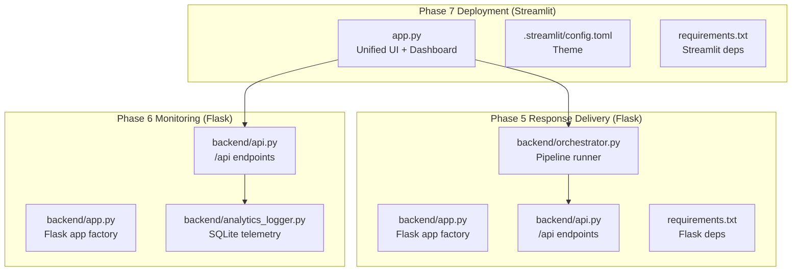
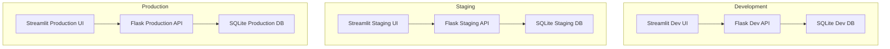
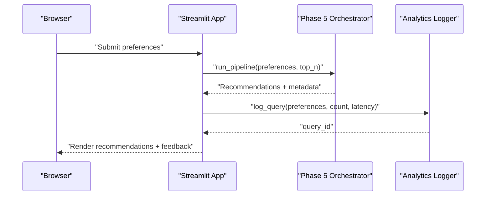
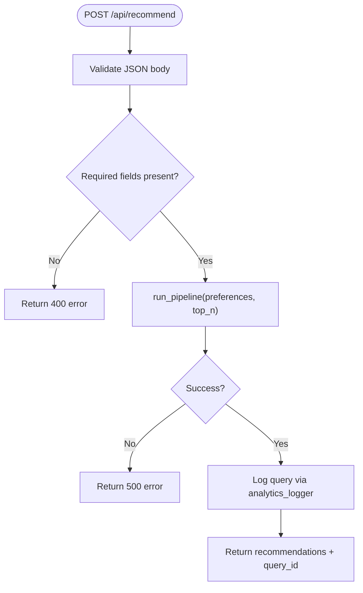
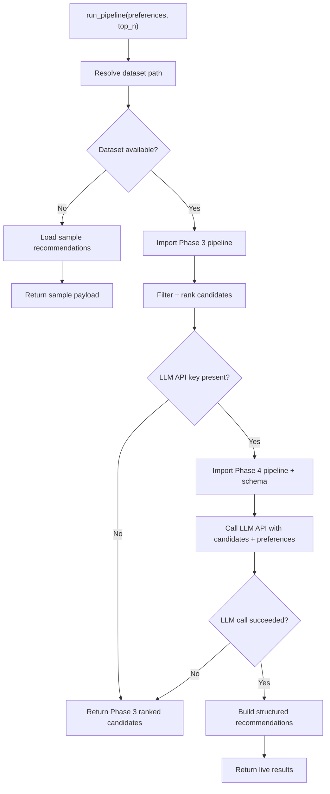
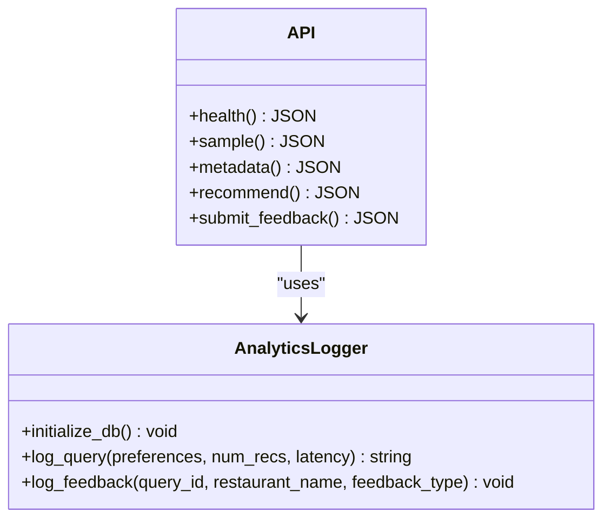
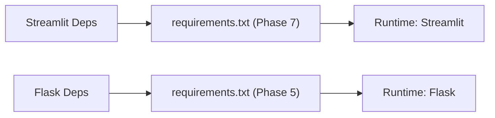
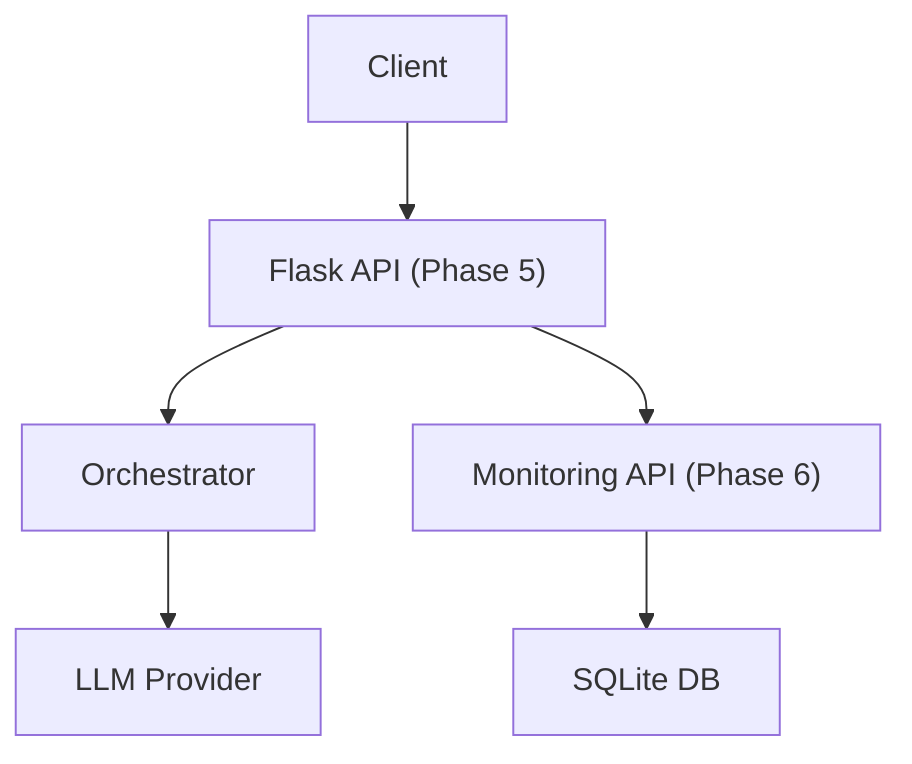

# Deployment Topology

<cite>
**Referenced Files in This Document**
- [phase-wise-architecture.md](file://Zomato/architecture/phase-wise-architecture.md)
- [app.py](file://Zomato/architecture/phase_7_deployment/app.py)
- [.streamlit/config.toml](file://Zomato/architecture/phase_7_deployment/.streamlit/config.toml)
- [requirements.txt](file://Zomato/architecture/phase_7_deployment/requirements.txt)
- [app.py](file://Zomato/architecture/phase_5_response_delivery/backend/app.py)
- [api.py](file://Zomato/architecture/phase_5_response_delivery/backend/api.py)
- [orchestrator.py](file://Zomato/architecture/phase_5_response_delivery/backend/orchestrator.py)
- [requirements.txt](file://Zomato/architecture/phase_5_response_delivery/requirements.txt)
- [app.py](file://Zomato/architecture/phase_6_monitoring/backend/app.py)
- [api.py](file://Zomato/architecture/phase_6_monitoring/backend/api.py)
- [analytics_logger.py](file://Zomato/architecture/phase_6_monitoring/backend/analytics_logger.py)
</cite>

## Table of Contents
1. [Introduction](#introduction)
2. [Project Structure](#project-structure)
3. [Core Components](#core-components)
4. [Architecture Overview](#architecture-overview)
5. [Detailed Component Analysis](#detailed-component-analysis)
6. [Dependency Analysis](#dependency-analysis)
7. [Performance Considerations](#performance-considerations)
8. [Troubleshooting Guide](#troubleshooting-guide)
9. [Conclusion](#conclusion)
10. [Appendices](#appendices)

## Introduction
This document describes the deployment topology for the Zomato AI Recommendation System across development, staging, and production environments. It covers containerization strategy, cloud deployment options (Streamlit Cloud, Heroku, and self-hosted servers), microservice architecture patterns, load balancing and scaling considerations, failover mechanisms, CI/CD integration, automated testing, deployment automation, infrastructure requirements, security for LLM API keys, monitoring setup, cost optimization, and performance tuning.

## Project Structure
The system is organized as a multi-phase pipeline with a final deployment layer built on Streamlit. The key runtime surfaces are:
- Phase 5 Response Delivery: Flask REST API with SPA frontend and orchestrator that coordinates Phases 3 and 4.
- Phase 6 Monitoring: Analytics backend with SQLite logging and REST endpoints for telemetry.
- Phase 7 Deployment: Unified Streamlit app combining recommendation UI and analytics dashboard.

**Diagram sources**
- [app.py:1-128](file://Zomato/architecture/phase_7_deployment/app.py#L1-L128)
- [.streamlit/config.toml:1-7](file://Zomato/architecture/phase_7_deployment/.streamlit/config.toml#L1-L7)
- [requirements.txt:1-6](file://Zomato/architecture/phase_7_deployment/requirements.txt#L1-L6)
- [app.py:1-41](file://Zomato/architecture/phase_5_response_delivery/backend/app.py#L1-L41)
- [api.py:1-84](file://Zomato/architecture/phase_5_response_delivery/backend/api.py#L1-L84)
- [orchestrator.py:1-292](file://Zomato/architecture/phase_5_response_delivery/backend/orchestrator.py#L1-L292)
- [requirements.txt:1-6](file://Zomato/architecture/phase_5_response_delivery/requirements.txt#L1-L6)
- [app.py:1-41](file://Zomato/architecture/phase_6_monitoring/backend/app.py#L1-L41)
- [api.py:1-119](file://Zomato/architecture/phase_6_monitoring/backend/api.py#L1-L119)
- [analytics_logger.py:1-87](file://Zomato/architecture/phase_6_monitoring/backend/analytics_logger.py#L1-L87)

**Section sources**
- [phase-wise-architecture.md:1-113](file://Zomato/architecture/phase-wise-architecture.md#L1-L113)
- [app.py:1-128](file://Zomato/architecture/phase_7_deployment/app.py#L1-L128)
- [requirements.txt:1-6](file://Zomato/architecture/phase_7_deployment/requirements.txt#L1-L6)

## Core Components
- Streamlit Deployment App: Single-page application with a recommendation UI and analytics dashboard. It reads LLM API keys from Streamlit secrets and orchestrates the end-to-end pipeline.
- Flask API (Phase 5): REST API that validates requests, runs the pipeline, and returns recommendations. It also serves metadata and sample data.
- Orchestrator (Phase 5): Loads datasets, applies candidate filtering, calls the LLM pipeline, and returns structured results with fallback behavior.
- Monitoring Backend (Phase 6): REST endpoints for health checks, recommendations, and feedback logging; SQLite-backed telemetry.
- Analytics Logger (Phase 6): Persists queries and feedback with schema-defined tables.

Key runtime responsibilities:
- API surface: Health checks, metadata retrieval, recommendation generation, feedback submission.
- Data access: Reads dataset files and metadata JSON; falls back to sample data when needed.
- Security: API keys are loaded from environment/secrets; sensitive data is not logged beyond structured telemetry.

**Section sources**
- [phase-wise-architecture.md:67-112](file://Zomato/architecture/phase-wise-architecture.md#L67-L112)
- [app.py:1-128](file://Zomato/architecture/phase_7_deployment/app.py#L1-L128)
- [api.py:1-84](file://Zomato/architecture/phase_5_response_delivery/backend/api.py#L1-L84)
- [orchestrator.py:112-292](file://Zomato/architecture/phase_5_response_delivery/backend/orchestrator.py#L112-L292)
- [api.py:1-119](file://Zomato/architecture/phase_6_monitoring/backend/api.py#L1-L119)
- [analytics_logger.py:1-87](file://Zomato/architecture/phase_6_monitoring/backend/analytics_logger.py#L1-L87)

## Architecture Overview
The deployment topology supports three environments with shared orchestration and modularized monitoring.

**Diagram sources**
- [phase-wise-architecture.md:94-112](file://Zomato/architecture/phase-wise-architecture.md#L94-L112)
- [app.py:1-128](file://Zomato/architecture/phase_7_deployment/app.py#L1-L128)
- [api.py:1-119](file://Zomato/architecture/phase_6_monitoring/backend/api.py#L1-L119)
- [analytics_logger.py:1-87](file://Zomato/architecture/phase_6_monitoring/backend/analytics_logger.py#L1-L87)

## Detailed Component Analysis

### Streamlit Deployment App
- Responsibilities:
  - Hosts recommendation UI and analytics dashboard.
  - Loads LLM API key from Streamlit secrets and sets environment variables.
  - Invokes the orchestrator to compute recommendations and logs telemetry.
- Multi-environment considerations:
  - Secrets management differs by platform; Streamlit Cloud uses secrets, local uses .env.
  - Theme configured centrally via .streamlit/config.toml.

**Diagram sources**
- [app.py:82-127](file://Zomato/architecture/phase_7_deployment/app.py#L82-L127)
- [orchestrator.py:112-292](file://Zomato/architecture/phase_5_response_delivery/backend/orchestrator.py#L112-L292)
- [analytics_logger.py:46-70](file://Zomato/architecture/phase_6_monitoring/backend/analytics_logger.py#L46-L70)

**Section sources**
- [app.py:1-128](file://Zomato/architecture/phase_7_deployment/app.py#L1-L128)
- [.streamlit/config.toml:1-7](file://Zomato/architecture/phase_7_deployment/.streamlit/config.toml#L1-L7)

### Flask API (Phase 5)
- Responsibilities:
  - Health check endpoint.
  - Metadata retrieval and sample data endpoint.
  - POST /api/recommend executes the pipeline and returns results.
- Error handling:
  - Validates input fields and budgets.
  - Returns structured errors with stack traces on exceptions.

**Diagram sources**
- [api.py:43-95](file://Zomato/architecture/phase_5_response_delivery/backend/api.py#L43-L95)
- [orchestrator.py:112-292](file://Zomato/architecture/phase_5_response_delivery/backend/orchestrator.py#L112-L292)
- [analytics_logger.py:46-70](file://Zomato/architecture/phase_6_monitoring/backend/analytics_logger.py#L46-L70)

**Section sources**
- [api.py:1-84](file://Zomato/architecture/phase_5_response_delivery/backend/api.py#L1-L84)

### Orchestrator (Phase 5)
- Responsibilities:
  - Loads dataset files or falls back to samples.
  - Executes Phase 3 filtering and ranking.
  - Executes Phase 4 LLM pipeline with fresh imports and environment loading.
  - Provides fallback recommendations when LLM is unavailable.
- Environment and secrets:
  - Loads .env from the Phase 5 directory for API keys.
  - Gracefully degrades to sample data when dataset or API key is missing.

**Diagram sources**
- [orchestrator.py:112-292](file://Zomato/architecture/phase_5_response_delivery/backend/orchestrator.py#L112-L292)

**Section sources**
- [orchestrator.py:1-292](file://Zomato/architecture/phase_5_response_delivery/backend/orchestrator.py#L1-L292)

### Monitoring Backend (Phase 6)
- Responsibilities:
  - Health check endpoint.
  - Metadata retrieval and sample data endpoint.
  - POST /api/recommend for analytics-aware recommendations.
  - POST /api/analytics/feedback for explicit user feedback.
- Data persistence:
  - SQLite database with tables for queries and feedback.

**Diagram sources**
- [api.py:1-119](file://Zomato/architecture/phase_6_monitoring/backend/api.py#L1-L119)
- [analytics_logger.py:1-87](file://Zomato/architecture/phase_6_monitoring/backend/analytics_logger.py#L1-L87)

**Section sources**
- [api.py:1-119](file://Zomato/architecture/phase_6_monitoring/backend/api.py#L1-L119)
- [analytics_logger.py:1-87](file://Zomato/architecture/phase_6_monitoring/backend/analytics_logger.py#L1-L87)

## Dependency Analysis
Runtime dependencies are declared per environment:
- Phase 7 Deployment: Streamlit, pandas, groq, pydantic, python-dotenv.
- Phase 5 Response Delivery: Flask, flask-cors, pydantic, python-dotenv, groq.

**Diagram sources**
- [requirements.txt:1-6](file://Zomato/architecture/phase_7_deployment/requirements.txt#L1-L6)
- [requirements.txt:1-6](file://Zomato/architecture/phase_5_response_delivery/requirements.txt#L1-L6)

**Section sources**
- [requirements.txt:1-6](file://Zomato/architecture/phase_7_deployment/requirements.txt#L1-L6)
- [requirements.txt:1-6](file://Zomato/architecture/phase_5_response_delivery/requirements.txt#L1-L6)

## Performance Considerations
- Dataset size and locality:
  - Prefer placing dataset files close to the runtime process to minimize IO latency.
  - Use the latest dataset file in the output directory for freshness.
- LLM API throughput:
  - Batch candidate selection upstream to reduce LLM calls.
  - Cache frequently accessed metadata to avoid repeated computation.
- Caching and imports:
  - The orchestrator clears module caches before importing Phase 3/4 to ensure deterministic runs; avoid excessive re-imports in hot paths.
- Latency measurement:
  - Instrument timing around Phase 3 and Phase 4 steps to identify bottlenecks.

[No sources needed since this section provides general guidance]

## Troubleshooting Guide
Common issues and remedies:
- Missing LLM API key:
  - Ensure the key is present in environment/secrets; otherwise, the system falls back to sample data.
- Dataset not found:
  - Verify dataset path resolution and file presence; the orchestrator attempts to locate the latest dataset file.
- CORS errors:
  - Flask APIs enable CORS; confirm client origin and headers are correctly configured.
- Analytics database initialization:
  - The logger initializes tables on import; verify file permissions for the database path.

**Section sources**
- [app.py:11-12](file://Zomato/architecture/phase_7_deployment/app.py#L11-L12)
- [orchestrator.py:23-37](file://Zomato/architecture/phase_5_response_delivery/backend/orchestrator.py#L23-L37)
- [analytics_logger.py:13-44](file://Zomato/architecture/phase_6_monitoring/backend/analytics_logger.py#L13-L44)

## Conclusion
The Zomato AI Recommendation System employs a modular, multi-phase architecture with a unified Streamlit deployment surface and a separate monitoring backend. The design emphasizes graceful degradation, centralized secrets management, and structured telemetry. The topology supports development, staging, and production environments with clear separation of concerns and straightforward deployment options across Streamlit Cloud, Heroku, and self-hosted servers.

[No sources needed since this section summarizes without analyzing specific files]

## Appendices

### Multi-Environment Architecture
- Development:
  - Local Streamlit with .env for API keys.
  - Minimal monitoring footprint; SQLite stored locally.
- Staging:
  - Streamlit Cloud or self-hosted with dedicated secrets and database.
  - Feature parity with production minus scale.
- Production:
  - Streamlit Cloud or self-hosted with secrets management and scaled database.
  - Health checks, rate limiting, and observability enabled.

**Section sources**
- [phase-wise-architecture.md:94-112](file://Zomato/architecture/phase-wise-architecture.md#L94-L112)
- [app.py:11-12](file://Zomato/architecture/phase_7_deployment/app.py#L11-L12)

### Containerization Strategy
- Image composition:
  - Base image: Python slim.
  - Install dependencies from requirements.txt.
  - Copy application code and assets.
- Entrypoint:
  - Streamlit for the unified app.
  - WSGI server (e.g., gunicorn) for Flask APIs in self-hosted deployments.
- Volumes:
  - Mount analytics database file for persistence.
- Networking:
  - Expose port 8501 for Streamlit; expose Flask port 5000 in self-hosted mode.

[No sources needed since this section provides general guidance]

### Cloud Deployment Options
- Streamlit Cloud:
  - One-click deployment with pinned dependencies.
  - Secrets management for API keys.
- Heroku:
  - Procfile-based dynos for Streamlit or Flask.
  - Config vars for API keys and environment.
- Self-hosted:
  - Docker containers behind Nginx or Traefik.
  - Reverse proxy with SSL termination and health checks.

[No sources needed since this section provides general guidance]

### Microservice Architecture Patterns
- Phase 5 API service: Stateless REST API with health checks and recommendation endpoints.
- Phase 6 Monitoring service: Separate telemetry service with SQLite persistence.
- Streamlit Deployment: Thin client that orchestrates calls to backend services.

**Diagram sources**
- [api.py:1-84](file://Zomato/architecture/phase_5_response_delivery/backend/api.py#L1-L84)
- [orchestrator.py:112-292](file://Zomato/architecture/phase_5_response_delivery/backend/orchestrator.py#L112-L292)
- [api.py:1-119](file://Zomato/architecture/phase_6_monitoring/backend/api.py#L1-L119)
- [analytics_logger.py:1-87](file://Zomato/architecture/phase_6_monitoring/backend/analytics_logger.py#L1-L87)

### Load Balancing and Scaling
- Horizontal scaling:
  - Stateless Flask API instances behind a load balancer.
  - Streamlit app can be scaled with multiple replicas if needed.
- Concurrency:
  - Use asynchronous workers for LLM calls; queue recommendations to manage burst traffic.
- Auto-scaling:
  - Scale based on CPU, memory, and request latency metrics.

[No sources needed since this section provides general guidance]

### Failover Mechanisms
- Dataset fallback:
  - Use sample data when dataset files are unavailable.
- LLM fallback:
  - Return Phase 3-ranked candidates when LLM is unreachable.
- Database failover:
  - Use managed SQLite-compatible storage or replication for analytics DB.

**Section sources**
- [orchestrator.py:166-190](file://Zomato/architecture/phase_5_response_delivery/backend/orchestrator.py#L166-L190)
- [orchestrator.py:266-291](file://Zomato/architecture/phase_5_response_delivery/backend/orchestrator.py#L266-L291)

### CI/CD Pipeline Integration
- Build:
  - Pin dependencies and run linters/tests.
- Test:
  - Unit tests for orchestrator and API endpoints.
  - Integration tests for end-to-end flows with mocked LLM responses.
- Deploy:
  - Automated deployment to Streamlit Cloud or self-hosted targets.
  - Rollback strategy using tagged releases.

[No sources needed since this section provides general guidance]

### Automated Testing Strategies
- Unit tests:
  - Mock LLM responses and dataset files.
- Integration tests:
  - End-to-end test with sample data and minimal dataset.
- Load tests:
  - Simulate concurrent users and measure latency.

[No sources needed since this section provides general guidance]

### Deployment Automation Scripts
- Streamlit:
  - Script to install dependencies and launch the app.
- Flask:
  - Script to start the API with environment variables and database initialization.
- Monitoring:
  - Script to initialize SQLite tables and seed metadata.

[No sources needed since this section provides general guidance]

### Infrastructure Requirements
- Compute:
  - Streamlit: Shared hosting with CPU/RAM autoscaling.
  - Flask: Small instances; scale based on concurrent requests.
- Storage:
  - Analytics database file; persistent volume for self-hosted deployments.
- Network:
  - HTTPS termination, firewall rules, and health check endpoints.

[No sources needed since this section provides general guidance]

### Security Considerations for LLM API Keys
- Secrets management:
  - Store keys in environment/secrets; never commit to source control.
- Least privilege:
  - Restrict API key scopes to required endpoints.
- Transport encryption:
  - Enforce TLS for all external API calls.
- Audit logging:
  - Log key usage events without exposing secrets.

**Section sources**
- [app.py:11-12](file://Zomato/architecture/phase_7_deployment/app.py#L11-L12)
- [api.py:70-77](file://Zomato/architecture/phase_5_response_delivery/backend/api.py#L70-L77)

### Monitoring Setup for Production
- Metrics:
  - Request latency, error rates, and LLM token usage.
- Logs:
  - Centralized logs for API and analytics services.
- Dashboards:
  - Real-time dashboards for queries, feedback, and system health.

**Section sources**
- [api.py:20-23](file://Zomato/architecture/phase_6_monitoring/backend/api.py#L20-L23)
- [analytics_logger.py:18-41](file://Zomato/architecture/phase_6_monitoring/backend/analytics_logger.py#L18-L41)

### Cost Optimization Strategies
- Resource sizing:
  - Right-size instances for expected concurrency.
- Caching:
  - Cache metadata and frequent queries.
- Batch processing:
  - Batch LLM calls where feasible.
- Spot instances:
  - Use spot instances for non-critical workloads.

[No sources needed since this section provides general guidance]

### Performance Tuning for Different Scenarios
- Development:
  - Use sample data and mock LLM responses.
- Staging:
  - Enable profiling and moderate caching.
- Production:
  - Optimize dataset access, tune LLM batch sizes, and monitor latency.

[No sources needed since this section provides general guidance]