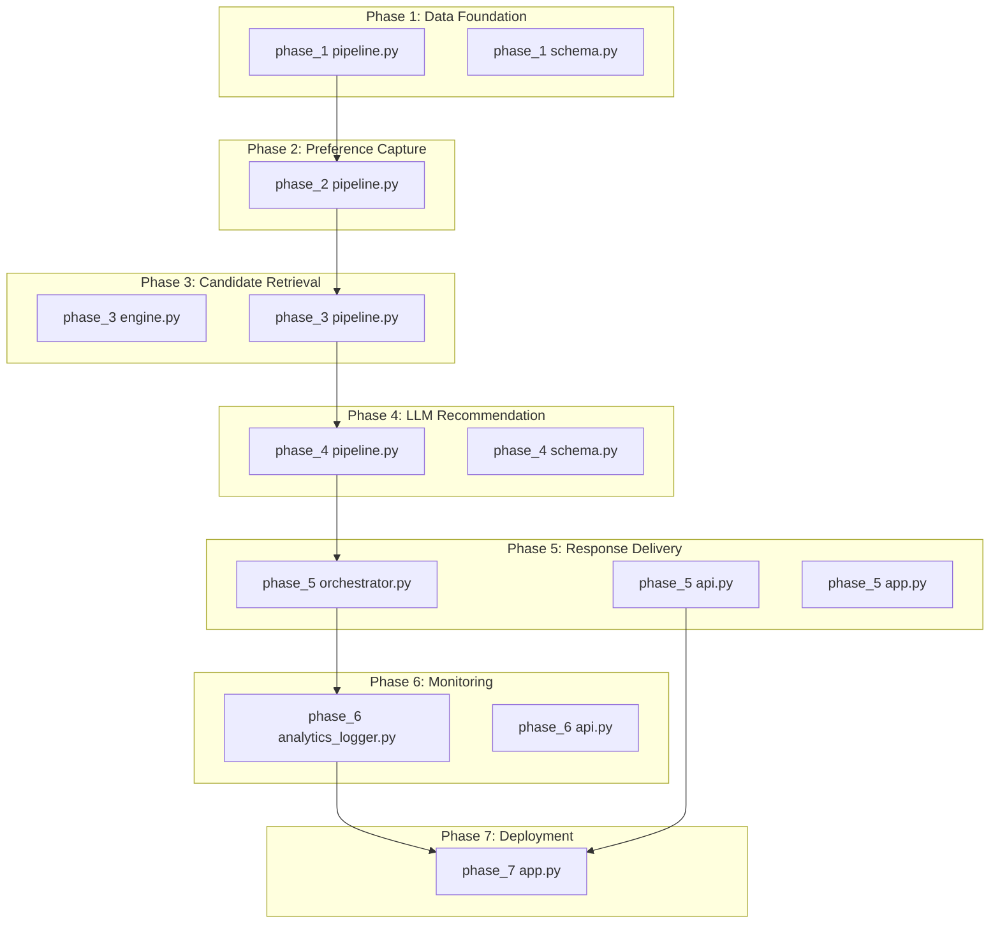
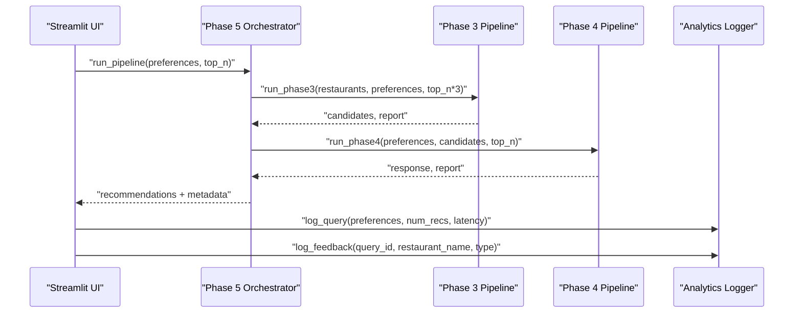
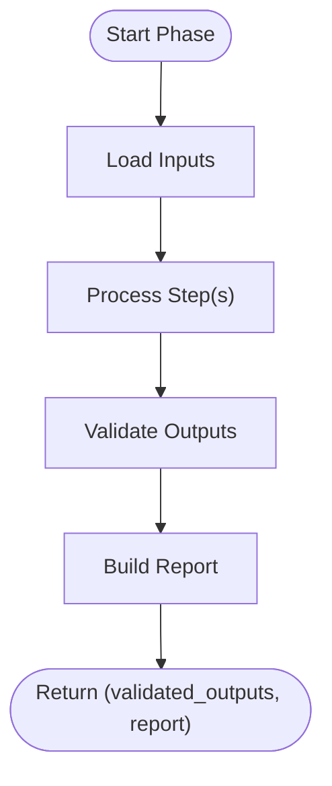
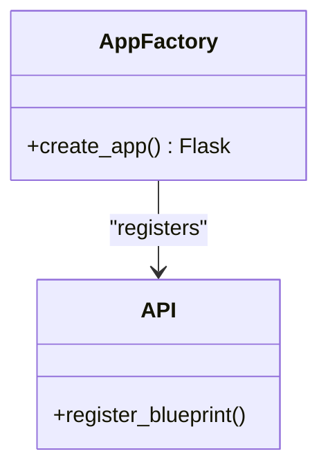
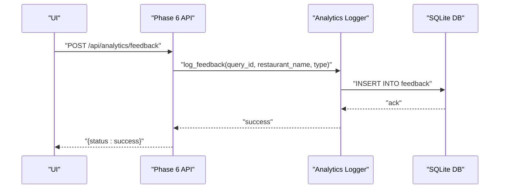
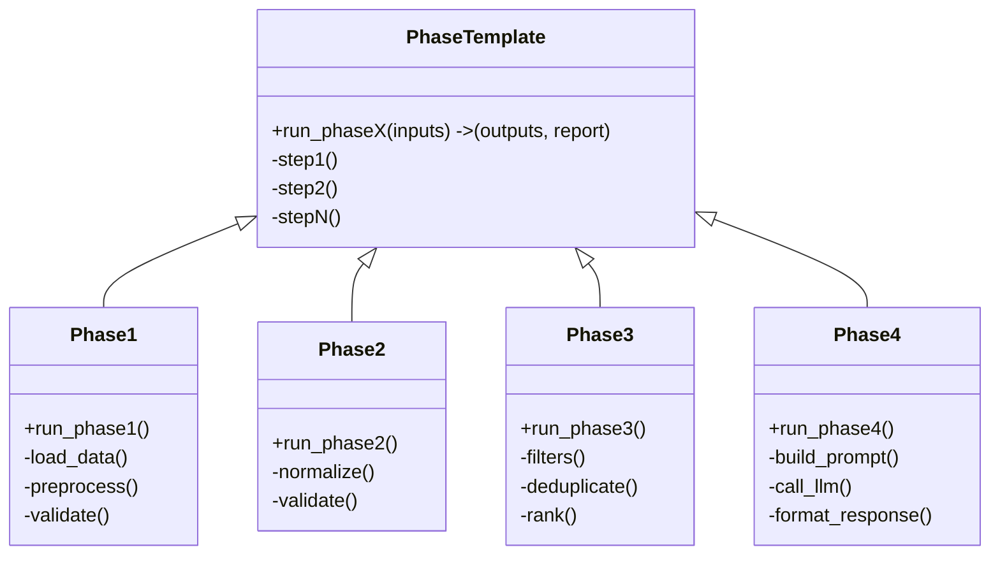
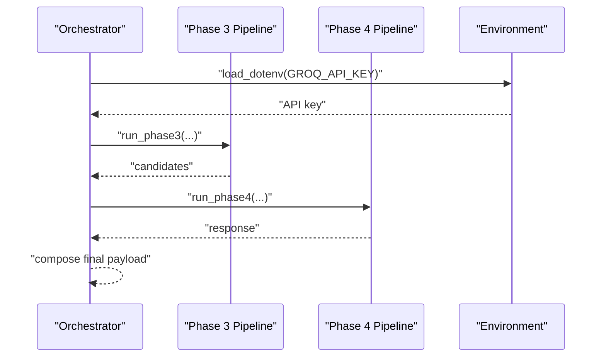
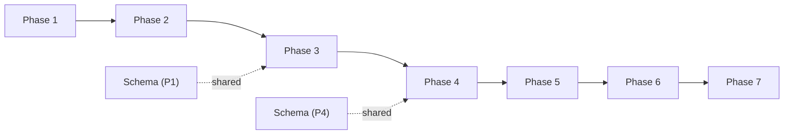

# Overall Design Patterns

<cite>
**Referenced Files in This Document**
- [phase_1 pipeline.py](file://Zomato/architecture/phase_1_data_foundation/pipeline.py)
- [phase_2 pipeline.py](file://Zomato/architecture/phase_2_preference_capture/pipeline.py)
- [phase_3 pipeline.py](file://Zomato/architecture/phase_3_candidate_retrieval/pipeline.py)
- [phase_3 engine.py](file://Zomato/architecture/phase_3_candidate_retrieval/engine.py)
- [phase_4 pipeline.py](file://Zomato/architecture/phase_4_llm_recommendation/pipeline.py)
- [phase_5 orchestrator.py](file://Zomato/architecture/phase_5_response_delivery/backend/orchestrator.py)
- [phase_5 app.py](file://Zomato/architecture/phase_5_response_delivery/backend/app.py)
- [phase_5 api.py](file://Zomato/architecture/phase_5_response_delivery/backend/api.py)
- [phase_6 analytics_logger.py](file://Zomato/architecture/phase_6_monitoring/backend/analytics_logger.py)
- [phase_6 api.py](file://Zomato/architecture/phase_6_monitoring/backend/api.py)
- [phase_7 app.py](file://Zomato/architecture/phase_7_deployment/app.py)
- [phase_1 schema.py](file://Zomato/architecture/phase_1_data_foundation/schema.py)
- [phase_4 schema.py](file://Zomato/architecture/phase_4_llm_recommendation/schema.py)
- [phase_1 __main__.py](file://Zomato/architecture/phase_1_data_foundation/__main__.py)
- [phase_2 __main__.py](file://Zomato/architecture/phase_2_preference_capture/__main__.py)
</cite>

## Table of Contents
1. [Introduction](#introduction)
2. [Project Structure](#project-structure)
3. [Core Components](#core-components)
4. [Architecture Overview](#architecture-overview)
5. [Detailed Component Analysis](#detailed-component-analysis)
6. [Dependency Analysis](#dependency-analysis)
7. [Performance Considerations](#performance-considerations)
8. [Troubleshooting Guide](#troubleshooting-guide)
9. [Conclusion](#conclusion)

## Introduction
This document explains the overall design patterns used in the Zomato AI Recommendation System and how they collaborate to form a modular, extensible, and scalable pipeline. The system is organized into seven distinct phases, each implementing a standardized processing workflow. The primary design patterns are:
- Pipeline Pattern: Sequential processing across seven phases
- Factory Pattern: Application creation via a factory function
- Observer Pattern: Real-time monitoring and feedback logging
- Template Method: Standardized processing workflows across phases

These patterns balance simplicity and flexibility, enabling straightforward development and easy future enhancements.

## Project Structure
The system is organized by phases, each encapsulating a focused responsibility:
- Phase 1: Data Foundation (loading, preprocessing, validation)
- Phase 2: Preference Capture (normalization and validation)
- Phase 3: Candidate Retrieval (filtering and scoring)
- Phase 4: LLM Recommendation (prompt building, LLM call, formatting)
- Phase 5: Response Delivery (orchestration, API, and serving)
- Phase 6: Monitoring (analytics logging and feedback)
- Phase 7: Deployment (Streamlit UI)

**Diagram sources**
- [phase_1 pipeline.py:1-81](file://Zomato/architecture/phase_1_data_foundation/pipeline.py#L1-L81)
- [phase_1 schema.py:1-54](file://Zomato/architecture/phase_1_data_foundation/schema.py#L1-L54)
- [phase_2 pipeline.py:1-21](file://Zomato/architecture/phase_2_preference_capture/pipeline.py#L1-L21)
- [phase_3 engine.py:1-118](file://Zomato/architecture/phase_3_candidate_retrieval/engine.py#L1-L118)
- [phase_3 pipeline.py:1-51](file://Zomato/architecture/phase_3_candidate_retrieval/pipeline.py#L1-L51)
- [phase_4 pipeline.py:1-47](file://Zomato/architecture/phase_4_llm_recommendation/pipeline.py#L1-L47)
- [phase_4 schema.py:1-38](file://Zomato/architecture/phase_4_llm_recommendation/schema.py#L1-L38)
- [phase_5 orchestrator.py:1-292](file://Zomato/architecture/phase_5_response_delivery/backend/orchestrator.py#L1-L292)
- [phase_5 api.py:1-84](file://Zomato/architecture/phase_5_response_delivery/backend/api.py#L1-L84)
- [phase_5 app.py:1-41](file://Zomato/architecture/phase_5_response_delivery/backend/app.py#L1-L41)
- [phase_6 analytics_logger.py:1-87](file://Zomato/architecture/phase_6_monitoring/backend/analytics_logger.py#L1-L87)
- [phase_6 api.py:1-119](file://Zomato/architecture/phase_6_monitoring/backend/api.py#L1-L119)
- [phase_7 app.py:1-123](file://Zomato/architecture/phase_7_deployment/app.py#L1-L123)

**Section sources**
- [phase_1 pipeline.py:1-81](file://Zomato/architecture/phase_1_data_foundation/pipeline.py#L1-L81)
- [phase_2 pipeline.py:1-21](file://Zomato/architecture/phase_2_preference_capture/pipeline.py#L1-L21)
- [phase_3 pipeline.py:1-51](file://Zomato/architecture/phase_3_candidate_retrieval/pipeline.py#L1-L51)
- [phase_4 pipeline.py:1-47](file://Zomato/architecture/phase_4_llm_recommendation/pipeline.py#L1-L47)
- [phase_5 orchestrator.py:1-292](file://Zomato/architecture/phase_5_response_delivery/backend/orchestrator.py#L1-L292)
- [phase_6 analytics_logger.py:1-87](file://Zomato/architecture/phase_6_monitoring/backend/analytics_logger.py#L1-L87)
- [phase_7 app.py:1-123](file://Zomato/architecture/phase_7_deployment/app.py#L1-L123)

## Core Components
- Pipeline Pattern: Each phase exposes a run_phaseX function that performs a well-defined set of steps and returns validated outputs plus a report. The phases are chained in order: 1 → 2 → 3 → 4 → 5 → 6 → 7.
- Factory Pattern: Application creation is centralized in a factory function that constructs the Flask app with routing and CORS support.
- Observer Pattern: Real-time monitoring logs queries and feedback into a persistent store, enabling continuous learning and observability.
- Template Method: Each phase’s run_phaseX function defines a canonical workflow template, while internal steps (e.g., filtering, prompting, validation) are pluggable.

Benefits:
- Modularity: Each phase is self-contained with clear inputs/outputs.
- Extensibility: New phases or steps can be added without disrupting existing ones.
- Maintainability: Standardized reports and validation improve debugging and auditing.
- Scalability: Independent phases can be parallelized or scaled separately.

**Section sources**
- [phase_1 pipeline.py:21-67](file://Zomato/architecture/phase_1_data_foundation/pipeline.py#L21-L67)
- [phase_2 pipeline.py:11-20](file://Zomato/architecture/phase_2_preference_capture/pipeline.py#L11-L20)
- [phase_3 pipeline.py:24-50](file://Zomato/architecture/phase_3_candidate_retrieval/pipeline.py#L24-L50)
- [phase_4 pipeline.py:29-46](file://Zomato/architecture/phase_4_llm_recommendation/pipeline.py#L29-L46)
- [phase_5 orchestrator.py:112-291](file://Zomato/architecture/phase_5_response_delivery/backend/orchestrator.py#L112-L291)
- [phase_5 app.py:14-40](file://Zomato/architecture/phase_5_response_delivery/backend/app.py#L14-L40)
- [phase_6 analytics_logger.py:46-83](file://Zomato/architecture/phase_6_monitoring/backend/analytics_logger.py#L46-L83)

## Architecture Overview
The system follows a strict seven-phase pipeline orchestrated by a central orchestrator. The orchestration layer dynamically resolves and imports phase-specific modules, ensuring clean separation and deterministic execution. Monitoring is integrated via an analytics logger that captures queries and feedback. The deployment layer (Streamlit) consumes the pipeline outputs and enables user feedback.

**Diagram sources**
- [phase_5 orchestrator.py:112-291](file://Zomato/architecture/phase_5_response_delivery/backend/orchestrator.py#L112-L291)
- [phase_3 pipeline.py:24-50](file://Zomato/architecture/phase_3_candidate_retrieval/pipeline.py#L24-L50)
- [phase_4 pipeline.py:29-46](file://Zomato/architecture/phase_4_llm_recommendation/pipeline.py#L29-L46)
- [phase_6 analytics_logger.py:46-83](file://Zomato/architecture/phase_6_monitoring/backend/analytics_logger.py#L46-L83)
- [phase_7 app.py:91-118](file://Zomato/architecture/phase_7_deployment/app.py#L91-L118)

## Detailed Component Analysis

### Pipeline Pattern: Seven-Phase Sequential Processing
Each phase implements a canonical run_phaseX function that:
- Accepts validated inputs
- Performs a series of processing steps
- Produces validated outputs and a concise report

Key characteristics:
- Consistent function signature across phases
- Strong validation via Pydantic models
- Clear separation of concerns per phase

**Diagram sources**
- [phase_1 pipeline.py:21-67](file://Zomato/architecture/phase_1_data_foundation/pipeline.py#L21-L67)
- [phase_2 pipeline.py:11-20](file://Zomato/architecture/phase_2_preference_capture/pipeline.py#L11-L20)
- [phase_3 pipeline.py:24-50](file://Zomato/architecture/phase_3_candidate_retrieval/pipeline.py#L24-L50)
- [phase_4 pipeline.py:29-46](file://Zomato/architecture/phase_4_llm_recommendation/pipeline.py#L29-L46)

Implementation highlights:
- Phase 1: Loads data from multiple sources, preprocesses, validates, and writes artifacts.
- Phase 2: Normalizes free-form inputs and validates them into a structured schema.
- Phase 3: Applies hard filters, deduplicates, ranks candidates, and reports counts.
- Phase 4: Builds prompts, calls the LLM, validates and formats the response.

**Section sources**
- [phase_1 pipeline.py:21-81](file://Zomato/architecture/phase_1_data_foundation/pipeline.py#L21-L81)
- [phase_2 pipeline.py:11-21](file://Zomato/architecture/phase_2_preference_capture/pipeline.py#L11-L21)
- [phase_3 pipeline.py:24-51](file://Zomato/architecture/phase_3_candidate_retrieval/pipeline.py#L24-L51)
- [phase_4 pipeline.py:29-47](file://Zomato/architecture/phase_4_llm_recommendation/pipeline.py#L29-L47)

### Factory Pattern: Application Creation Across Environments
The Flask application is created via a factory function that:
- Constructs the Flask app with static assets
- Registers blueprints for API routes
- Serves the SPA for non-API routes

This pattern enables:
- Environment-specific configurations
- Clean separation of concerns between app creation and routing
- Easy testing and reuse across environments

**Diagram sources**
- [phase_5 app.py:14-40](file://Zomato/architecture/phase_5_response_delivery/backend/app.py#L14-L40)
- [phase_5 api.py:1-84](file://Zomato/architecture/phase_5_response_delivery/backend/api.py#L1-L84)

**Section sources**
- [phase_5 app.py:14-40](file://Zomato/architecture/phase_5_response_delivery/backend/app.py#L14-L40)
- [phase_5 api.py:1-84](file://Zomato/architecture/phase_5_response_delivery/backend/api.py#L1-L84)

### Observer Pattern: Real-Time Monitoring and Feedback Collection
Monitoring is implemented as a layered observer:
- Analytics logger persists queries and feedback to a database
- API endpoints accept feedback submissions
- UI collects user feedback and logs it

**Diagram sources**
- [phase_6 api.py:97-118](file://Zomato/architecture/phase_6_monitoring/backend/api.py#L97-L118)
- [phase_6 analytics_logger.py:72-83](file://Zomato/architecture/phase_6_monitoring/backend/analytics_logger.py#L72-L83)

Operational benefits:
- Captures user sentiment for continuous improvement
- Provides audit trails for debugging and compliance
- Enables dashboards and reporting

**Section sources**
- [phase_6 analytics_logger.py:1-87](file://Zomato/architecture/phase_6_monitoring/backend/analytics_logger.py#L1-L87)
- [phase_6 api.py:97-119](file://Zomato/architecture/phase_6_monitoring/backend/api.py#L97-L119)

### Template Method Pattern: Standardized Processing Workflows
Template method is evident in each phase’s run_phaseX function:
- Define the high-level workflow
- Allow subclasses or internal steps to vary (e.g., filtering logic, prompt building)

**Diagram sources**
- [phase_1 pipeline.py:21-67](file://Zomato/architecture/phase_1_data_foundation/pipeline.py#L21-L67)
- [phase_2 pipeline.py:11-20](file://Zomato/architecture/phase_2_preference_capture/pipeline.py#L11-L20)
- [phase_3 pipeline.py:24-50](file://Zomato/architecture/phase_3_candidate_retrieval/pipeline.py#L24-L50)
- [phase_4 pipeline.py:29-46](file://Zomato/architecture/phase_4_llm_recommendation/pipeline.py#L29-L46)

**Section sources**
- [phase_1 pipeline.py:21-67](file://Zomato/architecture/phase_1_data_foundation/pipeline.py#L21-L67)
- [phase_2 pipeline.py:11-20](file://Zomato/architecture/phase_2_preference_capture/pipeline.py#L11-L20)
- [phase_3 pipeline.py:24-50](file://Zomato/architecture/phase_3_candidate_retrieval/pipeline.py#L24-L50)
- [phase_4 pipeline.py:29-46](file://Zomato/architecture/phase_4_llm_recommendation/pipeline.py#L29-L46)

### Orchestration and Cross-Phase Integration
The orchestrator coordinates phases 3 and 4, dynamically importing and invoking their run_phaseX functions. It also manages fallbacks and environment-specific behavior (e.g., API keys).

**Diagram sources**
- [phase_5 orchestrator.py:112-291](file://Zomato/architecture/phase_5_response_delivery/backend/orchestrator.py#L112-L291)

**Section sources**
- [phase_5 orchestrator.py:112-291](file://Zomato/architecture/phase_5_response_delivery/backend/orchestrator.py#L112-L291)

## Dependency Analysis
The system exhibits low coupling and high cohesion:
- Phases depend on shared schemas for validation and data interchange
- Orchestration layer depends on phase-specific pipelines but loads them dynamically
- Monitoring is decoupled and injected via API and UI

**Diagram sources**
- [phase_1 schema.py:1-54](file://Zomato/architecture/phase_1_data_foundation/schema.py#L1-L54)
- [phase_4 schema.py:1-38](file://Zomato/architecture/phase_4_llm_recommendation/schema.py#L1-L38)
- [phase_3 pipeline.py:1-51](file://Zomato/architecture/phase_3_candidate_retrieval/pipeline.py#L1-L51)
- [phase_4 pipeline.py:1-47](file://Zomato/architecture/phase_4_llm_recommendation/pipeline.py#L1-L47)

**Section sources**
- [phase_1 schema.py:1-54](file://Zomato/architecture/phase_1_data_foundation/schema.py#L1-L54)
- [phase_4 schema.py:1-38](file://Zomato/architecture/phase_4_llm_recommendation/schema.py#L1-L38)
- [phase_3 pipeline.py:1-51](file://Zomato/architecture/phase_3_candidate_retrieval/pipeline.py#L1-L51)
- [phase_4 pipeline.py:1-47](file://Zomato/architecture/phase_4_llm_recommendation/pipeline.py#L1-L47)

## Performance Considerations
- Dynamic imports in the orchestrator ensure fresh module state but add overhead; consider caching or lazy initialization for repeated calls.
- Deduplication in Phase 3 reduces redundant LLM calls and improves user experience.
- Validation and JSON serialization are centralized, reducing duplication and potential errors.
- Monitoring writes are lightweight; ensure database connection pooling for high throughput.

## Troubleshooting Guide
Common issues and resolutions:
- Missing GROQ API key: Orchestrator falls back to sample recommendations; verify environment configuration.
- Phase import failures: Orchestrator catches exceptions and returns sample data; check module paths and Python path manipulation.
- Validation errors: Reports include counts and sample errors; inspect validation messages to correct input formats.
- Monitoring failures: Analytics logger initializes tables on import; ensure database permissions and path resolution.

**Section sources**
- [phase_5 orchestrator.py:166-190](file://Zomato/architecture/phase_5_response_delivery/backend/orchestrator.py#L166-L190)
- [phase_5 orchestrator.py:266-291](file://Zomato/architecture/phase_5_response_delivery/backend/orchestrator.py#L266-L291)
- [phase_6 analytics_logger.py:13-44](file://Zomato/architecture/phase_6_monitoring/backend/analytics_logger.py#L13-L44)

## Conclusion
The Zomato AI Recommendation System leverages the Pipeline, Factory, Observer, and Template Method patterns to achieve a modular, extensible, and maintainable architecture. The seven-phase pipeline ensures clear processing stages, while the Factory pattern simplifies application creation. The Observer pattern provides robust monitoring and feedback collection, and the Template Method pattern standardizes workflows across phases. These design decisions enable future enhancements, such as adding new phases, integrating alternative LLM providers, or extending monitoring capabilities, without compromising system stability.