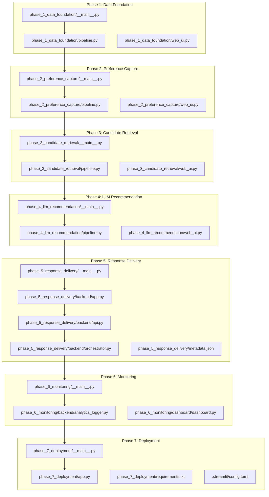
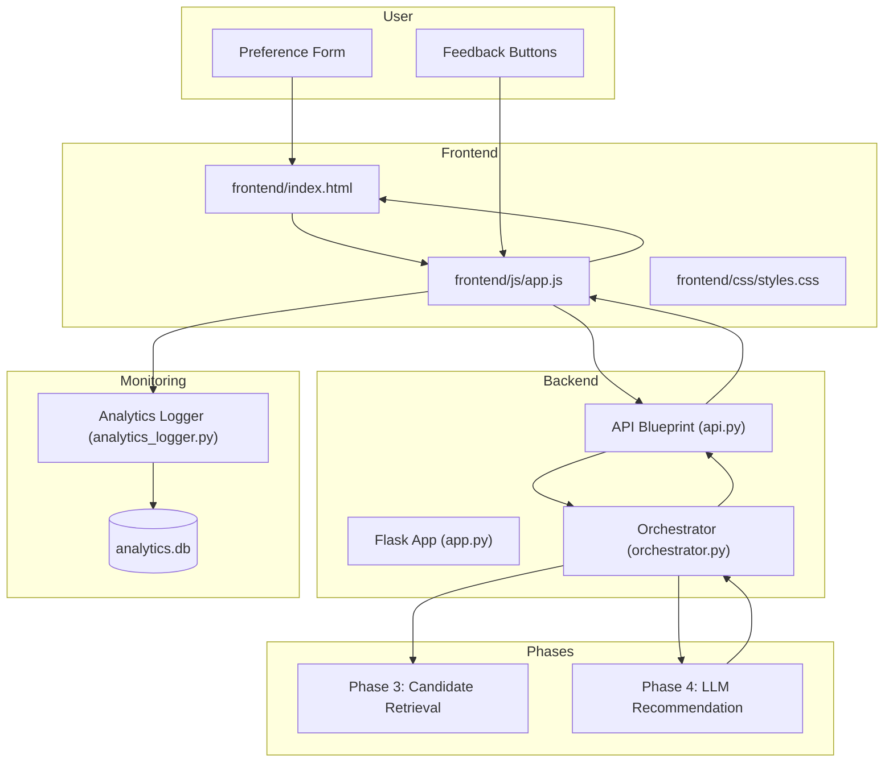
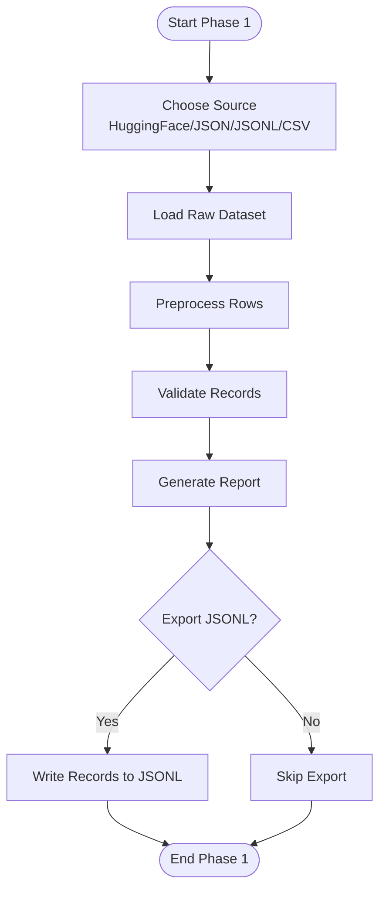
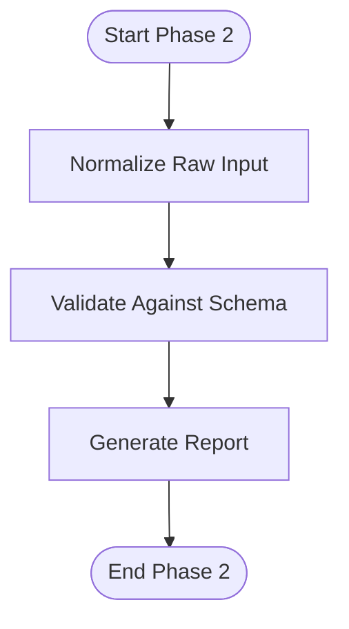
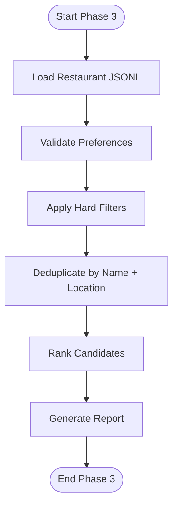
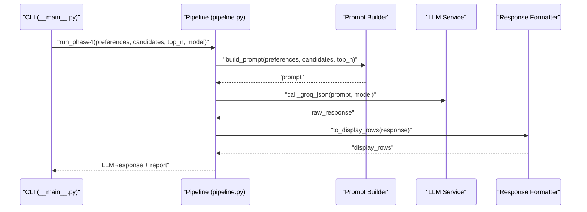
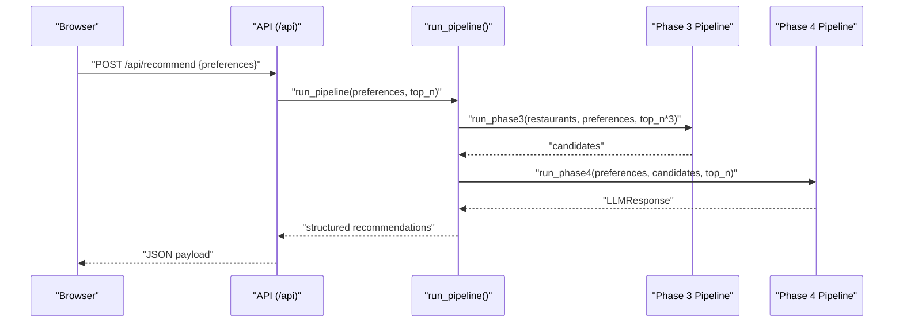
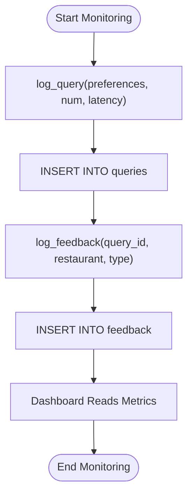
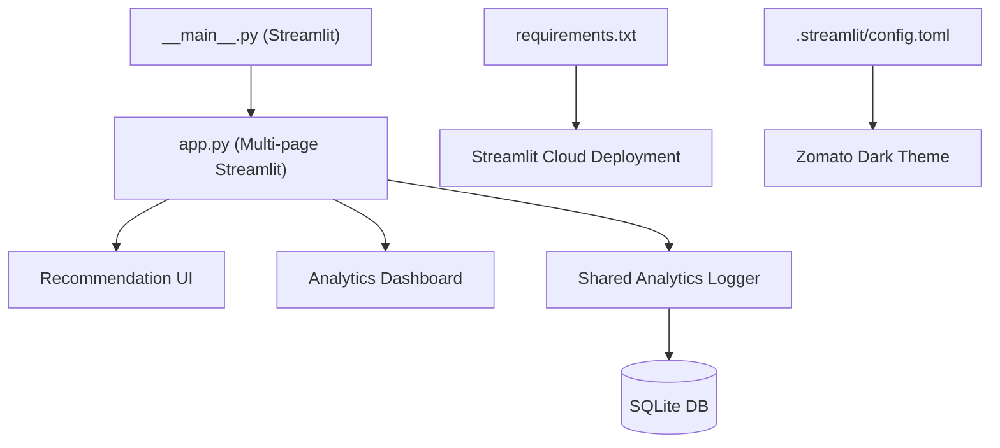
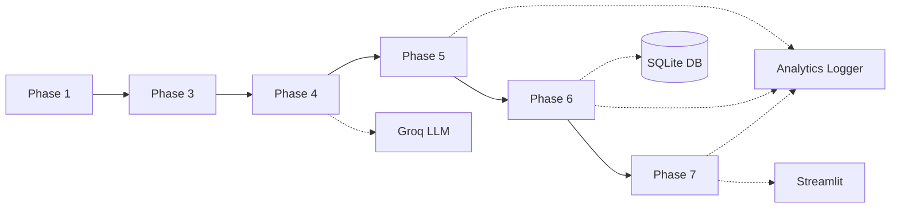

# System Architecture

<cite>
**Referenced Files in This Document**
- [phase-wise-architecture.md](file://architecture/phase-wise-architecture.md)
- [__main__.py](file://architecture/phase_1_data_foundation/__main__.py)
- [pipeline.py](file://architecture/phase_1_data_foundation/pipeline.py)
- [data_loader.py](file://architecture/phase_1_data_foundation/data_loader.py)
- [preprocess.py](file://architecture/phase_1_data_foundation/preprocess.py)
- [schema.py](file://architecture/phase_1_data_foundation/schema.py)
- [web_ui.py](file://architecture/phase_1_data_foundation/web_ui.py)
- [__main__.py](file://architecture/phase_2_preference_capture/__main__.py)
- [pipeline.py](file://architecture/phase_2_preference_capture/pipeline.py)
- [normalizer.py](file://architecture/phase_2_preference_capture/normalizer.py)
- [schema.py](file://architecture/phase_2_preference_capture/schema.py)
- [web_ui.py](file://architecture/phase_2_preference_capture/web_ui.py)
- [__main__.py](file://architecture/phase_3_candidate_retrieval/__main__.py)
- [pipeline.py](file://architecture/phase_3_candidate_retrieval/pipeline.py)
- [engine.py](file://architecture/phase_3_candidate_retrieval/engine.py)
- [schema.py](file://architecture/phase_3_candidate_retrieval/schema.py)
- [web_ui.py](file://architecture/phase_3_candidate_retrieval/web_ui.py)
- [__main__.py](file://architecture/phase_4_llm_recommendation/__main__.py)
- [pipeline.py](file://architecture/phase_4_llm_recommendation/pipeline.py)
- [prompt_builder.py](file://architecture/phase_4_llm_recommendation/prompt_builder.py)
- [llm_service.py](file://architecture/phase_4_llm_recommendation/llm_service.py)
- [response_formatter.py](file://architecture/phase_4_llm_recommendation/response_formatter.py)
- [schema.py](file://architecture/phase_4_llm_recommendation/schema.py)
- [web_ui.py](file://architecture/phase_4_llm_recommendation/web_ui.py)
- [__main__.py](file://architecture/phase_5_response_delivery/__main__.py)
- [app.py](file://architecture/phase_5_response_delivery/backend/app.py)
- [api.py](file://architecture/phase_5_response_delivery/backend/api.py)
- [orchestrator.py](file://architecture/phase_5_response_delivery/backend/orchestrator.py)
- [generate_metadata.py](file://architecture/phase_5_response_delivery/generate_metadata.py)
- [metadata.json](file://architecture/phase_5_response_delivery/metadata.json)
- [__main__.py](file://architecture/phase_6_monitoring/__main__.py)
- [analytics_logger.py](file://architecture/phase_6_monitoring/backend/analytics_logger.py)
- [dashboard/dashboard.py](file://architecture/phase_6_monitoring/dashboard/dashboard.py)
- [__main__.py](file://architecture/phase_7_deployment/__main__.py)
- [app.py](file://architecture/phase_7_deployment/app.py)
- [analytics_logger.py](file://architecture/phase_7_deployment/analytics_logger.py)
- [requirements.txt](file://architecture/phase_7_deployment/requirements.txt)
- [.streamlit/config.toml](file://architecture/phase_7_deployment/.streamlit/config.toml)
</cite>

## Table of Contents
1. [Introduction](#introduction)
2. [Project Structure](#project-structure)
3. [Core Components](#core-components)
4. [Architecture Overview](#architecture-overview)
5. [Detailed Component Analysis](#detailed-component-analysis)
6. [Dependency Analysis](#dependency-analysis)
7. [Performance Considerations](#performance-considerations)
8. [Troubleshooting Guide](#troubleshooting-guide)
9. [Conclusion](#conclusion)
10. [Appendices](#appendices)

## Introduction
This document describes the Zomato AI Recommendation System architecture built around a modular pipeline with seven distinct processing phases. The system follows a Pipeline Pattern for sequential processing, Factory Pattern for application creation, Observer Pattern for monitoring, and Template Method for standardized workflows. It integrates backend services (Flask), frontend interfaces (Streamlit SPA), and analytics systems (SQLite) to deliver personalized restaurant recommendations powered by Groq LLM.

## Project Structure
The repository is organized by phases, each encapsulating a focused stage of the recommendation pipeline. Each phase includes:
- CLI entrypoint (__main__.py)
- Pipeline orchestration (pipeline.py)
- Supporting modules (schema, normalization, engines, UI)
- Optional web UI and sample data
- Shared artifacts (metadata.json, sample outputs)

**Diagram sources**
- [__main__.py:1-54](file://architecture/phase_1_data_foundation/__main__.py#L1-L54)
- [pipeline.py:1-81](file://architecture/phase_1_data_foundation/pipeline.py#L1-L81)
- [__main__.py:1-46](file://architecture/phase_2_preference_capture/__main__.py#L1-L46)
- [pipeline.py:1-21](file://architecture/phase_2_preference_capture/pipeline.py#L1-L21)
- [__main__.py:1-51](file://architecture/phase_3_candidate_retrieval/__main__.py#L1-L51)
- [pipeline.py:1-51](file://architecture/phase_3_candidate_retrieval/pipeline.py#L1-L51)
- [__main__.py:1-41](file://architecture/phase_4_llm_recommendation/__main__.py#L1-L41)
- [pipeline.py:1-47](file://architecture/phase_4_llm_recommendation/pipeline.py#L1-L47)
- [__main__.py:1-44](file://architecture/phase_5_response_delivery/__main__.py#L1-L44)
- [app.py:1-41](file://architecture/phase_5_response_delivery/backend/app.py#L1-L41)
- [api.py:1-84](file://architecture/phase_5_response_delivery/backend/api.py#L1-L84)
- [orchestrator.py:1-292](file://architecture/phase_5_response_delivery/backend/orchestrator.py#L1-L292)
- [analytics_logger.py:1-87](file://architecture/phase_6_monitoring/backend/analytics_logger.py#L1-L87)
- [__main__.py:1-44](file://architecture/phase_7_deployment/__main__.py#L1-L44)
- [app.py:1-200](file://architecture/phase_7_deployment/app.py#L1-L200)
- [requirements.txt:1-200](file://architecture/phase_7_deployment/requirements.txt#L1-L200)
- [.streamlit/config.toml:1-200](file://architecture/phase_7_deployment/.streamlit/config.toml#L1-L200)

**Section sources**
- [phase-wise-architecture.md:1-113](file://architecture/phase-wise-architecture.md#L1-L113)

## Core Components
- Phase 1: Data Foundation
  - Loads datasets from multiple sources, preprocesses, validates, and exports clean records.
  - CLI entrypoint supports web UI and multiple input formats.
- Phase 2: Preference Capture
  - Normalizes and validates user preferences (location, budget, cuisines, ratings, optional preferences).
- Phase 3: Candidate Retrieval
  - Applies hard filters and soft matching, deduplicates, and ranks candidates.
- Phase 4: LLM Recommendation
  - Builds prompts, calls Groq LLM, enforces output format, and formats display rows.
- Phase 5: Response Delivery
  - Flask backend with API endpoints and SPA frontend; orchestrates Phases 3–4 and serves recommendations.
- Phase 6: Monitoring
  - Analytics logger with SQLite storage and a dashboard for metrics.
- Phase 7: Deployment
  - Unified Streamlit app combining recommendation UI and analytics dashboard.

**Section sources**
- [phase-wise-architecture.md:3-113](file://architecture/phase-wise-architecture.md#L3-L113)
- [__main__.py:1-54](file://architecture/phase_1_data_foundation/__main__.py#L1-L54)
- [pipeline.py:1-81](file://architecture/phase_1_data_foundation/pipeline.py#L1-L81)
- [__main__.py:1-46](file://architecture/phase_2_preference_capture/__main__.py#L1-L46)
- [pipeline.py:1-21](file://architecture/phase_2_preference_capture/pipeline.py#L1-L21)
- [__main__.py:1-51](file://architecture/phase_3_candidate_retrieval/__main__.py#L1-L51)
- [pipeline.py:1-51](file://architecture/phase_3_candidate_retrieval/pipeline.py#L1-L51)
- [__main__.py:1-41](file://architecture/phase_4_llm_recommendation/__main__.py#L1-L41)
- [pipeline.py:1-47](file://architecture/phase_4_llm_recommendation/pipeline.py#L1-L47)
- [__main__.py:1-44](file://architecture/phase_5_response_delivery/__main__.py#L1-L44)
- [app.py:1-41](file://architecture/phase_5_response_delivery/backend/app.py#L1-L41)
- [api.py:1-84](file://architecture/phase_5_response_delivery/backend/api.py#L1-L84)
- [orchestrator.py:1-292](file://architecture/phase_5_response_delivery/backend/orchestrator.py#L1-L292)
- [analytics_logger.py:1-87](file://architecture/phase_6_monitoring/backend/analytics_logger.py#L1-L87)
- [__main__.py:1-44](file://architecture/phase_7_deployment/__main__.py#L1-L44)

## Architecture Overview
The system follows a modular pipeline architecture with clear boundaries between phases. Each phase exposes a CLI entrypoint and a web UI for interactive exploration. The backend orchestrator composes Phases 3 and 4 to produce recommendations, while the frontend presents results and collects feedback. Monitoring persists telemetry in SQLite and surfaces insights via a dashboard.

**Diagram sources**
- [app.py:1-41](file://architecture/phase_5_response_delivery/backend/app.py#L1-L41)
- [api.py:1-84](file://architecture/phase_5_response_delivery/backend/api.py#L1-L84)
- [orchestrator.py:1-292](file://architecture/phase_5_response_delivery/backend/orchestrator.py#L1-L292)
- [analytics_logger.py:1-87](file://architecture/phase_6_monitoring/backend/analytics_logger.py#L1-L87)

## Detailed Component Analysis

### Phase 1: Data Foundation
- Purpose: Establish a clean, normalized restaurant dataset.
- Patterns:
  - Pipeline Pattern: Sequential load → preprocess → validate → export.
  - Factory-like selection of loader based on source argument.
- Key modules:
  - CLI entrypoint parses arguments and delegates to pipeline.
  - Pipeline orchestrates loaders, preprocessing, and validation.
  - Schema defines record structure and validation rules.
- Outputs: Clean records and run reports; optional JSONL export.

**Diagram sources**
- [__main__.py:1-54](file://architecture/phase_1_data_foundation/__main__.py#L1-L54)
- [pipeline.py:1-81](file://architecture/phase_1_data_foundation/pipeline.py#L1-L81)

**Section sources**
- [phase-wise-architecture.md:3-16](file://architecture/phase-wise-architecture.md#L3-L16)
- [__main__.py:1-54](file://architecture/phase_1_data_foundation/__main__.py#L1-L54)
- [pipeline.py:1-81](file://architecture/phase_1_data_foundation/pipeline.py#L1-L81)
- [data_loader.py:1-200](file://architecture/phase_1_data_foundation/data_loader.py#L1-L200)
- [preprocess.py:1-200](file://architecture/phase_1_data_foundation/preprocess.py#L1-L200)
- [schema.py:1-200](file://architecture/phase_1_data_foundation/schema.py#L1-L200)
- [web_ui.py:1-200](file://architecture/phase_1_data_foundation/web_ui.py#L1-L200)

### Phase 2: Preference Capture
- Purpose: Normalize and validate user preferences.
- Patterns:
  - Template Method: run_phase2 standardizes normalization and validation steps.
- Key modules:
  - CLI entrypoint accepts command-line preferences.
  - Pipeline normalizes raw input and validates against schema.
- Outputs: Structured preferences and a validation report.

**Diagram sources**
- [__main__.py:1-46](file://architecture/phase_2_preference_capture/__main__.py#L1-L46)
- [pipeline.py:1-21](file://architecture/phase_2_preference_capture/pipeline.py#L1-L21)
- [normalizer.py:1-200](file://architecture/phase_2_preference_capture/normalizer.py#L1-L200)
- [schema.py:1-200](file://architecture/phase_2_preference_capture/schema.py#L1-L200)

**Section sources**
- [phase-wise-architecture.md:17-29](file://architecture/phase-wise-architecture.md#L17-L29)
- [__main__.py:1-46](file://architecture/phase_2_preference_capture/__main__.py#L1-L46)
- [pipeline.py:1-21](file://architecture/phase_2_preference_capture/pipeline.py#L1-L21)
- [normalizer.py:1-200](file://architecture/phase_2_preference_capture/normalizer.py#L1-L200)
- [schema.py:1-200](file://architecture/phase_2_preference_capture/schema.py#L1-L200)
- [web_ui.py:1-200](file://architecture/phase_2_preference_capture/web_ui.py#L1-L200)

### Phase 3: Candidate Retrieval
- Purpose: Filter and rank candidates based on preferences.
- Patterns:
  - Template Method: run_phase3 applies hard filters, deduplicates, and ranks.
- Key modules:
  - CLI entrypoint loads dataset and preferences, invokes pipeline.
  - Engine applies hard filters and soft matching.
  - Pipeline orchestrates filtering, deduplication, and ranking.
- Outputs: Shortlisted candidates with match reasons and ranking report.

**Diagram sources**
- [__main__.py:1-51](file://architecture/phase_3_candidate_retrieval/__main__.py#L1-L51)
- [pipeline.py:1-51](file://architecture/phase_3_candidate_retrieval/pipeline.py#L1-L51)
- [engine.py:1-200](file://architecture/phase_3_candidate_retrieval/engine.py#L1-L200)
- [schema.py:1-200](file://architecture/phase_3_candidate_retrieval/schema.py#L1-L200)

**Section sources**
- [phase-wise-architecture.md:30-42](file://architecture/phase-wise-architecture.md#L30-L42)
- [__main__.py:1-51](file://architecture/phase_3_candidate_retrieval/__main__.py#L1-L51)
- [pipeline.py:1-51](file://architecture/phase_3_candidate_retrieval/pipeline.py#L1-L51)
- [engine.py:1-200](file://architecture/phase_3_candidate_retrieval/engine.py#L1-L200)
- [schema.py:1-200](file://architecture/phase_3_candidate_retrieval/schema.py#L1-L200)
- [web_ui.py:1-200](file://architecture/phase_3_candidate_retrieval/web_ui.py#L1-L200)

### Phase 4: LLM Recommendation
- Purpose: Generate personalized, explainable recommendations via Groq LLM.
- Patterns:
  - Template Method: run_phase4 builds prompt, calls LLM, formats response.
- Key modules:
  - CLI entrypoint loads candidates and preferences, invokes pipeline.
  - Prompt builder constructs structured context.
  - LLM service calls Groq with enforced JSON output.
  - Response formatter converts LLM output to display rows.
- Outputs: Ranked recommendations with explanations and summary.

**Diagram sources**
- [__main__.py:1-41](file://architecture/phase_4_llm_recommendation/__main__.py#L1-L41)
- [pipeline.py:1-47](file://architecture/phase_4_llm_recommendation/pipeline.py#L1-L47)
- [prompt_builder.py:1-200](file://architecture/phase_4_llm_recommendation/prompt_builder.py#L1-L200)
- [llm_service.py:1-200](file://architecture/phase_4_llm_recommendation/llm_service.py#L1-L200)
- [response_formatter.py:1-200](file://architecture/phase_4_llm_recommendation/response_formatter.py#L1-L200)
- [schema.py:1-200](file://architecture/phase_4_llm_recommendation/schema.py#L1-L200)

**Section sources**
- [phase-wise-architecture.md:43-55](file://architecture/phase-wise-architecture.md#L43-L55)
- [__main__.py:1-41](file://architecture/phase_4_llm_recommendation/__main__.py#L1-L41)
- [pipeline.py:1-47](file://architecture/phase_4_llm_recommendation/pipeline.py#L1-L47)
- [prompt_builder.py:1-200](file://architecture/phase_4_llm_recommendation/prompt_builder.py#L1-L200)
- [llm_service.py:1-200](file://architecture/phase_4_llm_recommendation/llm_service.py#L1-L200)
- [response_formatter.py:1-200](file://architecture/phase_4_llm_recommendation/response_formatter.py#L1-L200)
- [schema.py:1-200](file://architecture/phase_4_llm_recommendation/schema.py#L1-L200)
- [web_ui.py:1-200](file://architecture/phase_4_llm_recommendation/web_ui.py#L1-L200)

### Phase 5: Response Delivery and UX
- Purpose: Serve recommendations via a Flask API and SPA frontend.
- Patterns:
  - Factory Pattern: create_app() assembles Flask app with CORS and routes.
  - Observer Pattern: analytics logging captures queries and feedback.
  - Template Method: run_pipeline orchestrates Phase 3 + Phase 4 with fallbacks.
- Key modules:
  - CLI entrypoint starts Flask server.
  - App factory registers blueprints and serves SPA assets.
  - API blueprint exposes health, sample, metadata, and recommendation endpoints.
  - Orchestrator resolves datasets, imports phase modules dynamically, and executes pipelines.
- Outputs: JSON recommendations and metadata; SPA renders cards and handles feedback.

**Diagram sources**
- [__main__.py:1-44](file://architecture/phase_5_response_delivery/__main__.py#L1-L44)
- [app.py:1-41](file://architecture/phase_5_response_delivery/backend/app.py#L1-L41)
- [api.py:1-84](file://architecture/phase_5_response_delivery/backend/api.py#L1-L84)
- [orchestrator.py:1-292](file://architecture/phase_5_response_delivery/backend/orchestrator.py#L1-L292)

**Section sources**
- [phase-wise-architecture.md:56-77](file://architecture/phase-wise-architecture.md#L56-L77)
- [__main__.py:1-44](file://architecture/phase_5_response_delivery/__main__.py#L1-L44)
- [app.py:1-41](file://architecture/phase_5_response_delivery/backend/app.py#L1-L41)
- [api.py:1-84](file://architecture/phase_5_response_delivery/backend/api.py#L1-L84)
- [orchestrator.py:1-292](file://architecture/phase_5_response_delivery/backend/orchestrator.py#L1-L292)
- [generate_metadata.py:1-200](file://architecture/phase_5_response_delivery/generate_metadata.py#L1-L200)
- [metadata.json:1-200](file://architecture/phase_5_response_delivery/metadata.json#L1-L200)

### Phase 6: Monitoring and Continuous Improvement
- Purpose: Persist telemetry and power an analytics dashboard.
- Patterns:
  - Observer Pattern: analytics_logger logs queries and feedback events.
- Key modules:
  - Analytics logger initializes SQLite tables and provides logging functions.
  - Dashboard reads metrics and displays recent queries and feedback.
- Outputs: Metrics dashboards and historical logs for tuning.

**Diagram sources**
- [analytics_logger.py:1-87](file://architecture/phase_6_monitoring/backend/analytics_logger.py#L1-L87)
- [dashboard/dashboard.py:1-200](file://architecture/phase_6_monitoring/dashboard/dashboard.py#L1-L200)

**Section sources**
- [phase-wise-architecture.md:78-89](file://architecture/phase-wise-architecture.md#L78-L89)
- [analytics_logger.py:1-87](file://architecture/phase_6_monitoring/backend/analytics_logger.py#L1-L87)
- [dashboard/dashboard.py:1-200](file://architecture/phase_6_monitoring/dashboard/dashboard.py#L1-L200)

### Phase 7: Deployment
- Purpose: Host the unified Streamlit application with recommendation UI and analytics dashboard.
- Patterns:
  - Factory Pattern: Streamlit app factory with multi-page navigation.
- Key modules:
  - CLI entrypoint runs Streamlit app.
  - App combines recommendation UI and analytics dashboard.
  - Requirements pinned for reproducible deployments.
- Outputs: Publicly accessible Streamlit app.

**Diagram sources**
- [__main__.py:1-44](file://architecture/phase_7_deployment/__main__.py#L1-L44)
- [app.py:1-200](file://architecture/phase_7_deployment/app.py#L1-L200)
- [analytics_logger.py:1-87](file://architecture/phase_7_deployment/analytics_logger.py#L1-L87)
- [requirements.txt:1-200](file://architecture/phase_7_deployment/requirements.txt#L1-L200)
- [.streamlit/config.toml:1-200](file://architecture/phase_7_deployment/.streamlit/config.toml#L1-L200)

**Section sources**
- [phase-wise-architecture.md:94-113](file://architecture/phase-wise-architecture.md#L94-L113)
- [__main__.py:1-44](file://architecture/phase_7_deployment/__main__.py#L1-L44)
- [app.py:1-200](file://architecture/phase_7_deployment/app.py#L1-L200)
- [analytics_logger.py:1-87](file://architecture/phase_7_deployment/analytics_logger.py#L1-L87)
- [requirements.txt:1-200](file://architecture/phase_7_deployment/requirements.txt#L1-L200)
- [.streamlit/config.toml:1-200](file://architecture/phase_7_deployment/.streamlit/config.toml#L1-L200)

## Dependency Analysis
- Inter-phase dependencies:
  - Phase 1 output (cleaned dataset) feeds Phase 3.
  - Phase 3 output (candidates) feeds Phase 4.
  - Phase 4 output (recommendations) feeds Phase 5 UI.
  - Phase 5 telemetry feeds Phase 6 monitoring.
- Cross-cutting dependencies:
  - Shared analytics logger used by Phase 5 and Phase 6.
  - Streamlit app reuses shared logger for unified deployment.
- External integrations:
  - Groq LLM for recommendation generation.
  - SQLite for telemetry persistence.
  - Streamlit for deployment and dashboarding.

**Diagram sources**
- [pipeline.py:1-81](file://architecture/phase_1_data_foundation/pipeline.py#L1-L81)
- [pipeline.py:1-51](file://architecture/phase_3_candidate_retrieval/pipeline.py#L1-L51)
- [pipeline.py:1-47](file://architecture/phase_4_llm_recommendation/pipeline.py#L1-L47)
- [orchestrator.py:1-292](file://architecture/phase_5_response_delivery/backend/orchestrator.py#L1-L292)
- [analytics_logger.py:1-87](file://architecture/phase_6_monitoring/backend/analytics_logger.py#L1-L87)
- [app.py:1-200](file://architecture/phase_7_deployment/app.py#L1-L200)

**Section sources**
- [phase-wise-architecture.md:90-93](file://architecture/phase-wise-architecture.md#L90-L93)
- [pipeline.py:1-81](file://architecture/phase_1_data_foundation/pipeline.py#L1-L81)
- [pipeline.py:1-51](file://architecture/phase_3_candidate_retrieval/pipeline.py#L1-L51)
- [pipeline.py:1-47](file://architecture/phase_4_llm_recommendation/pipeline.py#L1-L47)
- [orchestrator.py:1-292](file://architecture/phase_5_response_delivery/backend/orchestrator.py#L1-L292)
- [analytics_logger.py:1-87](file://architecture/phase_6_monitoring/backend/analytics_logger.py#L1-L87)
- [app.py:1-200](file://architecture/phase_7_deployment/app.py#L1-L200)

## Performance Considerations
- Caching and imports:
  - Phase 5 orchestrator clears module caches and reloads phase modules to ensure deterministic imports during each request.
- Latency mitigation:
  - Fallback to sample recommendations when Groq key is missing or LLM calls fail.
  - Metadata generation avoids repeated computation by caching results.
- Throughput:
  - Top-N scaling: Phase 3 increases candidates to top_n*3 to improve LLM recall; Phase 4 trims to requested top_n.
- Observability:
  - Health checks and structured reports enable monitoring pipeline health and performance.

[No sources needed since this section provides general guidance]

## Troubleshooting Guide
- Missing Groq API key:
  - Symptom: LLM calls fail and system falls back to Phase 3 rankings.
  - Action: Set GROQ_API_KEY and restart backend.
- No Phase 1 dataset found:
  - Symptom: Backend falls back to sample recommendations.
  - Action: Run Phase 1 to generate cleaned dataset or place a JSONL file in the expected output path.
- CORS errors:
  - Symptom: Frontend cannot reach backend endpoints.
  - Action: Verify Flask CORS configuration and origin policies.
- SQLite initialization failures:
  - Symptom: Analytics not recorded.
  - Action: Ensure analytics.db path exists and is writable; tables are initialized on import.

**Section sources**
- [orchestrator.py:210-214](file://architecture/phase_5_response_delivery/backend/orchestrator.py#L210-L214)
- [orchestrator.py:174-177](file://architecture/phase_5_response_delivery/backend/orchestrator.py#L174-L177)
- [analytics_logger.py:13-44](file://architecture/phase_6_monitoring/backend/analytics_logger.py#L13-L44)

## Conclusion
The Zomato AI Recommendation System is a modular, pipeline-driven architecture that separates concerns across seven phases. It leverages the Pipeline Pattern for sequential processing, Factory Pattern for application creation, Observer Pattern for monitoring, and Template Method for standardized workflows. The system integrates a Flask backend, a modern SPA frontend, Groq LLM for intelligent ranking, and SQLite-backed analytics, culminating in a unified Streamlit deployment for broad accessibility.

[No sources needed since this section summarizes without analyzing specific files]

## Appendices

### Technology Stack
- Backend: Flask, Python
- Data Validation: Pydantic models
- LLM Provider: Groq
- Frontend: HTML/CSS/JavaScript SPA
- Deployment: Streamlit
- Storage: SQLite
- Web UI: Basic Flask web UIs per phase and a premium SPA

**Section sources**
- [phase-wise-architecture.md:56-113](file://architecture/phase-wise-architecture.md#L56-L113)
- [requirements.txt:1-200](file://architecture/phase_7_deployment/requirements.txt#L1-L200)