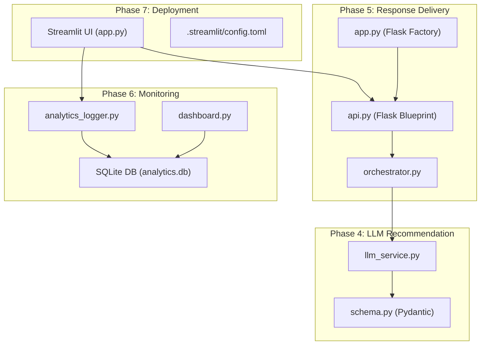
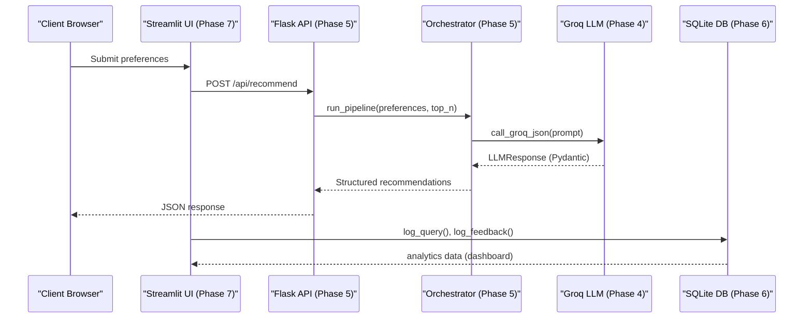
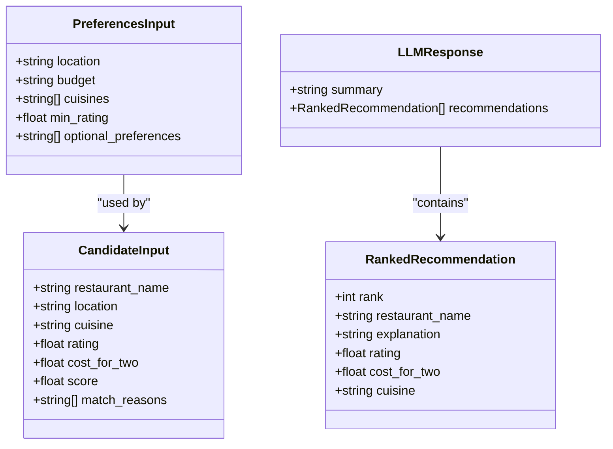
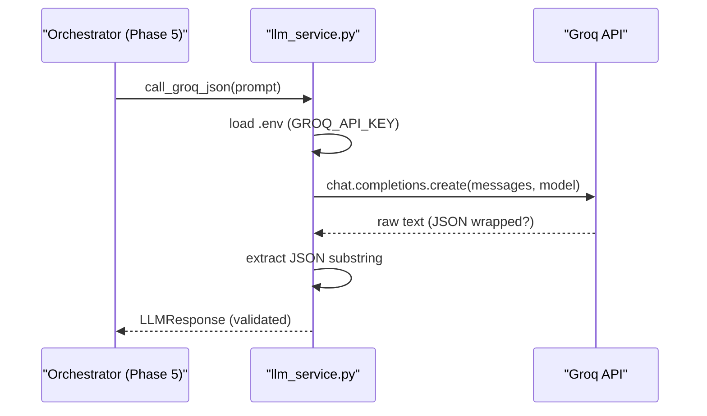
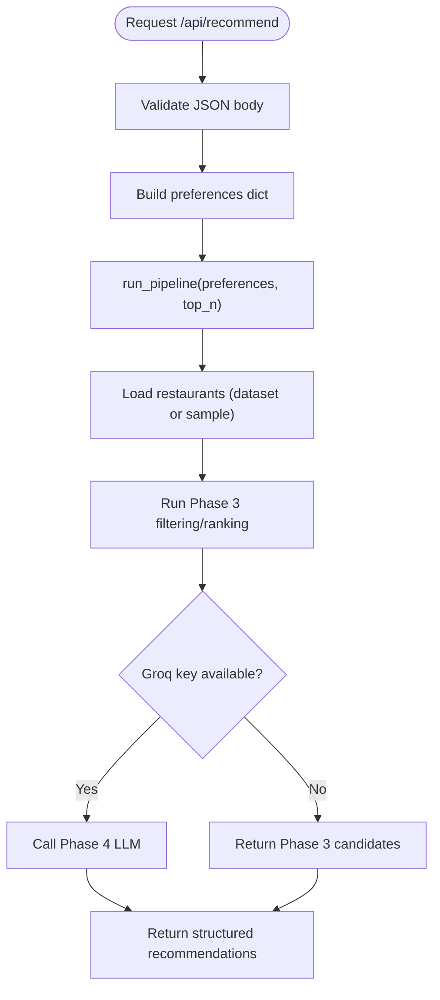
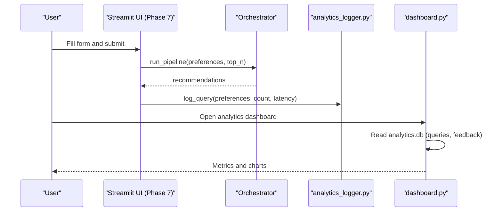
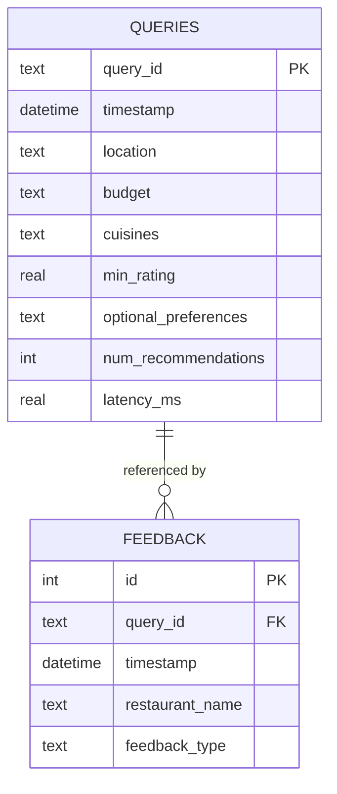
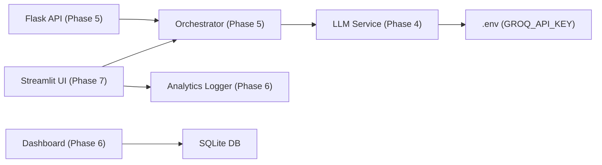

# Technology Stack

<cite>
**Referenced Files in This Document**
- [requirements.txt (Phase 1)](file://Zomato/architecture/phase_1_data_foundation/requirements.txt)
- [requirements.txt (Phase 2)](file://Zomato/architecture/phase_2_preference_capture/requirements.txt)
- [requirements.txt (Phase 3)](file://Zomato/architecture/phase_3_candidate_retrieval/requirements.txt)
- [requirements.txt (Phase 4)](file://Zomato/architecture/phase_4_llm_recommendation/requirements.txt)
- [requirements.txt (Phase 5)](file://Zomato/architecture/phase_5_response_delivery/requirements.txt)
- [requirements.txt (Phase 7)](file://Zomato/architecture/phase_7_deployment/requirements.txt)
- [llm_service.py](file://Zomato/architecture/phase_4_llm_recommendation/llm_service.py)
- [schema.py (Phase 4)](file://Zomato/architecture/phase_4_llm_recommendation/schema.py)
- [app.py (Phase 5 backend)](file://Zomato/architecture/phase_5_response_delivery/backend/app.py)
- [api.py (Phase 5 backend)](file://Zomato/architecture/phase_5_response_delivery/backend/api.py)
- [orchestrator.py (Phase 5)](file://Zomato/architecture/phase_5_response_delivery/backend/orchestrator.py)
- [app.py (Phase 7 deployment)](file://Zomato/architecture/phase_7_deployment/app.py)
- [config.toml (Phase 7 Streamlit)](file://Zomato/architecture/phase_7_deployment/.streamlit/config.toml)
- [analytics_logger.py (Phase 6)](file://Zomato/architecture/phase_6_monitoring/backend/analytics_logger.py)
- [dashboard.py (Phase 6)](file://Zomato/architecture/phase_6_monitoring/dashboard/dashboard.py)
</cite>

## Table of Contents
1. [Introduction](#introduction)
2. [Project Structure](#project-structure)
3. [Core Components](#core-components)
4. [Architecture Overview](#architecture-overview)
5. [Detailed Component Analysis](#detailed-component-analysis)
6. [Dependency Analysis](#dependency-analysis)
7. [Performance Considerations](#performance-considerations)
8. [Troubleshooting Guide](#troubleshooting-guide)
9. [Conclusion](#conclusion)
10. [Appendices](#appendices)

## Introduction
This document describes the technology stack of the Zomato AI Recommendation System. The system is implemented in Python and composes modular phases that progressively refine restaurant recommendations. The primary technologies are:
- Python as the core programming language
- Flask for building the REST API and serving a single-page frontend
- Pydantic for robust data validation and serialization
- Groq for Large Language Model (LLM) inference
- Streamlit for interactive deployment and analytics dashboards
- SQLite for lightweight analytics persistence

We explain version requirements, dependency management strategies, integration patterns, rationale for technology choices, performance characteristics, scalability implications, setup instructions, environment configuration, and cross-environment compatibility.

## Project Structure
The repository is organized into phases, each encapsulating a stage of the recommendation pipeline. The stack spans:
- Phase 4 (LLM recommendation) with Groq integration and Pydantic schemas
- Phase 5 (response delivery) with Flask API and orchestration
- Phase 6 (monitoring) with SQLite-backed analytics and Streamlit dashboard
- Phase 7 (deployment) with Streamlit UI and environment secrets handling
- Earlier phases (data foundation, preference capture, candidate retrieval) that feed data into later stages

**Diagram sources**
- [llm_service.py:1-43](file://Zomato/architecture/phase_4_llm_recommendation/llm_service.py#L1-L43)
- [schema.py (Phase 4):1-38](file://Zomato/architecture/phase_4_llm_recommendation/schema.py#L1-L38)
- [api.py (Phase 5 backend):1-84](file://Zomato/architecture/phase_5_response_delivery/backend/api.py#L1-L84)
- [app.py (Phase 5 backend):1-41](file://Zomato/architecture/phase_5_response_delivery/backend/app.py#L1-L41)
- [orchestrator.py (Phase 5):1-292](file://Zomato/architecture/phase_5_response_delivery/backend/orchestrator.py#L1-L292)
- [analytics_logger.py (Phase 6):1-87](file://Zomato/architecture/phase_6_monitoring/backend/analytics_logger.py#L1-L87)
- [dashboard.py (Phase 6):1-102](file://Zomato/architecture/phase_6_monitoring/dashboard/dashboard.py#L1-L102)
- [app.py (Phase 7 deployment):1-128](file://Zomato/architecture/phase_7_deployment/app.py#L1-L128)
- [config.toml (Phase 7 Streamlit):1-7](file://Zomato/architecture/phase_7_deployment/.streamlit/config.toml#L1-L7)

**Section sources**
- [requirements.txt (Phase 1):1-4](file://Zomato/architecture/phase_1_data_foundation/requirements.txt#L1-L4)
- [requirements.txt (Phase 2):1-3](file://Zomato/architecture/phase_2_preference_capture/requirements.txt#L1-L3)
- [requirements.txt (Phase 3):1-3](file://Zomato/architecture/phase_3_candidate_retrieval/requirements.txt#L1-L3)
- [requirements.txt (Phase 4):1-5](file://Zomato/architecture/phase_4_llm_recommendation/requirements.txt#L1-L5)
- [requirements.txt (Phase 5):1-6](file://Zomato/architecture/phase_5_response_delivery/requirements.txt#L1-L6)
- [requirements.txt (Phase 7):1-6](file://Zomato/architecture/phase_7_deployment/requirements.txt#L1-L6)

## Core Components
- Python: Used across all phases for orchestration, data processing, and UI logic.
- Flask: Provides the REST API and serves the frontend assets for Phase 5.
- Pydantic: Enforces strict schema validation for LLM inputs and outputs in Phase 4 and supports robust data modeling.
- Groq: Powers LLM inference for ranking candidates in Phase 4 and is also used in Phase 7 deployment.
- Streamlit: Powers the interactive UI and analytics dashboard for deployment and monitoring.
- SQLite: Stores analytics logs (queries and feedback) for continuous improvement.

Version requirements and dependencies are declared per-phase via requirements.txt files. The following sections detail each technology’s role, integration, and configuration.

**Section sources**
- [requirements.txt (Phase 4):1-5](file://Zomato/architecture/phase_4_llm_recommendation/requirements.txt#L1-L5)
- [requirements.txt (Phase 5):1-6](file://Zomato/architecture/phase_5_response_delivery/requirements.txt#L1-L6)
- [requirements.txt (Phase 7):1-6](file://Zomato/architecture/phase_7_deployment/requirements.txt#L1-L6)
- [schema.py (Phase 4):1-38](file://Zomato/architecture/phase_4_llm_recommendation/schema.py#L1-L38)
- [llm_service.py:1-43](file://Zomato/architecture/phase_4_llm_recommendation/llm_service.py#L1-L43)
- [api.py (Phase 5 backend):1-84](file://Zomato/architecture/phase_5_response_delivery/backend/api.py#L1-L84)
- [app.py (Phase 5 backend):1-41](file://Zomato/architecture/phase_5_response_delivery/backend/app.py#L1-L41)
- [orchestrator.py (Phase 5):1-292](file://Zomato/architecture/phase_5_response_delivery/backend/orchestrator.py#L1-L292)
- [analytics_logger.py (Phase 6):1-87](file://Zomato/architecture/phase_6_monitoring/backend/analytics_logger.py#L1-L87)
- [dashboard.py (Phase 6):1-102](file://Zomato/architecture/phase_6_monitoring/dashboard/dashboard.py#L1-L102)
- [app.py (Phase 7 deployment):1-128](file://Zomato/architecture/phase_7_deployment/app.py#L1-L128)
- [config.toml (Phase 7 Streamlit):1-7](file://Zomato/architecture/phase_7_deployment/.streamlit/config.toml#L1-L7)

## Architecture Overview
The system integrates multiple phases:
- Data Foundation (Phase 1) produces datasets consumed by downstream phases.
- Preference Capture (Phase 2) and Candidate Retrieval (Phase 3) prepare candidate lists.
- LLM Recommendation (Phase 4) ranks candidates using Groq and Pydantic schemas.
- Response Delivery (Phase 5) exposes a REST API and serves a SPA frontend.
- Monitoring (Phase 6) persists analytics and visualizes trends.
- Deployment (Phase 7) runs the Streamlit UI and integrates analytics logging.

**Diagram sources**
- [app.py (Phase 7 deployment):82-127](file://Zomato/architecture/phase_7_deployment/app.py#L82-L127)
- [api.py (Phase 5 backend):41-83](file://Zomato/architecture/phase_5_response_delivery/backend/api.py#L41-L83)
- [orchestrator.py (Phase 5):112-291](file://Zomato/architecture/phase_5_response_delivery/backend/orchestrator.py#L112-L291)
- [llm_service.py:19-42](file://Zomato/architecture/phase_4_llm_recommendation/llm_service.py#L19-L42)
- [analytics_logger.py (Phase 6):46-83](file://Zomato/architecture/phase_6_monitoring/backend/analytics_logger.py#L46-L83)

## Detailed Component Analysis

### Python and Pydantic
- Pydantic models define strict input/output schemas for LLM inputs and recommendations, ensuring reliable serialization and validation.
- Version requirement: pydantic>=2.0.0 is present in most phase requirements, ensuring modern validation features.

**Diagram sources**
- [schema.py (Phase 4):8-37](file://Zomato/architecture/phase_4_llm_recommendation/schema.py#L8-L37)

**Section sources**
- [schema.py (Phase 4):1-38](file://Zomato/architecture/phase_4_llm_recommendation/schema.py#L1-L38)
- [requirements.txt (Phase 1)](file://Zomato/architecture/phase_1_data_foundation/requirements.txt#L2)
- [requirements.txt (Phase 2)](file://Zomato/architecture/phase_2_preference_capture/requirements.txt#L1)
- [requirements.txt (Phase 3)](file://Zomato/architecture/phase_3_candidate_retrieval/requirements.txt#L1)
- [requirements.txt (Phase 4)](file://Zomato/architecture/phase_4_llm_recommendation/requirements.txt#L2)
- [requirements.txt (Phase 5)](file://Zomato/architecture/phase_5_response_delivery/requirements.txt#L3)
- [requirements.txt (Phase 7)](file://Zomato/architecture/phase_7_deployment/requirements.txt#L4)

### Groq Integration
- Groq is used for fast LLM inference in Phase 4 and is referenced in Phase 7 deployment requirements.
- Environment configuration uses python-dotenv to load GROQ_API_KEY.
- The LLM service validates and parses JSON responses, isolating the JSON object when returned with surrounding text.

**Diagram sources**
- [llm_service.py:19-42](file://Zomato/architecture/phase_4_llm_recommendation/llm_service.py#L19-L42)
- [requirements.txt (Phase 4)](file://Zomato/architecture/phase_4_llm_recommendation/requirements.txt#L1)
- [requirements.txt (Phase 5)](file://Zomato/architecture/phase_5_response_delivery/requirements.txt#L5)
- [requirements.txt (Phase 7)](file://Zomato/architecture/phase_7_deployment/requirements.txt#L3)

**Section sources**
- [llm_service.py:1-43](file://Zomato/architecture/phase_4_llm_recommendation/llm_service.py#L1-L43)
- [requirements.txt (Phase 4):1-5](file://Zomato/architecture/phase_4_llm_recommendation/requirements.txt#L1-L5)
- [requirements.txt (Phase 5):1-6](file://Zomato/architecture/phase_5_response_delivery/requirements.txt#L1-L6)
- [requirements.txt (Phase 7):1-6](file://Zomato/architecture/phase_7_deployment/requirements.txt#L1-L6)

### Flask API and Application Factory
- Phase 5 uses Flask application factory pattern to configure routes, CORS, and serve SPA assets.
- A dedicated blueprint defines health checks, sample data, metadata, and the recommendation endpoint.
- The orchestrator coordinates data loading, Phase 3 candidate filtering, and Phase 4 LLM ranking.

**Diagram sources**
- [api.py (Phase 5 backend):41-83](file://Zomato/architecture/phase_5_response_delivery/backend/api.py#L41-L83)
- [orchestrator.py (Phase 5):112-291](file://Zomato/architecture/phase_5_response_delivery/backend/orchestrator.py#L112-L291)
- [app.py (Phase 5 backend):14-40](file://Zomato/architecture/phase_5_response_delivery/backend/app.py#L14-L40)

**Section sources**
- [app.py (Phase 5 backend):1-41](file://Zomato/architecture/phase_5_response_delivery/backend/app.py#L1-L41)
- [api.py (Phase 5 backend):1-84](file://Zomato/architecture/phase_5_response_delivery/backend/api.py#L1-L84)
- [orchestrator.py (Phase 5):1-292](file://Zomato/architecture/phase_5_response_delivery/backend/orchestrator.py#L1-L292)
- [requirements.txt (Phase 5):1-6](file://Zomato/architecture/phase_5_response_delivery/requirements.txt#L1-L6)

### Streamlit Deployment and Dashboard
- Phase 7 runs a Streamlit UI that reads preferences, invokes the orchestrator, logs queries and feedback, and renders recommendations.
- Streamlit Secrets are supported for cloud deployments; local .env files are used otherwise.
- Phase 6 provides a Streamlit dashboard that reads analytics from SQLite and displays metrics and trends.

**Diagram sources**
- [app.py (Phase 7 deployment):82-127](file://Zomato/architecture/phase_7_deployment/app.py#L82-L127)
- [analytics_logger.py (Phase 6):46-83](file://Zomato/architecture/phase_6_monitoring/backend/analytics_logger.py#L46-L83)
- [dashboard.py (Phase 6):1-102](file://Zomato/architecture/phase_6_monitoring/dashboard/dashboard.py#L1-L102)

**Section sources**
- [app.py (Phase 7 deployment):1-128](file://Zomato/architecture/phase_7_deployment/app.py#L1-L128)
- [config.toml (Phase 7 Streamlit):1-7](file://Zomato/architecture/phase_7_deployment/.streamlit/config.toml#L1-L7)
- [analytics_logger.py (Phase 6):1-87](file://Zomato/architecture/phase_6_monitoring/backend/analytics_logger.py#L1-L87)
- [dashboard.py (Phase 6):1-102](file://Zomato/architecture/phase_6_monitoring/dashboard/dashboard.py#L1-L102)
- [requirements.txt (Phase 7):1-6](file://Zomato/architecture/phase_7_deployment/requirements.txt#L1-L6)

### SQLite Analytics Storage
- Analytics logger initializes SQLite tables for queries and feedback and writes records upon user actions.
- The dashboard reads these tables to compute metrics and visualize trends.

**Diagram sources**
- [analytics_logger.py (Phase 6):18-41](file://Zomato/architecture/phase_6_monitoring/backend/analytics_logger.py#L18-L41)
- [dashboard.py (Phase 6):23-30](file://Zomato/architecture/phase_6_monitoring/dashboard/dashboard.py#L23-L30)

**Section sources**
- [analytics_logger.py (Phase 6):1-87](file://Zomato/architecture/phase_6_monitoring/backend/analytics_logger.py#L1-L87)
- [dashboard.py (Phase 6):1-102](file://Zomato/architecture/phase_6_monitoring/dashboard/dashboard.py#L1-L102)

## Dependency Analysis
- Cross-phase imports are handled carefully in the orchestrator to ensure deterministic imports and avoid module caching issues.
- Environment variables are loaded via python-dotenv in both Phase 4 and Phase 5.
- Streamlit UI integrates with the backend orchestrator and analytics logger.

**Diagram sources**
- [orchestrator.py (Phase 5):132-244](file://Zomato/architecture/phase_5_response_delivery/backend/orchestrator.py#L132-L244)
- [llm_service.py:16-22](file://Zomato/architecture/phase_4_llm_recommendation/llm_service.py#L16-L22)
- [api.py (Phase 5 backend):1-13](file://Zomato/architecture/phase_5_response_delivery/backend/api.py#L1-L13)
- [app.py (Phase 7 deployment):21-22](file://Zomato/architecture/phase_7_deployment/app.py#L21-L22)
- [analytics_logger.py (Phase 6):1-11](file://Zomato/architecture/phase_6_monitoring/backend/analytics_logger.py#L1-L11)

**Section sources**
- [orchestrator.py (Phase 5):1-292](file://Zomato/architecture/phase_5_response_delivery/backend/orchestrator.py#L1-L292)
- [requirements.txt (Phase 4)](file://Zomato/architecture/phase_4_llm_recommendation/requirements.txt#L4)
- [requirements.txt (Phase 5)](file://Zomato/architecture/phase_5_response_delivery/requirements.txt#L4)
- [app.py (Phase 7 deployment):9-12](file://Zomato/architecture/phase_7_deployment/app.py#L9-L12)

## Performance Considerations
- LLM calls: Groq is used for rapid inference; ensure GROQ_API_KEY is configured to avoid fallbacks to Phase 3-only results.
- Data loading: The orchestrator attempts to load the latest dataset from Phase 1 output; if unavailable, it falls back to samples, which impacts latency and completeness.
- Caching and imports: The orchestrator clears module caches and reloads modules deterministically to prevent stale state during repeated runs.
- Frontend responsiveness: Streamlit UI uses spinner and immediate feedback; analytics logging occurs asynchronously after rendering recommendations.

[No sources needed since this section provides general guidance]

## Troubleshooting Guide
Common issues and remedies:
- Missing GROQ_API_KEY:
  - Symptom: Runtime error indicating missing API key or fallback to sample recommendations.
  - Action: Set GROQ_API_KEY in .env (local) or Streamlit Secrets (cloud).
- Database not found:
  - Symptom: Dashboard reports database not found or stops execution.
  - Action: Ensure analytics.db exists or run the backend to initialize tables.
- CORS errors:
  - Symptom: Browser blocks API requests from the frontend.
  - Action: Confirm Flask-CORS is enabled in the backend app factory.
- Module import errors:
  - Symptom: ImportError or unexpected behavior when importing sibling phases.
  - Action: Verify orchestrator’s dynamic import logic and sys.path adjustments.

**Section sources**
- [llm_service.py:20-22](file://Zomato/architecture/phase_4_llm_recommendation/llm_service.py#L20-L22)
- [app.py (Phase 7 deployment):11-12](file://Zomato/architecture/phase_7_deployment/app.py#L11-L12)
- [dashboard.py (Phase 6):12-14](file://Zomato/architecture/phase_6_monitoring/dashboard/dashboard.py#L12-L14)
- [app.py (Phase 5 backend)](file://Zomato/architecture/phase_5_response_delivery/backend/app.py#L20)
- [orchestrator.py (Phase 5):132-134](file://Zomato/architecture/phase_5_response_delivery/backend/orchestrator.py#L132-L134)

## Conclusion
The Zomato AI Recommendation System leverages a cohesive Python stack:
- Flask for a compact, maintainable API and SPA hosting
- Pydantic for strong, predictable data contracts
- Groq for efficient LLM ranking
- Streamlit for intuitive deployment and analytics
- SQLite for straightforward analytics persistence

This combination balances simplicity, performance, and observability, enabling iterative improvements through monitoring and controlled fallbacks.

[No sources needed since this section summarizes without analyzing specific files]

## Appendices

### Setup Instructions
- Prerequisites
  - Python 3.8+ recommended
  - pip for package management
- Install dependencies per phase
  - Phase 1–3: Install datasets/pydantic/flask as needed for earlier phases
  - Phase 4: Install groq, python-dotenv, pydantic, flask
  - Phase 5: Install flask, flask-cors, python-dotenv, groq, pydantic
  - Phase 6: Install pandas, streamlit, pydantic, python-dotenv
  - Phase 7: Install streamlit, pandas, groq, pydantic, python-dotenv
- Environment configuration
  - Local: Create a .env file with GROQ_API_KEY
  - Cloud (Streamlit): Store GROQ_API_KEY in Secrets
- Run components
  - Phase 5 API: Launch the Flask app factory
  - Phase 6 Dashboard: Start the Streamlit dashboard
  - Phase 7 UI: Launch the Streamlit UI; it will call the API and log analytics

**Section sources**
- [requirements.txt (Phase 1):1-4](file://Zomato/architecture/phase_1_data_foundation/requirements.txt#L1-L4)
- [requirements.txt (Phase 2):1-3](file://Zomato/architecture/phase_2_preference_capture/requirements.txt#L1-L3)
- [requirements.txt (Phase 3):1-3](file://Zomato/architecture/phase_3_candidate_retrieval/requirements.txt#L1-L3)
- [requirements.txt (Phase 4):1-5](file://Zomato/architecture/phase_4_llm_recommendation/requirements.txt#L1-L5)
- [requirements.txt (Phase 5):1-6](file://Zomato/architecture/phase_5_response_delivery/requirements.txt#L1-L6)
- [requirements.txt (Phase 7):1-6](file://Zomato/architecture/phase_7_deployment/requirements.txt#L1-L6)
- [app.py (Phase 7 deployment):9-12](file://Zomato/architecture/phase_7_deployment/app.py#L9-L12)
- [analytics_logger.py (Phase 6):13-44](file://Zomato/architecture/phase_6_monitoring/backend/analytics_logger.py#L13-L44)

### Compatibility and Scalability Notes
- Python version: Use Python 3.8+ for broad compatibility with dependencies.
- Flask: Version >=3.0.0 is required per requirements.
- Pydantic: Version >=2.0.0 ensures robust validation and serialization.
- Groq: Requires API key; network connectivity is essential for LLM ranking.
- Streamlit: Supports local and cloud deployments; use secrets for secure configuration.
- SQLite: Suitable for small-scale analytics; consider external databases for high write throughput.

[No sources needed since this section provides general guidance]